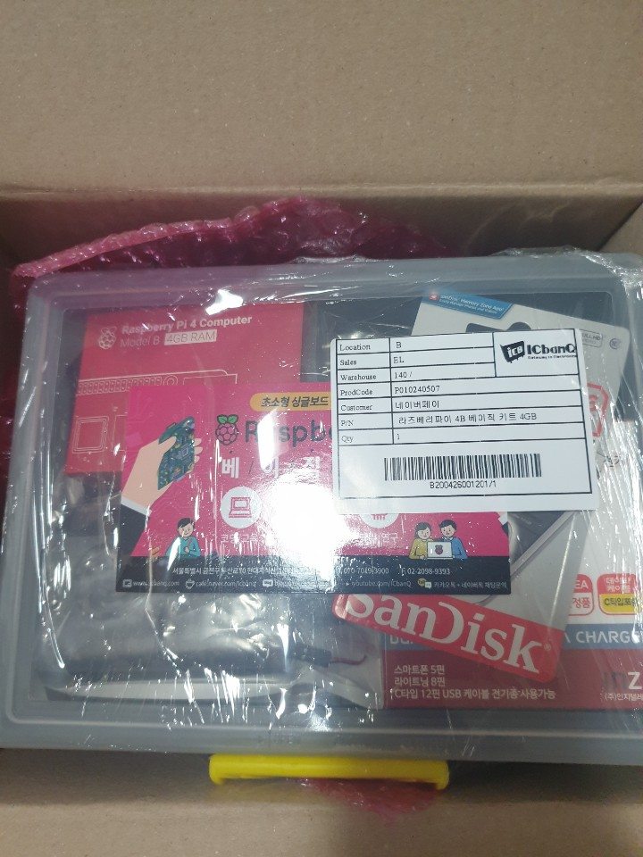

### 라즈베리 파이로 개인서버 만들기

---

최근 서비스를 만들어서 배포해보고 싶기도하고, 서버에 관심도 생겨

> 나만의 서버가 있었으면

하는 생각이 들었습니다.

물론 AWS를 사용해보고 싶었지만

역시나 비용 문제가....ㅎㅎ

그러다 구입하게된게 라즈베리파이4 입니다.

라즈베리파이3 보다 RAM이 늘어나 괜찮게 사용할 수 있을 것 같아 구매했습니다.

**[구입처](https://www.icbanq.com)**

물론 서버의 용도로 사용하기에는 무리가 있지만 싼맛에 연습용으로는

충분한 것 같습니다.

_설렌다..._

라즈베리파이4에는 발열 이슈가 있어 발열에 신경을 써주셔야 합니다.

저는 발열판과 발열케이스가 함께 구성된 패키지를 구매했습니다.

라즈베리파이 OS 설치와 기타 셋팅은

**[이곳](https://ryan-han.com/post/server/raspberry_server_1/)** 을 참고하여 진행했습니다.
