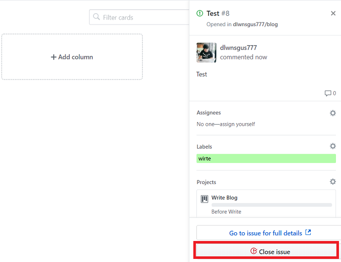

### Git Hub - Issues & Projects로 프로젝트 관리하기

---

Git Hub에 있는

- Issues
- Projects

기능을 이용해 프로젝트를 관리하는 법을 알아보겠습니다.

간략하게 용어에 대해 설명하자면

Issue(이슈)는

**다양한 작업** 이라고 생각하시면 됩니다.

버그 수정, 새로운 기능 추가, 개선 해야할 기능 등등을 이슈라고 합니다.

이런 다양한 Issue(이슈)를 기반으로 작업을 진행하게 됩니다.

이런 **Issue(이슈)를 관리하는 도구**를 **이슈 트래커**라고 부릅니다.

- JIRA
- Trello

등등 다양한 이슈 트래커들이 있습니다.

그 중에서 앞서 말한대로 Git Hub에 있는

- Issues
- Projects

기능을 이용하겠습니다.

---

깃허브에 있는 repo중에 관리할 repo를 선택해 들어갑니다.

**Issues** 탭을 클릭해 Issue를 관리하는 화면으로 들어갑니다.

**Labels** 버튼을 클릭해 들어가면 이슈가 발생했을때 사용할 라벨을
설정할 수 있습니다.

**New Label** 버튼을 클릭하면 새로운 라벨을 만들 수 있습니다.

저는 블로그 작성에 대한 작업을 관리하기 위해 **write**라는 라벨을 만들어보겠습니다.

색깔도 지정할 수 있습니다.

라벨이 잘 만들어진 걸 확인합니다.

---

이제 Projects 기능을 사용해 보겠습니다.

**Projects** 탭을 클릭해 해당화면으로 들어갑니다.

**Create a project** 버튼을 클릭합니다.

프로젝트 보드이름, 보드에 대한 설명, 보드에 사용할 템플릿을

설정할 수 있습니다.

저는 템플릿을 None으로 선택하고 만들겠습니다.

Add a column 버튼을 클릭합니다.

Preset 기능을 이용해 해당 보드에 이슈를 자동으로 등록할 수 있습니다.

저는 처음 이슈가 등록되었을때 Before Write라는 컬럼에 등록되게 설정했습니다.

같은 방법으로 글을 작성하고 이슈를 닫았을 때는 Write라는 컬럼으로

이슈가 넘어가게 설정했습니다.

이제 테스트 해보겠습니다.

---

이슈를 만들어보겠습니다.

**New Issue** 버튼을 클릭합니다.

간단하게 test용으로 작성하겠습니다.

라벨과 프로젝트를 선택하고 **Submit new Issue** 버튼을 클릭합니다.

보드에 잘 추가된 걸 확인할 수 있습니다.

이제 Issue를 닫아보겠습니다.

보드에서 Issue를 클릭하시면 화면 우측에

다음과 같이 메뉴가 나오는데 하단에 Close Issue 버튼을 클릭합니다.

글을 썻다는 컬럼인 Write 칸에 닫힌 이슈가 들어온걸 확인할 수 있습니다.

---

지금은 단순히 제가 블로그의 글감을 찾고, 글을 작성하는 작업에 대한

이슈와 작업에 대한 과정을 담았습니다.

다른 사람들과 함께 프로젝트를 할 시에는 좀 더 디테일한 작업 과정이 필요합니다.

이슈를 만들어 작업자를 지정하고, pull Request를 보내서 리뷰를 받고 이슈를 다른 컬럼으로 이동시키는 등의 자세한 작업은

- [백엔드 개발자가 이정도는 해줘야함](https://velog.io/@city7310/%EB%B0%B1%EC%97%94%EB%93%9C%EA%B0%80-%EC%9D%B4%EC%A0%95%EB%8F%84%EB%8A%94-%ED%95%B4%EC%A4%98%EC%95%BC-%ED%95%A8-3.-%EA%B0%9C%EB%B0%9C-%ED%94%84%EB%A1%9C%EC%84%B8%EC%8A%A4-%EC%A0%95%EB%A6%BD)

- [깃허브로 프로젝트 관리하기](https://www.popit.kr/github%EB%A1%9C-%ED%94%84%EB%A1%9C%EC%A0%9D%ED%8A%B8-%EA%B4%80%EB%A6%AC%ED%95%98%EA%B8%B0-part1-%EC%9D%B4%EC%8A%88-%EB%B0%9C%EA%B8%89-%EB%B6%80%ED%84%B0-%EC%BD%94%EB%93%9C%EB%A6%AC%EB%B7%B0%EA%B9%8C/)

를 참고해주시기 바랍니다.

---

아무래도 혼자 공부를 하다보면 주먹구구식으로 진행하기 마련인데,

이번에 알아본 깃허브의 이슈관리 기능을 이용해

앞으로 다른 사람과 함께 작업할때나, 혼자 작업할 때 좀 더

체계적으로 진행할 수 있도록 습관을 들이도록 해야겠습니다.
