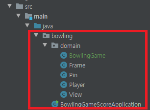

### 객체지향 연습하기 (Java) - 볼링 게임 점수판

---

[지난 포스트](https://pro-dev.tistory.com/50) 에서 볼링 게임 점수판을 구현하기에 앞서 생각해야할 것들을 정리해봤습니다.

이번 포스트에서는 볼링 게임 점수판을 구현하기 위해 어떤 객체들이 있고, 어떤 메시지들이 필요한지 살펴보겠습니다.

다만 주의할 점은 설계는 구현 과정에서 변할 수 있다는 점과

구현 전에 생각해보는 설계에 너무 큰 공을 들이지는 않을 것이라는 점입니다.

---

먼저 볼링 게임 점수판에는 어떤 객체들이 있을지 생각해보겠습니다.

#### 플레이어

첫번째로 볼링 게임을 플레이하는 **플레이어**가 있습니다.

플레이어는 투구를 해서 볼링 핀을 넘어뜨리게 됩니다.

지금 프로젝트는 볼링 게임 프로젝트가 아닌 볼링 게임 점수판 프로젝트이기 때문에

플레이어가 어떤 식으로 투구할지는 생략하겠습니다.

#### 볼링 핀 

두번째로 플레이어가 넘어뜨릴 **볼링 핀**이 있습니다.

플레이어는 투구를 하여 볼링 핀을 넘어뜨립니다.

위에서 말한 것처럼 플레이어가 투구를 한 후 볼링 핀이 넘어지는 과정에 대한 구현은 

생략하겠습니다.

#### 프레임

세번째로는 **프레임** 이 있는데요, 

한 프레임에서 플레이어는 두번의 투구를 할 수 있습니다.

두번의 투구 후 해당 프레임에서의 점수를 볼링 규칙에 따라 계산하게됩니다.

#### 점수판

네번째는 **점수판** 입니다.

간단하게 프레임에서 계산된 플레이어의 점수를 화면에 출력해주게 됩니다.

----

대략적으로 볼링 점수판이라는 시스템 안에 어떤 객체들이 존재하는지 살펴보았습니다.

저는 점수 계산에 대한 책임을 프레임이 수행하게 생각했습니다.

이유는 

* 플레이어는 단순히 투구를 하여 볼링핀을 넘어뜨리면 됩니다.

* 점수판은 화면에 전달된 값을 표현해주는 책임이지, 점수 계산은 다른 부분에서 해야합니다.

또한, 프레임이라는 전체적인 틀 안에서 게임이 진행되기 때문에 점수 계산 또한 

프레임에서 진행하도록 했습니다.

##### 늘 그랬듯이 설계는 구현단계에서 바뀔 수 있습니다.

----

이제 객체 간에 어떤 메시지를 주고 받을지 그림으로 그려보면 다음과 같습니다.


_발그림... 죄송합니다_

1. 플레이어는 투구를 하여 볼링 핀을 넘어뜨립니다.

2. 플레이어가 투구를 하고 나면 프레임에서 볼링 핀의 상태를 체크합니다.

3. 볼링 핀에서 자신의 상태를 프레임에게 전달해 줍니다.

4. 이때 점수를 계산한 뒤 플레이어에게 차례가 끝났는지, 아니면 한번의 투구 기회가 더 있는지 전달해줍니다.

5. 플레이어가 해당 프레임에서 득점한 점수를 점수판에 전달해 점수판에서 출력합니다.

제가 생각한 객체들이 메시지를 주고받는 전반적인 흐름입니다.

---



위의 사진과 같이 프로젝트 폴더 구조를 짰습니다.

**domain** 이라는 패키지 안에 

**Frame, Pin, Player, View 클래스** 가 있습니다.

**BowlingGameScoreApplication**은 볼링 게임 점수판 프로젝트의 시작인 Main클래스입니다.

먼저 플레이어는 **한 프레임에서 두번의 투구를 할 수 있습니다.**

저는 프레임을 통해서 플레이어가 투구를 하고, 핀을 넘어뜨리는 과정을 생각했습니다.

또한 프레임은 매번 핀의 상태를 알아야합니다.

그래서 **프레임과 볼링핀 사이에는 연관관계가 존재합니다.**

지금은 이렇게 연관 관계가 있다는 것만 알아두고, 객체간의 메시지 전달에 집중하겠습니다.

어떠한 객체가 메시지를 수신할 수 있다는 뜻은 그 객체의 인터페이스를 통하여 그 객체에 접근할 수 있다는 뜻입니다.

다시 한번, 강조하지만 구현보다는 메시지들의 송수신을 먼저 생각하는게 더 좋은 객체를 설계할 수 있는 방법입니다.

먼저 **Frame** 객체는 플레이어가 공을 던진다는 메시지를 수신할 수 있어야합니다.

**Frame.java**
```java
public class Frame {
    public void rollingBall() {
        // TODO:
    }
}
```


1. 어떤 객체들이있는지

2. 어떤 관계가 있는지

3. 어떤 메시지를 주고받는지 생각하기.
