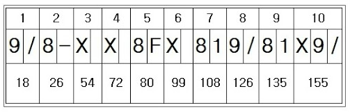
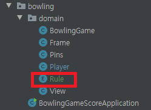

### 객체지향 연습하기 (Java) - 볼링 게임 점수판

---

[지난 포스트](https://pro-dev.tistory.com/51) 에서는 객체간의 메시지들을 생각해보고 객체가 외부에 공개하는 인터페이스를 통해 메시지를 어떻게 수신할지 간단하게 작성해봤습니다.

이번 포스트부터는 기능의 구현을 통해 객체 간의 협력이 어떻게 이루어지는지 살펴보도록 하겠습니다.

비교적 기능이 간단한 클래스들부터 구현하도록 하겠습니다.

---

먼저 **Pin** 클래스를 구현해보도록 하겠습니다.

한 프레임에 볼링 핀은 총 10개가 세워지게됩니다.

플레이어가 공을 투구하여 세워진 10개의 볼링 핀을 맞추게됩니다.

물론 못 맞출수도 있겠죠.

그리고, 각각의 볼링 핀 구현이 아닌 최대 10개까지, 즉 0개 이상의 볼링 핀을 구현하기 때문에

**Pin -> Pins**로 클래스 이름을 변경하겠습니다.

```java
public class Pins {

    private static final int MAX_BOWLING_PIN = 10;

    private int bowlingPins;

    public Pins() {
        this.bowlingPins = MAX_BOWLING_PIN;
    }

    public void rollingBall() {
        int randomNumber = (int)(Math.random() * MAX_BOWLING_PIN + 1);
        hitBowlingPin(randomNumber);
    }

    private void hitBowlingPin(int hitBowlingpinCount) {
        this.bowlingPins -= hitBowlingpinCount;
    }
}
```
여기서 볼링 핀의 상태를 변경하는 메소드를 추가하여 **rollingBall** 메소드에서 호출한 이유는

**볼링 핀의 상태를 변경하는 기능은 철저히 외부로부터 감추기 위해서** 입니다.

객체의 상태를 외부에서 관리하면 객체의 자율성이 떨어지게됩니다.

또, 어디서 객체의 상태가 변경되는지 감지하기 힘들기때문에 유지 보수하기 힘들어질 수도 있습니다.

그래서 변경의 기능을 하는 메소드는 외부에 노출시키지 않도록하겠습니다.

이제 테스트를 해보겠습니다.

```java
public class PinsTests {

    @Test
    public void 볼링핀이_HIT_되는지_테스트() {
        try {
            // given
            Pins pins = new Pins();

            Method method = pins.getClass().getDeclaredMethod("hitBowlingPin", int.class);
            method.setAccessible(true);

            // when
            method.invoke(pins, 3);

            // then
            Field field = pins.getClass().getDeclaredField("bowlingPins");
            field.setAccessible(true);

            int resultPin = (int) field.get(pins);

            assertThat(resultPin, is(7));

        } catch (NoSuchMethodException e) {
            e.printStackTrace();
        } catch (NoSuchFieldException e) {
            e.printStackTrace();
        } catch (InvocationTargetException e) {
            e.printStackTrace();
        } catch (IllegalAccessException e) {
            e.printStackTrace();
        }

    }
}
```

**hitBowlingPin** 메소드에 대한 테스트 코드입니다.

테스트 코드에 대한 설명은 이번 포스트의 주제와는 무관하니 생략하겠습니다.

---

이제 **Player** 클래스를 구현하겠습니다.

플레이어는 게임을 하는 유저입니다.

볼링을 할 때, 플레이어는 투구를 하여 볼링 핀을 맞추어 점수를 획득하는 일에 집중하게 됩니다.

화면에 표시되는 점수가 어떻게 계산이 되는지, 

화면에는 어떻게 표시가 되는지는 플레이어와는 전혀 상관이 없습니다.

대신 한명의 플레이어가 아닌 여러 플레이어가 있을때, 이를 구분지어줄 상태가 필요합니다.

**Player**
```java
public class Player {
    private String name;

    public Player(String name) {
        this.name = name;
    }
}
```

아직까지는 플레이어는 이름만 있으면 될 것 같습니다.

사실 이렇게 간단한 코드도 테스트해야하나 싶지만 테스트 연습을 위해 작성하겠습니다.

```java
public class PlayerTests {

    @Test
    public void 플레이어이름이_잘_생성되는가() {
        try {
            // when
            Player player = new Player("test");

            // then
            Field field =  player.getClass().getDeclaredField("name");
            field.setAccessible(true);

            String playerName = (String)field.get(player);

            assertThat(playerName, is("test"));

        } catch (NoSuchFieldException e) {
            e.printStackTrace();
        } catch (IllegalAccessException e) {
            e.printStackTrace();
        }
    }
}
```
당연한 얘기겠지만 지금까지의 구현 과정에서 객체가 다른 객체에게 값을 요구하는 메시지는 없었습니다.

따라서 **Getter**를 사용하지 않았습니다.

테스트 코드를 편하게 하기위해 메소드를 추가하는 건 주객이 전도되는 것이기 때문에 

객체의 값이 필요하게되면 그때 **Getter**를 추가하겠습니다.

---

다음은 **BowlingGame** 객체를 구현하겠습니다.

**BowlingGame** 은 게임의 중재자 역할이라고 생각하시면 됩니다.

플레이어의 차례가 되면 공을 굴리게하고, 차례가 끝나면 다음 플레이어가 공을 굴리게 합니다.


<!-- 다음은 **View** 를 구현하겠습니다.

이름에서 알 수 있듯 화면에 대한 출력을 담당하는 객체입니다.

View 객체의 입장에서 화면에 출력할 값들이 어떻게 계산되고, 어떻게 저장되었는지는 전혀 상관이 없습니다.

그저 전달받은 값을 원하는 포맷으로 출력하는 책임만 수행하면 됩니다.

구현하기 전 볼링에서는 점수를 어떻게 표현하는지 보겠습니다.



스트라이크, 스페어가 아닌 단순히 핀만 넘어뜨렸을 때는 **숫자**

스트라이크는 **X** 스페어는 **/**

아무것도 못 넘어뜨렸을 때는 **-** 

이렇게 표현하게됩니다.

이 부분은 출력 객체가 담당하기보다는 **enum**을 만들어 관리하는게 좀 더 나아보입니다.

**enum**을 먼저 구현한 뒤 View를 구현하겠습니다.



**Rule** Enum을 추가하겠습니다. 

**View** -->


