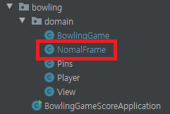
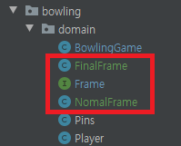

### 객체지향 연습하기 (Java) - 볼링 게임 점수판

---

[지난 포스트](https://pro-dev.tistory.com/51) 에서는 객체간의 메시지들을 생각해보고 객체가 외부에 공개하는 인터페이스를 통해 메시지를 어떻게 수신할지 간단하게 작성해봤습니다.

이번 포스트부터는 기능의 구현을 통해 객체 간의 협력이 어떻게 이루어지는지 살펴보도록 하겠습니다.

---

먼저 **Pin** 클래스를 구현해보도록 하겠습니다.

한 프레임에 볼링 핀은 총 10개가 세워지게됩니다.

플레이어가 공을 투구하여 세워진 10개의 볼링 핀을 맞추게됩니다.

물론 못 맞출수도 있겠죠.

그리고, 각각의 볼링 핀 구현이 아닌 최대 10개까지, 즉 0개 이상의 볼링 핀을 구현하기 때문에

**Pin -> Pins**로 클래스 이름을 변경하겠습니다.

```java
public class Pins {

    private static final int MAX_BOWLING_PIN = 10;

    private int bowlingPins;

    public Pins() {
        this.bowlingPins = MAX_BOWLING_PIN;
    }

    public void rollingBall() {
        int randomNumber = (int)(Math.random() * MAX_BOWLING_PIN + 1);
        hitBowlingPin(randomNumber);
    }

    private void hitBowlingPin(int hitBowlingpinCount) {
        this.bowlingPins -= hitBowlingpinCount;
    }
}
```
여기서 볼링 핀의 상태를 변경하는 메소드를 추가하여 **rollingBall** 메소드에서 호출한 이유는

**볼링 핀의 상태를 변경하는 기능은 철저히 외부로부터 감추기 위해서** 입니다.

객체의 상태를 외부에서 관리하면 객체의 자율성이 떨어지게됩니다.

또, 어디서 객체의 상태가 변경되는지 감지하기 힘들기때문에 유지 보수하기 힘들어질 수도 있습니다.

그래서 변경의 기능을 하는 메소드는 외부에 노출시키지 않도록하겠습니다.

이제 테스트를 해보겠습니다.

```java
public class PinsTests {

    @Test
    public void 볼링핀이_HIT_되는지_테스트() {
        try {
            // given
            Pins pins = new Pins();

            Method method = pins.getClass().getDeclaredMethod("hitBowlingPin", int.class);
            method.setAccessible(true);

            // when
            method.invoke(pins, 3);

            // then
            Field field = pins.getClass().getDeclaredField("bowlingPins");
            field.setAccessible(true);

            int resultPin = (int) field.get(pins);

            assertThat(resultPin, is(7));

        } catch (NoSuchMethodException e) {
            e.printStackTrace();
        } catch (NoSuchFieldException e) {
            e.printStackTrace();
        } catch (InvocationTargetException e) {
            e.printStackTrace();
        } catch (IllegalAccessException e) {
            e.printStackTrace();
        }

    }
}
```

**hitBowlingPin** 메소드에 대한 테스트 코드입니다.

테스트 코드에 대한 설명은 이번 포스트의 주제와는 무관하니 생략하겠습니다.

---

이제 **Player** 클래스를 구현하겠습니다.

플레이어는 게임을 하는 유저입니다.

볼링을 할 때, 플레이어는 투구를 하여 볼링 핀을 맞추어 점수를 획득하는 일에 집중하게 됩니다.

화면에 표시되는 점수가 어떻게 계산이 되는지, 

화면에는 어떻게 표시가 되는지는 플레이어와는 전혀 상관이 없습니다.

대신 한명의 플레이어가 아닌 여러 플레이어가 있을때, 이를 구분지어줄 상태가 필요합니다.

**Player**
```java
public class Player {
    private String name;

    public Player(String name) {
        this.name = name;
    }
}
```

아직까지는 플레이어는 이름만 있으면 될 것 같습니다.

사실 이렇게 간단한 코드도 테스트해야하나 싶지만 테스트 연습을 위해 작성하겠습니다.

```java
public class PlayerTests {

    @Test
    public void 플레이어이름이_잘_생성되는가() {
        try {
            // when
            Player player = new Player("test");

            // then
            Field field =  player.getClass().getDeclaredField("name");
            field.setAccessible(true);

            String playerName = (String)field.get(player);

            assertThat(playerName, is("test"));

        } catch (NoSuchFieldException e) {
            e.printStackTrace();
        } catch (IllegalAccessException e) {
            e.printStackTrace();
        }
    }
}
```
당연한 얘기겠지만 지금까지의 구현 과정에서 객체가 다른 객체에게 값을 요구하는 메시지는 없었습니다.

따라서 **Getter**를 사용하지 않았습니다.

테스트 코드를 편하게 하기위해 메소드를 추가하는 건 주객이 전도되는 것이기 때문에 

객체의 값이 필요하게되면 그때 **Getter**를 추가하겠습니다.

---

다음은 **Frame** 객체를 구현하겠습니다.

프레임은 총 10회, 각 프레임마다 2번의 투구 기회가 있습니다.

다만 플레이어가 스트라이크를 획득 했을 때는 해당 프레임의 투구 기회는 끝나고,

다음 프레임의 점수에 따라서 추가 점수를 획득하게 됩니다.

**게임의 마지막 프레임은 총 3번의 투구 기회를 가지게 됩니다.**

```java
public class Frame {
    private static final int TOTAL_FRAME = 9;
    private static final int NOMAL_FRAME = 2;
    private static final int FINAL_FRAME = 3;
    private static final int TOTAL_PIN = 10;

    private int turn;

    public Frame(int frameNumber) {
        if (frameNumber == TOTAL_FRAME) {
            turn = FINAL_FRAME;
            return;
        }
        turn = NOMAL_FRAME;
    }

    public void calculateScore(int pinCount) {
        if (pinCount == TOTAL_PIN) {
            turn -= 2;
        }
        turn--;
    }

    public boolean hasTurn() {
        return turn > 0;
    }
}
```
마지막 프레임일때는 총 3번의 투구 기회를 가질 수 있도록 구현했습니다.

이제 테스트 코드를 작성해 보겠습니다.

```java
public class FrameTests {
    private Frame nomalFrame;
    private Frame finalFrame;

    @Before
    public void setUp() {
        nomalFrame = new Frame(0);
        finalFrame = new Frame(9);
    }

    @Test
    public void 점수계산후_턴이_줄어드는가() {
        //when
        nomalFrame.calculateScore(0);

        //then
        assertThat(nomalFrame.hasTurn(), is(true));
    }

    @Test
    public void 마지막프레임은_턴이_3번투구할수있는가() {
        finalFrame.calculateScore(0);
        finalFrame.calculateScore(0);
        
        assertThat(finalFrame.hasTurn(), is(true));
        
        finalFrame.calculateScore(0);

        assertThat(finalFrame.hasTurn(), is(false));
    }
}
```
---

이제 점수를 계산하기 위한 로직을 구현하겠습니다.

점수를 계산하기 위해서는 해당 프레임에서의 첫번째 투구, 두번째 투구에 대한 점수가 필요합니다.

**firstShot, secondShot** 변수를 추가하고 생성자에서 초기화 하겠습니다.

또, 해당 프레임에서 획득한 점수가 **STRIKE** 인지, **SPAIRE** 인지 등등을 확인해야합니다.

**state** 변수도 같이 추가하겠습니다.

```java
public class Frame {
    private static final int TOTAL_FRAME = 9;
    private static final int NOMAL_FRAME = 2;
    private static final int FINAL_FRAME = 3;
    private static final int TOTAL_PIN = 10;

    private int turn;
    private int firstShot;
    private int secondShot;
    private String state;

    public Frame(int frameNumber) {
        firstShot = 0;
        secondShot = 0;
        state = "NOMAL";
        if (frameNumber == TOTAL_FRAME) {
            turn = FINAL_FRAME;
            return;
        }
        turn = NOMAL_FRAME;
    }

    public void calculateScore(int pinCount) {
        if (hasTurn()) {
            firstShot = pinCount;
        }

        if (!hasTurn()) {
            secondShot = pinCount;
        }

        if (pinCount == TOTAL_PIN) {
            turn -= 2;
            return;
        }

        turn--;
    }

    public boolean hasTurn() {
        return turn > 0;
    }
}
```

현재 위의 코드는 굉장히 지저분합니다. 

if문이 많이 사용되고있고, 코드도 알아보기 힘듭니다.

추후에 리팩토링을 진행할 때 수정하도록 하고, 지금은 일단 점수 계산에 대한 로직 구현에 집중하겠습니다.

구현을 하려고보니 **STRIKE, SPAIRE** 는 다음 프레임의 점수를 보고 현재 프레임의 점수가 측정됩니다.

과연 **현재 프레임이 다음 프레임, 그리고 이전 프레임까지 알아야할까?** 라는 의문이 들었습니다.

그래서 다른 객체에게 점수 계산에 대한 책임을 위임하도록 하겠습니다.

다른 객체를 생성하기 전에 **Frame** 클래스를 마저 구현하도록 하겠습니다.

```java
   public Frame(int frameNumber) {
        firstShot = 0;
        secondShot = 0;
        state = "NOMAL";
        if (frameNumber == TOTAL_FRAME) {
            turn = FINAL_FRAME;
            return;
        }
        turn = NOMAL_FRAME;
    }

    public void calculateScore(int pinCount) {
        if (hasTurn()) {
            firstShot = pinCount;
        }

        if (!hasTurn()) {
            secondShot = pinCount;
        }

        if (pinCount == TOTAL_PIN) {
            turn -= 2;
            return;
        }

        turn--;
    }
```

**Frame** 클래스의 생성자와 메서드를 보면 상당히 지저분합니다.

if문이 많이 나오고, 생성자 역시 길어져서 코드를 보기 상당히 불편합니다.

리팩토링 해보겠습니다.

```java
public class Frame {
    private static final int TOTAL_FRAME = 9;
    private static final int NOMAL_FRAME = 2;
    private static final int FINAL_FRAME = 3;
    private static final int TOTAL_PIN = 10;

    private int turn;
    private int firstShot;
    private int secondShot;
    private String state;

    public Frame(int frameNumber) {
        firstShot = 0;
        secondShot = 0;
        state = "NOMAL";
        setFrameState(frameNumber);
    }

    private void setFrameState(int frameNumber) {
        if (frameNumber == TOTAL_FRAME) {
            turn = FINAL_FRAME;
            return;
        }
        turn = NOMAL_FRAME;
    }

    public void calculateScore(int pinCount) {
        setShot(pinCount);
        setTurn(pinCount);
    }

    private void setShot(int pinCount) {
        if (hasTurn()) {
            firstShot = pinCount;
            return;
        }
        secondShot = pinCount;
    }

    private void setTurn(int pinCount) {
        if (pinCount == TOTAL_PIN) {
            turn -= 2;
            return;
        }
        turn--;
    }

    public boolean hasTurn() {
        return turn > 0;
    }
}
```
추가로 마지막 프레임일 때의 동작도 같이 추가해야합니다.

하지만 여기서 문제가 발생합니다. 프레임의 상태에 따라 다르게 상태를 가지려하다보니 

제가 작성한 로직에서는 구현이 난잡해질 것 같습니다.

그렇다고 마지막 프레임에 대한 객체를 구현하려고하니 기존의 Frame과 **책임도 같고, 겹치는 로직도 많습니다.**

그래서 자바의 인터페이스를 사용하여 Frame을 추상화하여 사용하겠습니다.



기존에 있은 **Frame** 클래스의 이름을 **NomalFrame** 으로 변경하겠습니다.




**Frame 인터페이스** 와 **FinalFrame 클래스** 를 추가합니다.

---

포스트가 길어질 것 같아 **Frame**에 대한 구현은 다음 포스트에서 이어서 하도록 하겠습니다.

처음 객체지향에 대해 공부를 하는 중이다 보니 부족한 점이 많습니다.

아쉬운 부분이나 수정해야할 부분 등 피드백 주시면 반영하도록 하겠습니다!


