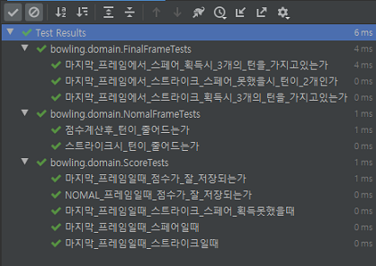

### 객체지향 연습하기 (Java) - 볼링 게임 점수판

---

[지난 포스트](https://pro-dev.tistory.com/51) 에 이어서 Frame 클래스를 인터페이스를 이용하여 추상화 시키는 작업을 진행하겠습니다.

---

**Frame Interface**

```java
public interface Frame {

    boolean hasTurn();

    void deductTurn();
}
```

프레임은 공통적으로 투구의 횟수가 남았는지와 투구 후에 턴을 계산하는 메세지를 수신할 수 있습니다.

**NomalFrame**

```java
public class NomalFrame implements Frame {
    private static final int NOMAL_FRAME = 2;
    private static final int TOTAL_PIN = 10;

    private int turn;
    private int firstShot;
    private int secondShot;

    public NomalFrame(int frameNumber) {
        firstShot = 0;
        secondShot = 0;
        turn = NOMAL_FRAME;
    }

    @Override
    public boolean hasTurn() {
        return turn > 0;
    }

    @Override
    public void playBawling(int pinCount) {
        setScore(pinCount);
        setTurn();
    }

    private void setScore(int pinCount) {
        if (!hasTurn()) {
            secondShot = pinCount;
            return;
        }
        firstShot = pinCount;
    }

    private void setTurn() {
        if (firstShot == TOTAL_PIN) {
            turn -= 2;
            return;
        }
        turn--;
    }
}
```

**FinalFrame**

```java
public class FinalFrame implements Frame {
    private static final int FINAL_FRAME = 3;

    private static final int SECOND_SHOT = 2;
    private static final int FINAL_SHOT = 1;

    private int turn;
    private int firstShot;
    private int secondShot;
    private int finalShot;

    public FinalFrame() {
        turn = FINAL_FRAME;
        firstShot = 0;
        secondShot = 0;
        firstShot = 0;
    }

    @Override
    public boolean hasTurn() {
        return turn > 0;
    }

    @Override
    public void playBawling(int pinCount) {
        setScore(pinCount);
        setTurn();
    }

    private void setScore(int pinCount) {
        switch (turn) {
            case SECOND_SHOT:
                secondShot = pinCount;
                break;
            case FINAL_SHOT:
                finalShot = pinCount;
                break;
            default:
                firstShot = pinCount;
        }
    }

    private void setTurn() {
        turn--;
    }
}
```

위처럼 Frame 객체를 구현했습니다.

투구시마다 해당 차례에 대한 점수를 저장하는 방식으로 구현했습니다.

첫번째 투구시에 firstShot에 점수를 저장하고,

두번째 투구시에 secondShot에 점수를 저장하는 방식입니다.

이렇게 한 이유는 스트라이크나 스페어시에 해당 프레임의 점수는 다음 프레임의 점수와 합산하기 때문입니다.

점수 계산을 하려고보니 Frame 객체에서 맡은 책임이 많아지는 것 같습니다.

게다가

```java
    // FinalFrame의 인스턴스 변수
    private int turn;
    private int firstShot;
    private int secondShot;
    private int finalShot;
```

이렇게 객체 내부의 상태가 많아지게 되어 클래스의 응집도가 낮아지게 됩니다.

여기서 응집도란 해당 기능을 수행하기 위해 연관된 책임과 아이디어가 얼만큼 뭉쳐있는지에 대한 정도입니다.

현재 Frame에는 투구 횟수와 관련된 책임만 가지고,

점수 저장에 대한 객체를 따로 만들어 점수 관리에 대한 책임을 위임하겠습니다.

대신, **해당 프레임에서 획득한 점수** 이기 때문에 Frame과 연관 관계를 맺도록 하겠습니다.

**Score**

```java
public class Score {
    private static final int FINAL_FRAME = 3;

    private static final int NOMAL_FRAME_FIRST_TURN = 2;

    private static final int FINAL_FRAME_FIRST_TURN = 3;
    private static final int FINAL_FRAME_SECOND_TURN = 2;

    private int firstShot;
    private int secondShot;
    private int finalShot;

    public Score(int frameState) {
        firstShot = 0;
        secondShot = 0;
        finalShot = frameState == FINAL_FRAME ? 0 : -1;
    }

    public void setScore(int pinCount, int turn) {
       if (finalShot != -1) {
           finalFrameSetScroe(pinCount, turn);
           return;
       }
       nomalFrameSetScore(pinCount, turn);
    }

    public int getTotalScore() {
        return firstShot + secondShot + firstShot;
    }

    public boolean hasFinalTurn() {
        return firstShot + secondShot >= 10;
    }

    private void finalFrameSetScroe(int pinCount, int turn) {
        switch (turn) {
            case FINAL_FRAME_FIRST_TURN:
                firstShot = pinCount;
                break;
            case FINAL_FRAME_SECOND_TURN:
                secondShot = pinCount;
                break;
            default:
                finalShot = pinCount;
                break;
        }
    }

    private void nomalFrameSetScore(int pinCount, int turn) {
        switch (turn) {
            case NOMAL_FRAME_FIRST_TURN:
                firstShot = pinCount;
                break;
            default:
                secondShot = pinCount;
                break;
        }
    }
}
```

**NomalFrame**

```java
public class NomalFrame implements Frame {
    private static final int NOMAL_FRAME = 2;
    private static final int TOTAL_PIN = 10;

    private int turn;
    private Score score;

    public NomalFrame() {
        turn = NOMAL_FRAME;
        score = new Score(turn);
    }

    @Override
    public boolean hasTurn() {
        return turn > 0;
    }

    @Override
    public void playBawling(int pinCount) {
        setScore(pinCount);
        setTurn(pinCount);
    }

    private void setScore(int pinCount) {
        score.setScore(pinCount, turn);
    }

    private void setTurn(int pinCount) {
        if (pinCount == TOTAL_PIN) {
            turn -= 2;
            return;
        }
        turn--;
    }
}
```

**FinalFrame**

```java
public class FinalFrame implements Frame {
    private static final int FINAL_FRAME = 3;
    private static final int SECOND_TURN = 2;

    private int turn;
    private Score score;

    public FinalFrame() {
        turn = FINAL_FRAME;
        score = new Score(turn);
    }

    @Override
    public boolean hasTurn() {
        return turn > 0;
    }

    @Override
    public void playBawling(int pinCount) {
        setScore(pinCount);
        setTurn();
    }

    private void setScore(int pinCount) {
        score.setScore(pinCount, turn);
    }

    private void setTurn() {
        if (turn == SECOND_TURN && !score.hasFinalTurn()) {
            turn -= 2;
        }
        turn--;
    }
}
```

---

위와 같이 **Frame 객체와 Score 객체** 를 만들었습니다.

이제 테스트 코드를 작성해 보겠습니다.

**NomalFrameTests** 

```java
public class NomalFrameTests {
    private Frame nomalFrame;

    @Before
    public void setUp() {
        nomalFrame = new NomalFrame();
    }

    @Test
    public void 점수계산후_턴이_줄어드는가() {
        //when
        nomalFrame.playBawling(0);

        //then
        assertThat(nomalFrame.hasTurn(), is(true));
    }

    @Test
    public void 스트라이크시_턴이_줄어드는가() {
         nomalFrame.playBawling(10);

        assertThat(nomalFrame.hasTurn(), is(false));
    }
}
```

**FinalFrameTests**

```java
public class FinalFrameTests {
    private Frame finalFrame;

    @Before
    public void setUp() {
        finalFrame = new FinalFrame();
    }

    @Test
    public void 마지막_프레임에서_스페어_획득시_3개의_턴을_가지고있는가() {
        finalFrame.playBawling(2);
        finalFrame.playBawling(8);

        assertThat(finalFrame.hasTurn(), is(true));
    }

    @Test
    public void 마지막_프레임에서_스트라이크_획득시_3개의_턴을_가지고있는가() {
        finalFrame.playBawling(10);

        assertThat(finalFrame.hasTurn(), is(true));

        finalFrame.playBawling(2);

        assertThat(finalFrame.hasTurn(), is(true));

        finalFrame.playBawling(2);

        assertThat(finalFrame.hasTurn(), is(false));
    }

    @Test
    public void 마지막_프레임에서_스트라이크_스페어_못했을시_턴이_2개인가() {
        finalFrame.playBawling(2);

        assertThat(finalFrame.hasTurn(), is(true));

        finalFrame.playBawling(2);

        assertThat(finalFrame.hasTurn(), is(false));
    }
}
```

**ScoreTests**

```java
public class ScoreTests {
    private Score nomalFrameScore;
    private Score finalFrameScore;

    @Before
    public void setUp() {
        finalFrameScore = new Score(3);
        nomalFrameScore = new Score(2);
    }

    @Test
    public void 마지막_프레임일때_점수가_잘_저장되는가() throws NoSuchFieldException, IllegalAccessException {
        finalFrameScore.setScore(4, 3);
        finalFrameScore.setScore(5, 2);
        finalFrameScore.setScore(6, 1);

        Field firstShot = finalFrameScore.getClass().getDeclaredField("firstShot");
        Field secondShot = finalFrameScore.getClass().getDeclaredField("secondShot");
        Field finalShot = finalFrameScore.getClass().getDeclaredField("finalShot");

        firstShot.setAccessible(true);
        secondShot.setAccessible(true);
        finalShot.setAccessible(true);

        int resultFirst = (int) firstShot.get(finalFrameScore);
        int resultSecond = (int) secondShot.get(finalFrameScore);
        int resultFinal = (int) finalShot.get(finalFrameScore);

        assertThat(resultFirst, is(4));
        assertThat(resultSecond, is(5));
        assertThat(resultFinal, is(6));
    }

    @Test
    public void 마지막_프레임일때_스트라이크_스페어_획득못했을때() {
        finalFrameScore.setScore(4, 3);
        finalFrameScore.setScore(5, 2);


        assertThat(finalFrameScore.hasFinalTurn(), is(false));
    }

    @Test
    public void 마지막_프레임일때_스트라이크일때() {
        finalFrameScore.setScore(10, 3);

        assertThat(finalFrameScore.hasFinalTurn(), is(true));
    }

    @Test
    public void 마지막_프레임일때_스페어일때() {
        finalFrameScore.setScore(8, 3);

        assertThat(finalFrameScore.hasFinalTurn(), is(false));

        finalFrameScore.setScore(2, 2);

        assertThat(finalFrameScore.hasFinalTurn(), is(true));
    }

    @Test
    public void NOMAL_프레임일때_점수가_잘_저장되는가() throws NoSuchFieldException, IllegalAccessException {
        nomalFrameScore.setScore(5, 2);
        nomalFrameScore.setScore(6, 1);

        Field firstShot = nomalFrameScore.getClass().getDeclaredField("firstShot");
        Field secondShot = nomalFrameScore.getClass().getDeclaredField("secondShot");

        firstShot.setAccessible(true);
        secondShot.setAccessible(true);

        int resultFirst = (int) firstShot.get(nomalFrameScore);
        int resultSecond = (int) secondShot.get(nomalFrameScore);

        assertThat(resultFirst, is(5));
        assertThat(resultSecond, is(6));
    }
}
```

---



테스트가 전부 통과하는 걸 확인할 수 있습니다.

다음 포스트에서 계속 진행하도록 하겠습니다.