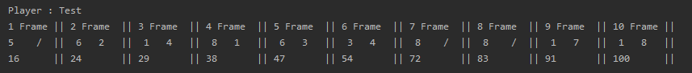

### 객체지향 연습하기 (Java) - 볼링 게임 점수판

---

[지난 포스트](https://pro-dev.tistory.com/53) 에 이어서 점수 계산과 화면 출력에 대해 구현해보겠습니다.

자세한 코드는 [깃 허브](https://github.com/dlwnsgus777/java-oop) 에 저장되어 있습니다.

---

이제 본격적으로 점수 계산 기능을 구현하겠습니다.

10개의 Frame이 자신의 점수를 가지고 있고, 점수에 따른 Frame의 상태

즉, **STRIKE, SPAIRE** 인지 아니면 단순히 **평범하게 점수를 획득한 Frame**인지에 대한 값을 가지게 됩니다.

먼저 **Score** 객체를 수정하겠습니다.

```java
    private int firstShot;
    private int secondShot;
    private int finalShot;
```

기존의 Score 객체가 가지는 상태 값입니다.

int 형 변수를 3개 사용하고 있습니다.

이 3개의 변수는 **점수**라는 하나의 공통된 의미가 있습니다.

이 3개의 변수를 배열로 만들어 하나의 변수로 만들겠습니다.

그리고 추가로 **STATE** 라는 변수를 만들어 현재 FRAME이 획득한 점수가 어떤 것인지

저장하겠습니다.

**Score**

```java
package bowling.domain;

import java.util.Arrays;

public class Score {
    private static final int FIRST_SHOT = 0;
    private static final int SECOND_SHOT = 1;
    private static final int FINAL_SHOT = 2;

    private static final int FINAL_FRAME = 3;
    private static final int NOMAL_FRAME = 2;

    private static final int NOMAL_FRAME_FIRST_TURN = 2;

    private static final int FINAL_FRAME_FIRST_TURN = 3;
    private static final int FINAL_FRAME_SECOND_TURN = 2;

    private int[] shotScores;
    private String state;

    public Score(int frameState) {
        if (frameState == FINAL_FRAME) {
            shotScores = new int[FINAL_FRAME];
        }
        shotScores = new int[NOMAL_FRAME];
        state = "NOMAL";
    }

    public String getState() {
        return state;
    }

    public int[] getShotScore() {
        return shotScores;
    }

    public void setScore(int pinCount, int turn) {
       if (shotScores.length == FINAL_FRAME) {
           finalFrameSetScroe(pinCount, turn);
           return;
       }
       nomalFrameSetScore(pinCount, turn);
    }

    public int getTotalScore() {
        return Arrays.stream(shotScores).sum();
    }

    public boolean hasFinalTurn() {
        return shotScores[FIRST_SHOT] + shotScores[SECOND_SHOT] >= 10;
    }

    private void finalFrameSetScroe(int pinCount, int turn) {
        switch (turn) {
            case FINAL_FRAME_FIRST_TURN:
                shotScores[FIRST_SHOT] = pinCount;
                break;
            case FINAL_FRAME_SECOND_TURN:
                shotScores[SECOND_SHOT] = pinCount;
                break;
            default:
                shotScores[FINAL_SHOT] = pinCount;
                break;
        }
    }

    private void nomalFrameSetScore(int pinCount, int turn) {
        switch (turn) {
            case NOMAL_FRAME_FIRST_TURN:
                shotScores[FIRST_SHOT] = pinCount;
                break;
            default:
                shotScores[SECOND_SHOT] = pinCount;
                break;
        }
    }

    public void calculateState() {
        if (shotScores[FIRST_SHOT] == 10) {
           state = "STRIKE";
            return;
        }

        if (shotScores[FIRST_SHOT] + shotScores[SECOND_SHOT] == 10) {
            state = "SPAIRE";
            return;
        }
    }
}
```

---

이제 Frame 객체를 수정하겠습니다.

Frame 객체는 현재 자신이 몇번째 Frame인지에 대한 변수와

Score 객체에게 메시지 요청을 하기위한 인터페이스를 추가하겠습니다.

**Frame Interface**

```java
package bowling.domain;

public interface Frame {

    boolean hasTurn();

    void playBawling(int pinCount);

    int[] getScore();

    int getTotalScore();

    int getFrameNumber();

    String getState();
}
```

이제 **Frame Interface**를 구현한 객체인 **NomalFrame, FinalFrame** 객체를 수정하겠습니다.

**NomalFrame**

```java
public class NomalFrame implements Frame {
    private static final int NOMAL_FRAME = 2;
    private static final int TOTAL_PIN = 10;

    private int turn;
    private Score score;
    private int frameNumber;

    public NomalFrame(int frameNumber) {
        this.frameNumber = frameNumber;
        turn = NOMAL_FRAME;
        score = new Score(turn);
    }

    @Override
    public int[] getScore() {
        return score.getShotScore();
    }

    @Override
    public int getTotalScore() {
        return score.getTotalScore();
    }

    @Override
    public int getFrameNumber() {
        return frameNumber;
    }

    @Override
    public String getState() {
        return score.getState();
    }

    @Override
    public boolean hasTurn() {
        return turn > 0;
    }

    @Override
    public void playBawling(int pinCount) {
        setScore(pinCount);
        setTurn(pinCount);
    }

    private void setScore(int pinCount) {
        score.setScore(pinCount, turn);
    }

    private void setTurn(int pinCount) {
        score.calculateState();
        if (pinCount == TOTAL_PIN) {
            turn -= 2;
            return;
        }
        turn--;
    }
}
```

**Final Frame**

```java
public class FinalFrame implements Frame {
    private static final int FINAL_FRAME = 3;
    private static final int SECOND_TURN = 2;

    private int turn;
    private Score score;
    private int frameNumber;

    public FinalFrame(int frameNumber) {
        this.frameNumber = frameNumber;
        turn = FINAL_FRAME;
        score = new Score(turn);
    }

    @Override
    public int[] getScore() {
        return score.getShotScore();
    }

    @Override
    public int getTotalScore() {
        return score.getTotalScore();
    }

    @Override
    public int getFrameNumber() {
        return frameNumber;
    }

    @Override
    public String getState() {
        return score.getState();
    }

    @Override
    public boolean hasTurn() {
        return turn > 0;
    }

    @Override
    public void playBawling(int pinCount) {
        setScore(pinCount);
        setTurn();
    }

    private void setScore(int pinCount) {
        score.setScore(pinCount, turn);
    }

    private void setTurn() {
        if (turn == SECOND_TURN && !score.hasFinalTurn()) {
            turn -= 2;
        }
        turn--;
    }
}
```

---

Frame을 구현했으니 볼링 게임을 관리할 **BowlingGame** 객체를 만들겠습니다.

 **BowlingGame 객체**  는 볼링 게임을 진행시키고, 볼링 게임이 종료되었으면 

 View객체에게 점수를 출력하게 메시지를 전송하는 역할을 하게됩니다.

 **BowlingGame**
 
 ```java

public class BowlingGame {
    private static final int FINAL_FRAME = 10;

    private Player player;
    private List<Frame> frames;
    private View view;

    public BowlingGame(Player player) {
        this.player = player;
        view = new View();
        frames = new ArrayList<>();
        setFrames();
    }

    public void startGame() {
        for (Frame frame: frames) {
            playGame(frame);
        }
        view.showBowlingGame(frames, player);
    }

    private void playGame(Frame frame) {
        Pins pin = new Pins();
        while(frame.hasTurn()) {
            int pinCount = pin.rollingBall();
            frame.playBawling(pinCount);
        }
        pin.resetPin();
    }

    private void setFrames() {
        for (int i = 1; i <= FINAL_FRAME; i++) {
            if (i == FINAL_FRAME) {
                frames.add(new FinalFrame(i));
                return;
            }
            frames.add(new NomalFrame(i));
        }
    }
}
 ```

 이제 게임이 진행되었으니 화면에 출력할 **View** 객체를 구현하겠습니다.

 ---

**View 객체** 는 Frame에 저장되어있는 점수들을 화면에 출력해주는 책임을 맡은 객체입니다.

점수를 화면에 출력할 때 획득한 점수에 따라서 **STRIKE, SPAIRE, GUTTER** 에 맞게 변환하여 

출력하게됩니다.

**View**

```java
public class View {
    private static final String STRIKE = "X";
    private static final String SPAIRE = " / ";
    private static final String GUTTER = " - ";

    private static final int FINAL_FRAME = 10;

    private String round;
    private String score;
    private String totalScore;
    private ResultScore resultScore;

    public View() {
        round = "";
        score = "";
        totalScore = "";
        resultScore = new ResultScore();
    }


    public void showBowlingGame(List<Frame> frames, Player player) {
        for(int i = 0; i < frames.size(); i++) {
            Frame frame = frames.get(i);
            setRound(frame.getFrameNumber());
            resultScore.calculateTotalScore(frame.getScore());
            if (frame.getState() != "NOMAL") {
                resultScore.calculateScoreWithNextFrame(frame.getState(), frames.get(i + 1));
            }

            setScore(frame.getScore(), frame.getState());
            setTotalScore(resultScore.getTotalScore());
        }

        System.out.println("Player : " + player.getName());
        System.out.println(round);
        System.out.println(score);
        System.out.println(totalScore);
    }

    private void setScore(int[] scores, String state) {
        for(int i = 0; i < scores.length; i++) {
            String convertScore = String.valueOf(scores[i]);

            if (scores[i] == 0) {
                convertScore = GUTTER;
            }
            if (state.equals("STRIKE") && i == 0) {
                convertScore = STRIKE;
            }

            if (state.equals("SPAIRE") && i == scores.length - 1) {
                convertScore = SPAIRE;
            }
            score += convertScore + "\t";
        }
        score += "||\t";
    }

    private void setTotalScore(int totalScore) {

        this.totalScore += totalScore + "\t\t|| ";
    }

    private void setRound(int frameNumber) {
        String thisRound =  frameNumber + " Frame\t|| ";;

        round += thisRound;
        round.trim();
    }
}
```
---

이제 Main클래스에서 실행을 시켜보겠습니다.

**BowlingGameScoreApplication.java**

```java
public class BowlingGameScoreApplication {
    public static void main(String[] args) {
       Player player = new Player("Test");
        BowlingGame bowlingGame = new BowlingGame(player);
        bowlingGame.startGame();
    }
}
```



---

최근 이것 저것 일이 생겨 완성하는데 생각보다 시간이 오래걸렸습니다...ㅎ

이렇게 객체지향 연습프로젝트로 볼링 점수판 구현을 완료했습니다.

수정할 부분 투성이고, 미흡한 점이 많은 점 양해 부탁드립니다.

이번 연습 프로젝트를 하면서 느꼈던 점은

**너무 설계에 대해서만 생각한 나머지 기능 구현이 더뎠다** 입니다.

좋은 설계를 해야한다는 생각에 치우쳐 기능 구현에 속도가 나지않았고,

잔고 끝에 악수를 둔다고 설계 또한 그렇게 깔끔하지 못한 것 같습니다.

좀 더 간단하게 코드를 쓸수있고, 좀 더 좋은 설계를 위한 공부가 필요함을 느꼈습니다.

부족한 부분, 아쉬운 부분 댓글 달아주시면 감사하겠습니다!


