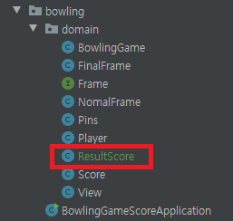

### 객체지향 연습하기 (Java) - 볼링 게임 점수판

---

[지난 포스트](https://pro-dev.tistory.com/53) 에 이어서 점수 계산과 화면 출력에 대해 구현해보겠습니다.

자세한 코드는 [깃 허브](https://github.com/dlwnsgus777/java-oop) 에 저장되어 있습니다.

---

점수 계산에 대한 책임이 있는 객체를 구현해보겠습니다.

점수 계산은 Frame이 끝날때 이루어집니다.

만약 점수 계산을 했을 때, 스트라이크나 스페어가 나올 시에는 다음 Frame이 필요하게됩니다.

먼저 점수를 계산하는 객체가 획득한 점수를 계산할 수 있도록

**Frame** 객체에서 획득한 점수를 알려달라는 메시지를 수신할 수 있도록 하겠습니다.

**Frame** 인터페이스를 수정하고 해당 메서드를 구현하겠습니다.

```java
public interface Frame {

    boolean hasTurn();

    void playBawling(int pinCount);

    Score getScore();
}
```

**NomalFrame, FinalFrame** 객체에 아래와 같이 인터페이스에 추가한 메소드를 구현하겠습니다.

```java
    @Override
    public Score getScore() {
        return score;
    }
```

이제 점수 계산을 위한 객체를 생성하겠습니다.



**ResultScore** 클래스를 생성합니다.

**ResultScore**

```java

```
