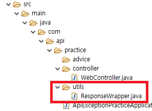

### 스프링부트 JSON 응답처리와 예외처리

---

저번 **[게시판 프로젝트를 하면서 느낀 부족한 점](https://pro-dev.tistory.com/44)** 중에서 

* 예외처리 미흡

* JSON Return 시에 공통된 포맷으로 리턴하지 못한점

이 있었습니다.

이 두문제에 대해 포스팅 해보겠습니다.

혹시 틀렸거나, 더 좋은 방법이 있다면 댓글 부탁드리겠습니다!

---

#### 공통된 포맷으로 JSON 리턴하기.

요청에 대한 응답을 할 때, 요청마다 JSON 응답의 포맷이 달랐기때문에

클라이언트에서 요청마다 다른 처리를 했습니다.

Return되는 JSON의 포맷이 통일되어있다면 api호출시 

error처리에 대한 부분도 통일되게 할 수 있을 것 같습니다.


우선 return 하게될 JSON 포맷은

```json
{
    data: {
        // 해당 요청의 결과가 들어가게 됩니다.
    }
    errors: {} // 오류가 있다면 오류의 내용이 들어가게됩니다.
}
```
입니다.

##### 프로젝트 생성과 폴더 구조는 생략하겠습니다.



먼저 **utils**라는 패키지 안에 

공통적으로 처리할 JSON포맷에 대한 클래스를 생성합니다.

저는 **ResponseWrapper**라고 이름 짓겠습니다.

```java
```


https://imasoftwareengineer.tistory.com/35

https://jeong-pro.tistory.com/195

https://www.slipp.net/questions/349