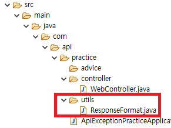
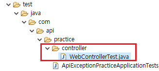

### 스프링부트 JSON 응답처리와 예외처리

---

저번 **[게시판 프로젝트를 하면서 느낀 부족한 점](https://pro-dev.tistory.com/44)** 중에서

- 예외처리 미흡

- JSON Return 시에 공통된 포맷으로 리턴하지 못한점

이 있었습니다.

이 두문제에 대해 포스팅 해보겠습니다.

혹시 틀렸거나, 더 좋은 방법이 있다면 댓글 부탁드리겠습니다!

---

#### 공통된 포맷으로 JSON 리턴하기.

요청에 대한 응답을 할 때, 요청마다 JSON 응답의 포맷이 달랐기때문에

클라이언트에서 요청마다 다른 처리를 했습니다.

Return되는 JSON의 포맷이 통일되어있다면 api호출시

error처리에 대한 부분도 통일되게 할 수 있을 것 같습니다.

우선 return 하게될 JSON 포맷은

```javascript
{
  data: {
    // 해당 요청의 결과가 들어가게 됩니다.
  }
  errors: {
    // 오류가 있다면 오류의 내용이 들어가게됩니다.
  }
}
```

입니다.

##### 프로젝트 생성과 폴더 구조는 생략하겠습니다.



먼저 **utils**라는 패키지 안에

공통적으로 처리할 JSON포맷에 대한 클래스를 생성합니다.

저는 **ResponseFormat** 으로 이름 짓겠습니다.

```java
@Getter
public class ResponseFormat {
	private Object data;

	public ResponseFormat of(Object data) {
		this.data = data;
		return this;
	}
}
```

에러에 대한 부분은 추후에 작성하고,

먼저 에러없이 동작했을 때를 작성했습니다.

이제 Controller를 작성합니다.

**WebController**

```java
@RestController
public class WebController {

	@GetMapping("/")
	public ResponseEntity<ResponseFormat> main() {
		ResponseFormat res = new ResponseFormat().of("테스트입니다.");
		return new ResponseEntity<>(res, HttpStatus.OK);
	}
}
```

이제 테스트 코드를 작성해 확인해보겠습니다.



**test > java > com > api > practice > controller > WebControllerTest.java** 를 생성합니다.

**WebControllerTest**

```java
package com.api.practice.controller;

import static org.springframework.test.web.servlet.request.MockMvcRequestBuilders.get;
import static org.springframework.test.web.servlet.result.MockMvcResultMatchers.jsonPath;
import static org.springframework.test.web.servlet.result.MockMvcResultMatchers.status;

import org.hamcrest.Matchers;
import org.junit.Before;
import org.junit.Test;
import org.junit.runner.RunWith;
import org.mockito.InjectMocks;
import org.mockito.junit.MockitoJUnitRunner;
import org.springframework.test.web.servlet.MockMvc;
import org.springframework.test.web.servlet.setup.MockMvcBuilders;

@RunWith(MockitoJUnitRunner.class)
public class WebControllerTest {

	@InjectMocks
	private WebController controller;
	private MockMvc mockMvc;

	@Before
	public void setup() {
		mockMvc = MockMvcBuilders.standaloneSetup(controller).build();
	}

	@Test
	public void 에러가_없으면_Errors_는_null() throws Exception{
		mockMvc.perform(get("/"))
			.andExpect(status().isOk())
			.andExpect(jsonPath("$.data", Matchers.is("테스트입니다.")))
			.andExpect(jsonPath("$.errors", Matchers.nullValue()));
	}

}
```

[참고한 블로그](https://velog.io/@minholee_93/JUnit-MockMvc-z0k5khacpt)

WebController에서 return 값으로 넣어줬던 "테스트입니다." 라는 값이

data 프로퍼티에 들어있는지 확인합니다.

또, 에러가 없다면 errors의 값은 null이 됩니다.

테스트코드를 실행해서 결과를 확인합니다.


이제 예외처리를 해보겠습니다.

여기서는

- @ControllerAdvice

- @ExceptionHandler

를 사용하겠습니다.

#### @ControllerAdvice

`@ControllerAdvice` 를 사용하면 Controller 에서 발생하는 Exception 들을 한곳에서 처리할 수 있습니다.

#### @ExceptionHandler

`@ExceptionHandler` 를 사용하면 `@ExceptionHandler`에 설정한 Exception에 대한 처리를 할 수 있습니다.

간단하게 다시 설명하면

1 ) **@ControllerAdvice** 를 이용해 오류가 발생했을 때 처리할 로직을 한곳에 모으고

2 ) **@ExceptionHandler** 을 이용해 발생한 오류에 대한 세세한 처리를 하는거라 이해하시면 됩니다.


practice 패키지 안에 advice 패키지를 생성하고

**GlobalControllerAdvice** 클래스를 생성합니다.

**GlobalControllerAdvice**

```java
@ControllerAdvice
public class GlobalControllerAdvice {

	@ExceptionHandler(IllegalAccessException.class)
	protected ResponseEntity<ResponseFormat> HandlerIllegalAccessException(IllegalAccessException e) {
		System.out.println("IllegalAccessException error");
		ResponseFormat res = new ResponseFormat().of(e);

		return new ResponseEntity<>(res, HttpStatus.INTERNAL_SERVER_ERROR);
	}

	@ExceptionHandler(NullPointerException.class)
	protected ResponseEntity<ResponseFormat> HandlerNullPointerException(NullPointerException e) {
		System.out.println("NullPointerException error");
		ResponseFormat res = new ResponseFormat().of(e);

		return new ResponseEntity<>(res, HttpStatus.INTERNAL_SERVER_ERROR);
	}

	@ExceptionHandler(Exception.class)
	protected ResponseEntity<ResponseFormat> HandlerException(Exception e) {
		System.out.println("Exception");
		ResponseFormat res = new ResponseFormat().of(e);;

		return new ResponseEntity<>(res, HttpStatus.INTERNAL_SERVER_ERROR);
	}
}
```

이제 에러 메세지를 처리하기위해

**ResponseFormat**에 코드를 추가하겠습니다.

**ResponseFormat**

```java
@Getter
public class ResponseFormat {
	private Object data;
	private ErrorResponse errors;

	@Getter
	private class ErrorResponse {
		private String errorName;

		public ErrorResponse(Exception error) {
			errorName = error.toString();
		}
	}

	public ResponseFormat of(Object data) {
		this.data = data;
		return this;
	}

	public ResponseFormat of(Exception error) {
		this.data = "오류가 발생했습니다.";
		errors = new ErrorResponse(error);
		return this;
	}
}
```

여기서는 단순히 어떤 오류가 발생했는지 확인하는 정도로만 했습니다.

[더 자세한 설정](https://cheese10yun.github.io/spring-guide-exception/) 도 가능합니다.

컨트롤러에 코드를 추가하겠습니다.

**WebController**

```java
@RestController
public class WebController {

	@GetMapping("/")
	public ResponseEntity<ResponseFormat> main() {
		ResponseFormat res = new ResponseFormat().of("테스트입니다.");
		return new ResponseEntity<>(res, HttpStatus.OK);
	}

	@GetMapping("/errorTest")
	public ResponseEntity<ResponseFormat> error() throws NullPointerException {
		String[] j = {"1"};
		j[1] = "2";
		ResponseFormat res = new ResponseFormat().of("테스트입니다.");
		return new ResponseEntity<>(res, HttpStatus.OK);
	}
}
```

**/errorTest** 의 주소로 접속을하면

**NullPointerException** 이 발생하게 코드를 작성했습니다.

이제 테스트 코드를 작성하겠습니다.

**WebControllerTest**

```java
@RunWith(MockitoJUnitRunner.class)
public class WebControllerTest {

	@InjectMocks
	private WebController controller;
	private MockMvc mockMvc;

	@Before
	public void setup() {
		mockMvc = MockMvcBuilders.standaloneSetup(controller)
				.setControllerAdvice(new GlobalControllerAdvice()).build();
	}

	@Test
	public void 에러가_없으면_Errors_는_null() throws Exception{
		mockMvc.perform(get("/"))
			.andExpect(status().isOk())
			.andExpect(jsonPath("$.data", Matchers.is("테스트입니다.")))
			.andExpect(jsonPath("$.errors", Matchers.nullValue()));
	}

	@Test
	public void 오류처리_테스트() throws Exception {
		mockMvc.perform(get("/errorTest"))
		.andExpect(status().is5xxServerError())
		.andExpect(jsonPath("$.data", Matchers.is("오류가 발생했습니다.")))
		.andExpect(jsonPath("$.errors", Matchers.notNullValue()));

	}
}

```


테스트 코드가 통과되었습니다.

현재 포스트에서는 간단하게 기본 구조만 잡는 식으로 진행했습니다.

상황에 따라 더 자세하게 Json 포맷 설정과 예외처리를 할 수 있습니다.

#### 참고자료

https://imasoftwareengineer.tistory.com/35

https://jeong-pro.tistory.com/195

https://www.slipp.net/questions/349

https://cheese10yun.github.io/spring-guide-exception/
