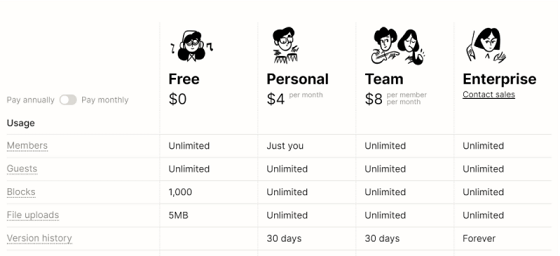
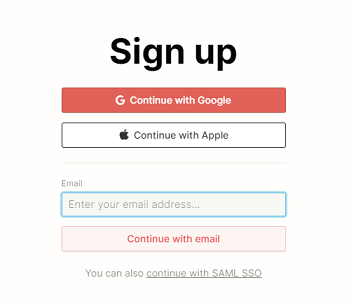

### 포트폴리오 만들기 - Notion
---

Notion에서 개인에게는 무료로 서비스를 이용해준다는 말을 듣고 

포트폴리오를 Notion으로 만들어야겠다는 생각을 하게되었습니다.

Notion이란 메모, 문서, 프로젝트관리 등을 통합한 메모서비스 입니다.

노션은 많은 장점이 있지만 그중에서도 깔끔하고, 이쁘게 문서 정리를 할 수 있다는 점이

가장 눈에 띄었습니다.

저는 디자인에는 잼병이기 때문에..ㅎㅎ

노션의 가격 정책입니다. 물론 저는 무료버전을 이용할겁니다.

---

### 가입하기

노션을 시작하려면 먼저 가입을 해야합니다.

가입을 진행하고나면 위와같은 화면이 나옵니다.

이제 본격적으로 포트폴리오를 꾸며보도록 하겠습니다.

---

### 포트폴리오 작성 

왼쪽의 탭에서 **Add a page** 를 클릭합니다.
