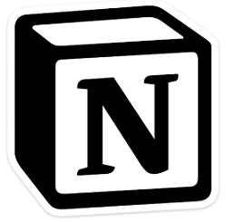

### 포트폴리오 만들기 - Notion
---

Notion에서 개인에게는 무료로 서비스를 이용해준다는 말을 듣고 

포트폴리오를 Notion으로 만들어야겠다는 생각을 하게되었습니다.

Notion이란 메모, 문서, 프로젝트관리 등을 통합한 메모서비스 입니다.

노션은 많은 장점이 있지만 그중에서도 깔끔하고, 이쁘게 문서 정리를 할 수 있다는 점이

가장 눈에 띄었습니다.

저는 디자인에는 잼병이기 때문에..ㅎㅎ

노션의 가격 정책입니다. 물론 저는 무료버전을 이용할겁니다.

---

### 가입하기

노션을 시작하려면 먼저 가입을 해야합니다.

가입을 진행하고나면 위와같은 화면이 나옵니다.

이제 본격적으로 포트폴리오를 꾸며보도록 하겠습니다.

---

### 노션 사용하기

이제 본격적으로 포트폴리오를 만들기위해 간단하게 노션 사용법을 알아보겠습니다.

먼저 포트폴리오로 사용하기 위한 페이지를 생성합니다.

왼쪽 탭에 **Add a page** 버튼을 클릭해 페이지를 추가합니다.

위와 같이 빈 페이지가 생성이 될텐데 각각의 메뉴를 클릭해 페이지를 꾸며나갈 수 있습니다.

중간에 보이는 **Templates** 버튼을 클릭하면 다양한 템플릿이 나오는데 이걸 활용하는

방법도 좋습니다.

템플릿 버튼을 클릭하고 마음에 드는 템플릿을 정해서 

상단에 Use this template 버튼을 클릭합니다.

저는 **Personal Home** 템플릿을 선택했습니다.

페이지 상단에 마우스를 올려보면 상단의 페이지 커버를 바꿀수 있는 메뉴가 나타납니다.

글이 있는 곳에 마우스를 올려보면 **+ 버튼과, 점으로 된 버튼**이 나옵니다.

**+ 버튼은 컨텐츠 추가** 를 **점으로된 버튼은 컨텐츠를 다른 곳으로 이동시키는 기능**을 합니다.

+버튼을 클릭했을 때 나오는 화면입니다. 

여기서 추가하고 싶은 컨텐츠를 추가할 수 있습니다.

추가할 거리들이 정말 다양하니 하나씩 입맛에 맞게 추가하면서 포트폴리오를 꾸며보면 될 것 같습니다.

---

이제 노션을 이용해 포트폴리오를 입맛에 맞게 만들 수 있습니다.

예전에는 PDF, PowerPoint 등을 통해 포트폴리오를 만들었다면

요즘은 확실히 노션이 대세인 것 같습니다.

PDF나 PowerPoint는 경력이 쌓일수록 그 수가 늘어나 정리하기 힘들어지지만

노션은 한눈에 알아볼 수 있게 정리할 수 있다는 점 또한 큰 장점입니다.

