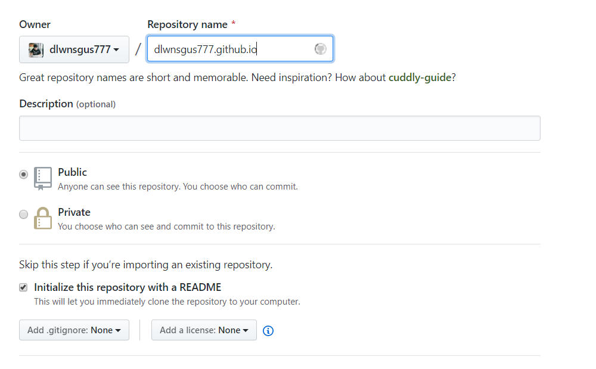
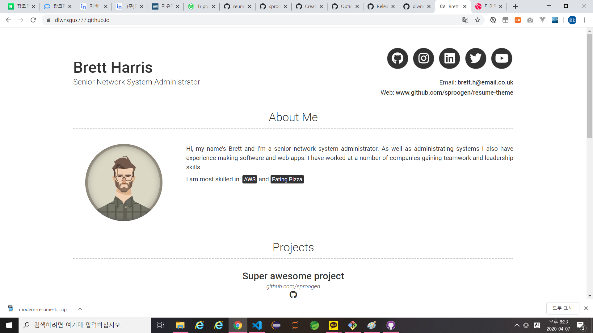
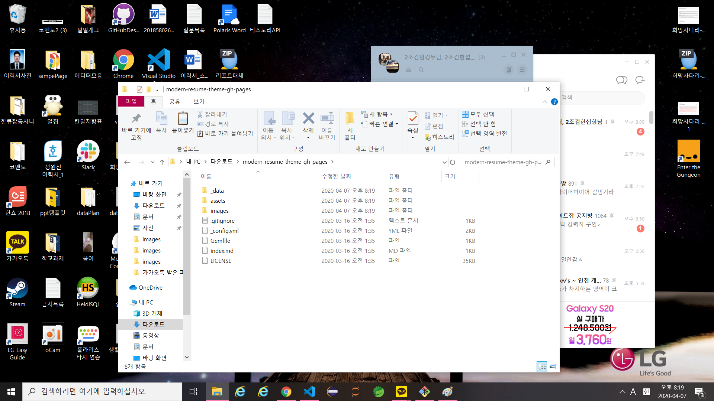
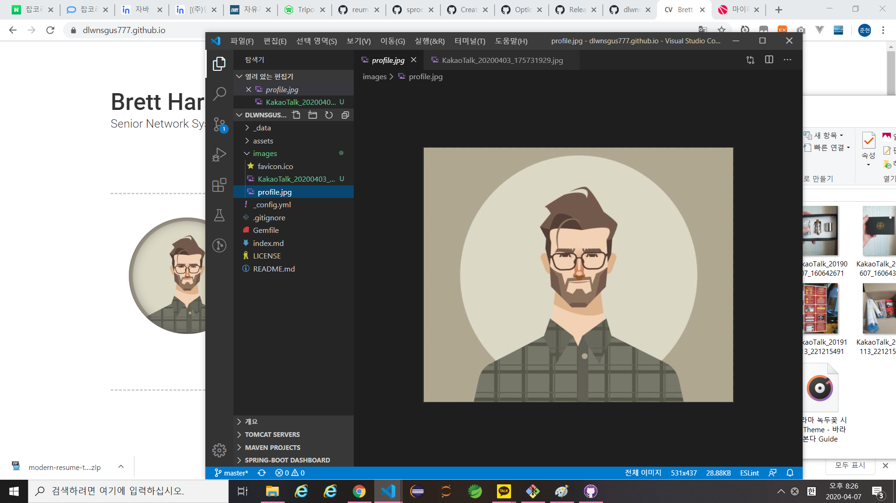
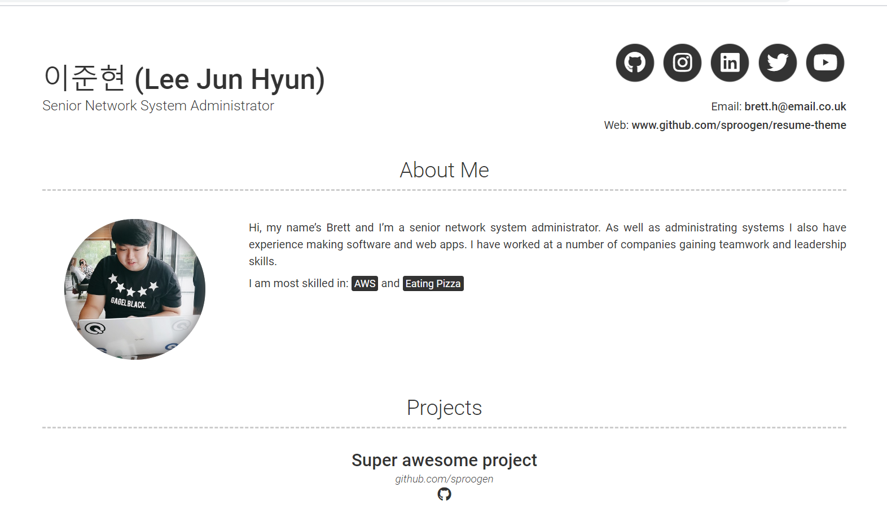

### 이력서 만들기 - GitHub Page

---

저는 그 동안 잡코리아, 사람인에 작성한 이력서를 이용해 구직 활동을 했습니다.

요즘 로켓펀치, 원티드 등 다양한 개발자 구직 / 구인 서비스가 늘어나면서 이력서 정리에 대한 필요성을 느꼈습니다.

저는 스펙이 낮은 편에 속하기 때문에...

> 좀 더 눈길을 끌만한 이력서가 없을까?

하는 생각을 하게되었고,

**GitHub Page** 를 이용해 이력서를 작성하기로 했습니다.

이력서는 경력을 쌓아가면서 꾸준히 관리를 해야한다고 들었기 때문에 이번 기회에 포스트를 작성하면서 이력서를 만들어보기로 했습니다.

---

먼저 깃허브에 Repository를 생성합니다.



위 처럼

**[내 아이디].github.io**

라는 이름으로 저장소를 생성하면 깃허브 페이지 서비스를 이용할 수 있습니다.



이력서로 사용할 테마입니다.

여러가지 테마가 있었지만 가장 심플하고 직관적인 것 같아 선택하게 되었습니다.

**[이력서 테마 GitHub](https://github.com/sproogen/modern-resume-theme)**

먼저 위의 주소로 가셔서 테마 저장소를 컴퓨터에 다운 받습니다.



다운받은 테마를 압축해제하시고 방금 생성한 깃허브 페이지 저장소에 파일과 폴더를 복사해줍니다.

물론 깃허브 페이지 저장소 역시 `git clone` 명령어를 사용해 컴퓨터에 저장소를 가져오셔야 합니다.

이제 간단히 프로필 사진을 변경해보겠습니다.



**images** 폴더 안에 변경하고 싶은 사진을 넣습니다.

이제 기존의 **profile.jpg** 파일을 삭제하고

변경하고 싶은 사진의 이름을 **profile.jpg**로 변경해줍니다.

이력서의 내용은 **\_data** 폴더 안의 **.yml** 파일과

**\_config.yml** 파일의 내용을 수정하시면 됩니다.

---

파일의 내용을 수정할때마다 커밋하고 깃페이지에서 확일 할 수 없으니 ruby를 설치해 로컬에서 확인할 수 있도록 하겠습니다.

**[ruby](https://rubyinstaller.org/downloads/)** 여기서 루비를 다운로드 받습니다.

저는 윈도우를 사용하기때문에 CMD 창을 열어

깃허브에서 clone한 저의 깃페이지 저장소에 **cd** 명령어를 이용해 접속해서 진행했습니다.

아래의 명령어를 그대로 진행하시면 됩니다.

```
cd [your-repository-name]

bundle install

bundle exec jekyll serve

Open your browser to http://localhost:4000
```

깃허브 페이지는 웹 브라우저의 주소창에

**[내 아이디].github.io** 를 입력해 접속할 수 있습니다.



좀 더 디테일한 수정을 원하시면

**[이력서 깃허브 저장소](https://github.com/dlwnsgus777/dlwnsgus777.github.io)** 에서 코드를 확인해 보시기 바랍니다.
