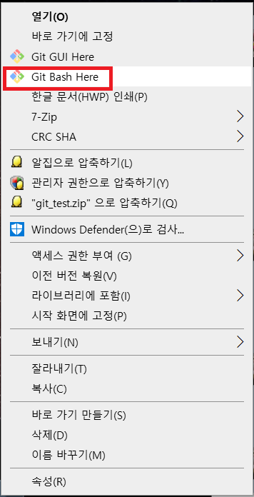
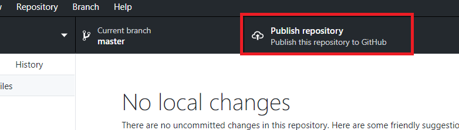
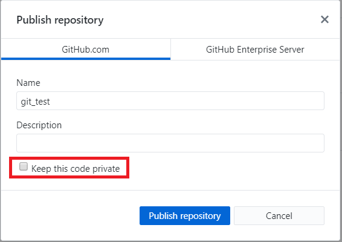

### git hub에 저장하기

#### 게시판을 만들고 있는 프로젝트를 Git Hub에 올리면서 스크린샷을 못찍어 간단히 폴더를 만들고 과정을 찍었습니다.

### 1. Git Init

git에 대한 게시글은 다음에 기회가 되면 차근차근 정리하겠습니다.

여기서는 Git이 설치되어있다는 가정하에 진행합니다.



프로젝트 폴더를 마우스 우클릭으로 클릭하여
**Git Bash Here** 를 선택해 Git Bash를 폴더의 경로에서 실행합니다.

#### Git Bash 화면입니다.


```
git init
```

을 입력하고 엔터를 누릅니다.

### 2. Git Desktop 실행

저는 **Git Desktop** 을 주로 사용합니다.

여기서도 역시 **Git Desktop** 을 사용하겠습니다.


**Git Desktop** 을 실행하고  
**file -> Add local Repository** 를 클릭합니다.


위와 같은 화면이 나오는데 **Chose..** 을 클릭해 `git init` 을 실행한 프로젝트를 선택하고 **Add Repository** 버튼을 클릭합니다.



Git Desktop 상단에 있는 **Publish repository** 버튼을 클릭합니다.



위와 같은 화면이 나오면

#### Keep this code private의 체크를 해제하셔야합니다.

체크를 꼭 **해제** 하시고 Publish repository버튼을 클릭하면 Git Hub의 저장소에 프로젝트가 저장됩니다.
