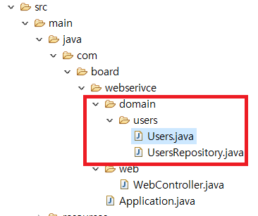

### JPA Test 코드 작성

#### [기억보단 기록을](https://jojoldu.tistory.com/284?category=689637) 블로그를 참고하여 만들었습니다.

#### ~~1. 프로젝트 생성~~

#### 2. DB 연결

#### 3. 로그인 Front Page 작성

#### 4. 로그인 기능 구현

#### 5. 게시판 Front Page 작성

#### 6. 게시판 기능 구현

이제 2번째 단계인 프로젝트에 DB를 연결하겠습니다.

DB연결을 하기전에 JPA 코드를 먼저 작성해보겠습니다.

#### JPA에 대한 연습을 하기위해 블로그를 참조하며 작성하였습니다.



webservice > domain > users 패키지를 생성하고,

- **Users** 클래스
- **UsersRepository** 인터페이스

를 작성합니다.

#### Users Class

```java
@NoArgsConstructor(access = AccessLevel.PROTECTED)
@Getter
@Entity
public class Users {

	@Id
	@GeneratedValue(strategy = GenerationType.IDENTITY)
	private Long id;

	@Column(length = 20,unique = true, nullable = false)
	private String userId;

	@Column(length = 50,unique = true, nullable = false)
	private String password;

	private String userName;

	@Builder
	public Users(String userId, String password, String userName) {
		this.userId = userId;
		this.password = password;
		this.userName = userName;
	}

}

```

- 해당 코드를 작성해서 실행하시기전에 IDE 별로 LOMBOK을 설치하셔야합니다.

- [이클립스에서 설치](http://countryxide.tistory.com/16)

#### UsersRepository Interface

```java
public interface UsersRepository extends JpaRepository<Users, Long> {

}

```

이후 테스트 코드에 대한 작성과 실행은 [기억보단 기록을](https://jojoldu.tistory.com/284?category=689637) 블로그를 참고하여 주시고, 저는 그 다음부터 진행해보겠습니다.

계층형 게시판 개발시 필수기술 중 하나인 mysql을 설치하여 연결하겠습니다.

mysql 설치가 먼저 되어야합니다.

- #### [mysql 설치](https://dog-developers.tistory.com/20)
