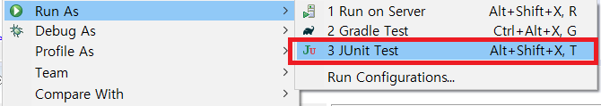

### JPA Test 코드 작성

#### [기억보단 기록을](https://jojoldu.tistory.com/284?category=689637) 블로그를 참고하여 만들었습니다.

#### ~~1. 프로젝트 생성~~

#### 2. DB 연결

#### 3. 로그인 Front Page 작성

#### 4. 로그인 기능 구현

#### 5. 게시판 Front Page 작성

#### 6. 게시판 기능 구현

이제 2번째 단계인 프로젝트에 DB를 연결하겠습니다.

DB연결을 하기전에 JPA 코드를 먼저 작성해보겠습니다.

#### JPA에 대한 연습을 하기위해 블로그를 참조하며 작성하였습니다.


webservice > domain > users 패키지를 생성하고,

- **Users** 클래스
- **UsersRepository** 인터페이스

를 작성합니다.

#### Users Class

```java
@NoArgsConstructor(access = AccessLevel.PROTECTED)
@Getter
@Entity
public class Users {

	@Id
	@GeneratedValue(strategy = GenerationType.IDENTITY)
	private Long id;

	@Column(length = 20,unique = true, nullable = false)
	private String userId;

	@Column(length = 50,unique = true, nullable = false)
	private String password;

	private String userName;

	@Builder
	public Users(String userId, String password, String userName) {
		this.userId = userId;
		this.password = password;
		this.userName = userName;
	}

}

```

- 해당 코드를 작성해서 실행하시기전에 IDE 별로 LOMBOK을 설치하셔야합니다.

- [이클립스에서 설치](http://countryxide.tistory.com/16)

#### UsersRepository Interface

```java
public interface UsersRepository extends JpaRepository<Users, Long> {

}

```

이제 Test 코드를 작성해보겠습니다.


프로젝트의 test 폴더에 다음과 같이 패키지와 class를 작성합니다.

현재 저는 **Junit 5** 버전을 사용하기때문에 다음과 같이 작성했습니다.

버전이 다르다면 각각의 버전에 맞게 코드를 작성해야합니다.

#### UserRepositoryTest

```java
@ExtendWith(SpringExtension.class)
@SpringBootTest
public class UsersRepositoryTest {

	@Autowired
	UsersRepository userRepository;

	@AfterEach
	public void cleanup() {
		userRepository.deleteAll();
	}

	@Test
	public void addUsers() {
		//given
		userRepository.save(Users.builder()
							.userId("test")
							.password("test")
							.userName("test용")
							.build());

		//when
		List<Users> usersList = userRepository.findAll();

		//then
		Users users = usersList.get(0);
		assertThat(users.getUserId(), is("test"));
		assertThat(users.getUserName(), is("test용"));
	}
}

```

#### 여기서 주의해야할 점은 어노테이션 Import 시에 Junit 버전에 맞게 주의해서 import를 진행하셔야합니다.



Test코드를 작성한 클래스의 코드화면에서

**마우스 우클릭 -> Run As -> Junit Test** 를 클릭합니다.


다음과 같은 화면이 나오면 Test 코드가 통과된 겁니다.

Test를 통과했으니 DTO 를 작성해보겠습니다.


위의 사진과 같이 패키지를 만들고

**UserSaveRequestDto Class** 를 작성합니다.

```java
@Getter
@Setter
@NoArgsConstructor
public class UsersSaveRequestDto {

	private String userId;
	private String password;
	private String userName;

	public Users toEntity() {
		return Users.builder()
				.userId(userId)
				.password(password)
				.userName(userName)
				.build();
	}
}
```

Controller도 다음과 같이 추가하겠습니다.

```java
@RestController
@AllArgsConstructor
public class WebController {

	private UsersRepository userRepository;

	@GetMapping("/")
	public String init() {
		return "Hello World";
	}

	@PostMapping("/users")
	public void saveUsers(@RequestBody UsersSaveRequestDto dto) {
		userRepository.save(dto.toEntity());
	}
}


```

이제 mysql을 연결해 테스트해보겠습니다.

- [mysql 설치하기](https://dog-developers.tistory.com/20)


mysql 설치가 완료되었다면 application.properties 파일의 확장자를
위의 사진처럼 **yml** 로 변경해줍니다.

yml 파일에 다음과 같이 작성해줍니다.

#### application.yml

```yml
spring:
  datasource:
    driver-class-name: com.mysql.cj.jdbc.Driver
    url: jdbc:mysql://localhost:3306/<databaseName>?useSSL=false&characterEncoding=UTF-8&serverTimezone=UTC
    username: <userId> #데이터 베이스에 접속할 아이디
    password: <password> # 데이터베이스에 접속할 비밀번호
  jpa:
    database: mysql
    show-sql: true
    generate-ddl: true
    database-platform: org.hibernate.dialect.MySQL5InnoDBDialect
```

**build.gradle** 의 디펜던시 부분에 다음을 추가합니다.

```
runtimeOnly 'mysql:mysql-connector-java'
```

이제 프로젝트를 실행하고 DataBase에 Users라는 테이블이 생성되었는지 확인해보겠습니다.


이제 값이 잘 들어가는지 테스트해보겠습니다.

그전에 사용자가 회원가입을 하게되면 등록일을 만들어야합니다.

추가로 수정일까지 추가되게 해보겠습니다.


위의 사진과 같이 **BaseTimeEntity** 클래스를 추가해주고 다음과 같이 작성합니다.

#### BaseTimeEntity.class

```java
@Getter
@MappedSuperclass
@EntityListeners(AuditingEntityListener.class)
public abstract class BaseTimeEntity {

	@CreatedDate
	private LocalDate createdDate;

	@LastModifiedDate
	private LocalDate modifiedDate;
}
```

이제 Users 클래스가 BaseTimeEntity 클래스를 상속받도록 코드를 수정하겠습니다.

```java
public class Users extends BaseTimeEntity {
...

}
```

다음으로 **Application** 파일에 다음과 같이 어노테이션을 추가해줍니다.

```java
@EnableJpaAuditing
@SpringBootApplication
public class Application {

	public static void main(String[] args) {
		SpringApplication.run(Application.class, args);
	}

}
```

이제 PostMan을 사용하여 테스트해보도록하겠습니다.


postMan에서 다음과 같이 url과 전달할 데이터를 작성하고, **Send** 버튼을 클릭하고 DB를 확인해보겠습니다.


다음과 같이 해당 값이 잘 들어가는 걸 확인할 수 있습니다.

**creaated_data** 와 **modified_data** 도 추가되었습니다.

### 수정사항

프로젝트 초반 H2를 사용하기위한 디펜던시를 추가하였지만 진행을 하다보니 굳이 사용할 필요가 없음을 깨달았습니다...

프로젝트 생성시 H2를 빼주시고 진행하셔도 무방합니다..ㅎ

다만 주의할점은 프로젝트를 생성하시고 실행하시기 전에 바로 DB를 연결해주셔야 프로젝트가 정상적으로 실행됩니다.
