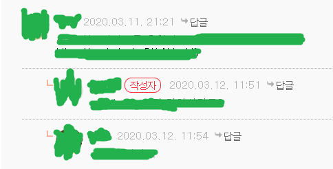

### 게시판 기능 구현 (1)

#### ~~1. 프로젝트 생성~~

#### ~~2. DB 연결~~

#### ~~3. 로그인 Front Page 작성~~

#### ~~4. 로그인 기능 구현~~

#### 5. 게시판 Front Page 작성

#### 6. 게시판 기능 구현

### 계층형 게시판

---

#### 계층형 게시판

계층형 게시판이 생소할 수도 있겠지만 의외로 주변에서 흔히 볼수있는 형식입니다.

대표적으로 답글을 다는 기능이 계층형이라고 생각하시면 됩니다.



이렇게 답글을 다는 형식을 많이 보셨을 겁니다.

오라클DB를 사용하면 **CONNECT BY** 와 **START WITH** 문법을 사용하면 비교적 간단하게 구현할 수 있습니다.

하지만 **MYSQL**에는 그런 기능이 없습니다.

대신 구현하는 방법이 몇가지 있었습니다.

#### 1. [함수를 정의하는 방법](https://shlee0882.tistory.com/241)

함수를 정의하는 방법은 구현이 복잡하다는 단점이 있습니다.


#### 2. [테이블 구조를 이용하는 방법](http://mikehillyer.com/articles/managing-hierarchical-data-in-mysql/)

테이블 구조를 이용하는 방법은 계층이 추가될때마다 나머지 데이터들을 수정해줘야한다는 단점이 있습니다. 

#### 3. [사용자 정의 변수를 사용하는 방법](https://12teamtoday.tistory.com/25)

사용자 정의 변수를 이용하면 **WHERE** 조건을 통해 하위 계층을 검색할 수 있지만 전체적인 계층 구조에 대한 검색은 되지않는다는 단점이 있습니다.

#### 4. [재귀 쿼리를 사용하는 방법](https://mysqlserverteam.com/mysql-8-0-labs-recursive-common-table-expressions-in-mysql-ctes-part-three-hierarchies/)

**MYSQL 5.7버전 이하** 에서는 동작하지 않고, 

해당 테이블의 행만큼 반복하기 때문에 역시 효율이 좋지는 않습니다.

이밖에도 [소수점 계층형 방식](https://gopenguin.tistory.com/7) 이라고 해서 계층에 대한 컬럼하나를 추가해 정렬을 통한 계층형 구조를 표현하는 방식이 있었습니다.

여러가지 방법이 있지만...

전부 그렇게 효율이 좋은 것 같지는 않았습니다.

이 중에서 **재귀 쿼리** 사용하여 구현하겠습니다.

**5.7 버전 이하 에서는 사용할 수 없습니다.**

재귀 쿼리를 사용할 때는 몇가지 **주의 사항**이 있습니다.


https://unrealengine.tistory.com/163
```sql
with RECURSIVE cts as (
	select  id
		,name
        ,p_id
        ,depth
        ,CAST(id as char(99)) lvl
	from test
    where p_id is null
    union all
    select b.id
		,b.name
        ,b.p_id
        ,b.depth
        ,concat(c.lvl, ",", b.id) lvl
        from test b
        inner join cts c
        on b.p_id = c.id
)
select id
	, concat(REPEAT("          ", depth),"ㄴ",name) as name
    ,p_id
    ,lvl
    ,depth
from cts
order by lvl
```

**Users.java**

```java
@NoArgsConstructor(access = AccessLevel.PROTECTED)
@Getter
@Entity
@DynamicUpdate
public class Users extends BaseTimeEntity {

	@Id
	@GeneratedValue(strategy = GenerationType.IDENTITY)
	private Long id;

	@Column(length = 20,unique = true, nullable = false)
	private String userId;

	@Column(nullable = false)
	private String password;

	@Column(unique = true)
	private String userName;

	@Builder
	public Users(String userId, String password, String userName) {
		this.userId = userId;
		this.password = password;
		this.userName = userName;
	}

	public void changeUserName(String userName) {
		this.userName = userName;
	}
}
```

엔티티의 값을 수정할 수 있도록 **changeUserName** 이라는 메서드를 만들었습니다.

**UserSecurityService**

```java
@Service
@AllArgsConstructor
public class UserSecurityService implements UserDetailsService  {
	private UsersRepository usersRepository;

	@Transactional
	public Long accountUser(UsersSaveRequestDto saveDto) {
		BCryptPasswordEncoder passwordEncoder = new BCryptPasswordEncoder();
		saveDto.setPassword(passwordEncoder.encode(saveDto.getPassword()));

		return usersRepository.save(saveDto.toEntity()).getId();
	}

	@Override
	public UserDetails loadUserByUsername(String userId) throws UsernameNotFoundException {
		// TODO Auto-generated method stub
		Optional<Users> userEntitiy = usersRepository.findByUserId(userId);
		Users findUser = userEntitiy.get();
		ArrayList<GrantedAuthority> authorities = new ArrayList<>();

		authorities.add(new SimpleGrantedAuthority("ROLE_USER"));

		return new User(findUser.getUserId(), findUser.getPassword(), authorities);
	}

	@Transactional
	public void changeUserName(String userId, String changeName) {
		Optional<Users> users = usersRepository.findByUserId(userId);
		Users user = users.get();
		user.changeUserName(changeName);
	}
}
```

**UserSecurityService** 클래스에 **changeUserName** 메서드를 추가했습니다.

사용자의 Id를 받아 DB에서 검색한 다음 가져온 엔티티의 값을 변경하는 메서드입니다.

**WebRestController**

```java
@RestController
@AllArgsConstructor
public class WebRestController {
	private UserSecurityService userSecurityService;

	@PostMapping("/users/signup")
	public ResponseEntity<Map<String, Object>> saveUsers(@RequestBody UsersSaveRequestDto dto) {
		userSecurityService.accountUser(dto);
		Map<String, Object> map = new HashMap<>();

		map.put("msg", "save");
		return new ResponseEntity<>(map, HttpStatus.OK);
	}

	@GetMapping("/user/userName")
	public ResponseEntity<Map<String, Object>> getUserName(Principal principal) {
		Map<String, Object> map = new HashMap<>();
		map.put("userName", principal.getName());
		return new ResponseEntity<>(map, HttpStatus.OK);
	}

	@PostMapping("/user/changeName")
	public ResponseEntity<Map<String, Object>> chageUserName(@RequestBody Map<String, Object> map,
			Principal principal) {
		String changeName = map.get("changeName").toString();
		String userId = principal.getName();

		userSecurityService.changeUserName(userId, changeName);

		Map<String, Object> responseMap = new HashMap<>();
		responseMap.put("msg", "success");

		return new ResponseEntity<>(responseMap, HttpStatus.OK);
	}
}
```

**WebRestController** 에 **chageUserName** 메서드를 추가했습니다.

화면의 사용자 정보는 `Principal` 을 매개변수로 받아 가져옵니다.

`principal.getName()`을 하면 **UserSecurityService**에서 **loadUserByUsername** 을 구현할때 return 값으로 전달한 User 객체에서 설정한 Id값을 가져옵니다.

**info.html**

```html
<!DOCTYPE html>
<html
  lang="ko"
  xmlns:th="http://www.thymeleaf.org"
  xmlns:sec="http://www.thymeleaf.org/thymeleaf-extras-springsecurity5"
  xmlns:layout="http://www.ultraq.net.nz/thymeleaf/layout"
  layout:decorate="~{cmmn/layout}"
>
  <section layout:fragment="content">
    <div class="container wrap__content">
      <div class="row text-center">
        <div class="col-sm-8 col-md-8 col-md-offset-2">
          <div class="thumbnail">
            <div class="caption">
              <h3><span th:text="${userName}"></span> 님 환영합니다.</h3>
              <div>
                <button
                  type="button"
                  class="btn btn-primary"
                  data-toggle="modal"
                  data-target="#chageUserModal"
                  id="btn-change-modal"
                >
                  회원 정보 변경
                </button>
                <button class="btn btn-default" role="button" id="btn-delete">
                  회원탈퇴
                </button>
              </div>
            </div>
          </div>
        </div>
      </div>

      <div
        class="modal fade"
        id="chageUserModal"
        tabindex="-1"
        role="dialog"
        aria-labelledby="chageUserLabel"
        aria-hidden="true"
      >
        <div class="modal-dialog" role="document">
          <div class="modal-content">
            <div class="modal-header">
              <h5 class="modal-title" id="accountUserLabel">회원 가입</h5>
              <button
                type="button"
                class="close"
                data-dismiss="modal"
                aria-label="Close"
              >
                <span aria-hidden="true">&times;</span>
              </button>
            </div>
            <div class="modal-body">
              <form id="changeName-frm">
                <div class="form-group">
                  <label for="user_name">이름</label>
                  <input
                    type="text"
                    class="form-control"
                    id="changeName"
                    th:placeholder="${userName}"
                  />
                </div>
              </form>
            </div>
            <div class="modal-footer">
              <button
                type="button"
                class="btn btn-secondary"
                data-dismiss="modal"
              >
                취소
              </button>
              <button type="button" class="btn btn-primary" id="btn-change">
                변경
              </button>
            </div>
          </div>
        </div>
      </div>
    </div>
    <script>
      let userInfo = {
        init: function() {
          this.clickChageName();
        },
        csrf: {
          token: $("meta[name='_csrf']").attr("content"),
          header: $("meta[name='_csrf_header']").attr("content")
        },
        clickChageName: function() {
          let $this = this;
          $("#btn-change").click(function() {
            let data = {
              changeName: $("#changeName").val()
            };
            console.log(data);
            $.ajax({
              type: "POST",
              url: "/user/changeName",
              dataType: "json",
              contentType: "application/json; charset=utf-8",
              data: JSON.stringify(data),
              beforeSend: function(xhr) {
                xhr.setRequestHeader($this.csrf.header, $this.csrf.token);
              }
            })
              .done(function(result) {
                if (result.msg === "success") {
                  alert("변경에 성공했습니다.");
                  location.reload();
                }
              })
              .fail(function(error) {
                console.log(error);
              });
          });
        }
      };
      $(function() {
        userInfo.init();
      });
    </script>
  </section>
</html>
```

ajax 통신을 사용해 서버에 값을 전달했습니다.

변경에 성공하면 Page를 새로고침해 화면에 변경한 유저의 이름이 나오도록 했습니다.

**WebController**

```java
@Controller
@AllArgsConstructor
public class WebController {
	private UsersRepository userRepository;

	@GetMapping("/")
	public String init() {
		return "contents/index";
	}

	@GetMapping("/board")
	public String hello() {
		return "contents/board";
	}

	@GetMapping("/login/error")
	public String error() {
		return "contents/error";
	}

	@PostMapping("/login/fail")
	public String initPost() {
		return "contents/index";
	}

	@GetMapping("/info")
	public String info(Principal principal, ModelMap model) {
		Optional<Users> users = userRepository.findByUserId(principal.getName());
		Users user = users.get();

		model.addAttribute("userName", user.getUserName());

		return "contents/info";
	}
}
```

**/info**
요청이 오면 해당 유저를 검색해 화면에 닉네임 값을 전달해줍니다.


유저 정보 화면입니다.

유저의 닉네임이 화면에 출력되는걸 확인할 수 있습니다.


**input** 의 placeholder 에 유저의 닉네임을 넣어줬습니다.


닉네임을 **test1** 으로 변경해보겠습니다.


화면이 새로고침되며 유저의 변경된 닉네임이 화면에 출력됩니다.

### 회원 탈퇴

---

이제 회원 탈퇴 기능을 진행하겠습니다.

보통은 DB에 DEL_YN 필드를 만들어 삭제 여부를 **Y**, **N** 으로 저장해 검색시 DEL_YN 필드값이 **N** 인 회원들을 검색하는게 정석입니다.

이 기능은 추후에 필요하면 추가하겠습니다.

지금은 단순히 DB에서 삭제시키는 걸로 하겠습니다.

**info.html**

```html
<!DOCTYPE html>
<html
  lang="ko"
  xmlns:th="http://www.thymeleaf.org"
  xmlns:sec="http://www.thymeleaf.org/thymeleaf-extras-springsecurity5"
  xmlns:layout="http://www.ultraq.net.nz/thymeleaf/layout"
  layout:decorate="~{cmmn/layout}"
>
  <section layout:fragment="content">
    <div class="container wrap__content">
      <div class="row text-center">
        <div class="col-sm-8 col-md-8 col-md-offset-2">
          <div class="thumbnail">
            <div class="caption">
              <h3><span th:text="${userName}"></span> 님 환영합니다.</h3>
              <div>
                <button
                  type="button"
                  class="btn btn-primary"
                  data-toggle="modal"
                  data-target="#chageUserModal"
                  id="btn-change-modal"
                >
                  회원 정보 변경
                </button>
                <button class="btn btn-default" role="button" id="btn-delete">
                  회원탈퇴
                </button>
              </div>
            </div>
          </div>
        </div>
      </div>

      <div
        class="modal fade"
        id="chageUserModal"
        tabindex="-1"
        role="dialog"
        aria-labelledby="chageUserLabel"
        aria-hidden="true"
      >
        <div class="modal-dialog" role="document">
          <div class="modal-content">
            <div class="modal-header">
              <h5 class="modal-title" id="accountUserLabel">회원 가입</h5>
              <button
                type="button"
                class="close"
                data-dismiss="modal"
                aria-label="Close"
              >
                <span aria-hidden="true">&times;</span>
              </button>
            </div>
            <div class="modal-body">
              <form id="changeName-frm">
                <div class="form-group">
                  <label for="user_name">이름</label>
                  <input
                    type="text"
                    class="form-control"
                    id="changeName"
                    th:placeholder="${userName}"
                  />
                </div>
              </form>
            </div>
            <div class="modal-footer">
              <button
                type="button"
                class="btn btn-secondary"
                data-dismiss="modal"
              >
                취소
              </button>
              <button type="button" class="btn btn-primary" id="btn-change">
                변경
              </button>
            </div>
          </div>
        </div>
      </div>
    </div>
    <script>
      let userInfo = {
        init: function() {
          this.clickChageName();
          this.clickDeleteUser();
        },
        csrf: {
          token: $("meta[name='_csrf']").attr("content"),
          header: $("meta[name='_csrf_header']").attr("content")
        },
        clickChageName: function() {
          let $this = this;
          $("#btn-change").click(function() {
            let data = {
              changeName: $("#changeName").val()
            };
            console.log(data);
            $.ajax({
              type: "POST",
              url: "/user/changeName",
              dataType: "json",
              contentType: "application/json; charset=utf-8",
              data: JSON.stringify(data),
              beforeSend: function(xhr) {
                xhr.setRequestHeader($this.csrf.header, $this.csrf.token);
              }
            })
              .done(function(result) {
                if (result.msg === "success") {
                  alert("변경에 성공했습니다.");
                  location.reload();
                }
              })
              .fail(function(error) {
                console.log(error);
              });
          });
        },
        clickDeleteUser: function() {
          let $this = this;
          $("#btn-delete").click(function() {
            $.ajax({
              type: "DELETE",
              url: "/user",
              dataType: "json",
              contentType: "application/json; charset=utf-8",
              beforeSend: function(xhr) {
                xhr.setRequestHeader($this.csrf.header, $this.csrf.token);
              }
            })
              .done(function(result) {
                console.log(result);
                alert("삭제에 성공했습니다.");
                location.href = "/user/logout";
              })
              .fail(function(error) {
                console.log(error);
              });
          });
        }
      };
      $(function() {
        userInfo.init();
      });
    </script>
  </section>
</html>
```

info.html의 script를 다음과 같이 수정했습니다.

Ajax에서 DELETE 메서드로 값을 넘깁니다.

삭제 후에 session을 제거하기위해 logout을 호출했습니다.

**UserRepository**

```java
public interface UsersRepository extends JpaRepository<Users, Long> {
	Optional<Users> findByUserId(String userId);
	Long deleteByUserId(String userId);
}
```

**UserRepository**에 **deleteByUserId** 메서드를 추가했습니다.

**WebRestController**

```java
@RestController
@AllArgsConstructor
public class WebRestController {
	private UserSecurityService userSecurityService;

	@PostMapping("/users/signup")
	public ResponseEntity<Map<String, Object>> saveUsers(@RequestBody UsersSaveRequestDto dto) {
		userSecurityService.accountUser(dto);
		Map<String, Object> map = new HashMap<>();

		map.put("msg", "save");
		return new ResponseEntity<>(map, HttpStatus.OK);
	}

	@GetMapping("/user/userName")
	public ResponseEntity<Map<String, Object>> getUserName(Principal principal) {
		Map<String, Object> map = new HashMap<>();
		map.put("userName", principal.getName());
		return new ResponseEntity<>(map, HttpStatus.OK);
	}

	@PostMapping("/user/changeName")
	public ResponseEntity<Map<String, Object>> chageUserName(@RequestBody Map<String, Object> map,
			Principal principal) {
		String changeName = map.get("changeName").toString();
		String userId = principal.getName();

		userSecurityService.changeUserName(userId, changeName);

		Map<String, Object> responseMap = new HashMap<>();
		responseMap.put("msg", "success");

		return new ResponseEntity<>(responseMap, HttpStatus.OK);
	}

	@DeleteMapping("/user")
	public ResponseEntity<Map<String, Object>> deleteUser(Principal principal) {
		String userId = principal.getName();
		userSecurityService.deleteUser(userId);
		Map<String, Object> responseMap = new HashMap<>();
		return new ResponseEntity<>(responseMap, HttpStatus.OK);
	}
}
```

**WebRestController**에 deleteUser 메서드를 만들고

userSecurityService에서 deleteUser 메서드를 실행할 수 있게 작성합니다.

**UserSecurityService**

```java
@Service
@AllArgsConstructor
public class UserSecurityService implements UserDetailsService  {
	private UsersRepository usersRepository;

	@Transactional
	public Long accountUser(UsersSaveRequestDto saveDto) {
		BCryptPasswordEncoder passwordEncoder = new BCryptPasswordEncoder();
		saveDto.setPassword(passwordEncoder.encode(saveDto.getPassword()));

		return usersRepository.save(saveDto.toEntity()).getId();
	}

	@Override
	public UserDetails loadUserByUsername(String userId) throws UsernameNotFoundException {
		// TODO Auto-generated method stub
		Optional<Users> userEntitiy = usersRepository.findByUserId(userId);
		Users findUser = userEntitiy.get();
		ArrayList<GrantedAuthority> authorities = new ArrayList<>();

		authorities.add(new SimpleGrantedAuthority("ROLE_USER"));

		return new User(findUser.getUserId(), findUser.getPassword(), authorities);
	}

	@Transactional
	public void changeUserName(String userId, String changeName) {
		Optional<Users> users = usersRepository.findByUserId(userId);
		Users user = users.get();
		user.changeUserName(changeName);
	}

	@Transactional
	public void deleteUser(String userId) {
		usersRepository.deleteByUserId(userId);
	}
}
```

deletUser는 유저의 Id를 매개변수로 받아서 DB에서 해당 Id의 값을 삭제하는 기능을 합니다.

이제 화면에서 기능을 확인해보겠습니다.


회원탈퇴 클릭시


회원탈퇴 성공시

대략적인 회원가입, 로그인 / 로그아웃 기능이 완성되었습니다.

앞으로 만들면서 수정할 부분이 있으면 수정하겠습니다.

---

시큐리티에서 유저 정보를 변경하고 session을 변경하고 싶을때가 있습니다.

SecurityContext의 유저 정보를 새로 세팅하는 법입니다.

시큐리티 유저 정보 변경

```java
		List<GrantedAuthority> authorities = new ArrayList<>();
		authorities.add(new SimpleGrantedAuthority("ROLE_USER"));

		Authentication auth = new UsernamePasswordAuthenticationToken(user.getEmail(), user.getPassword(), authorities);
		SecurityContextHolder.getContext().setAuthentication(auth);
```
