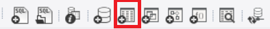
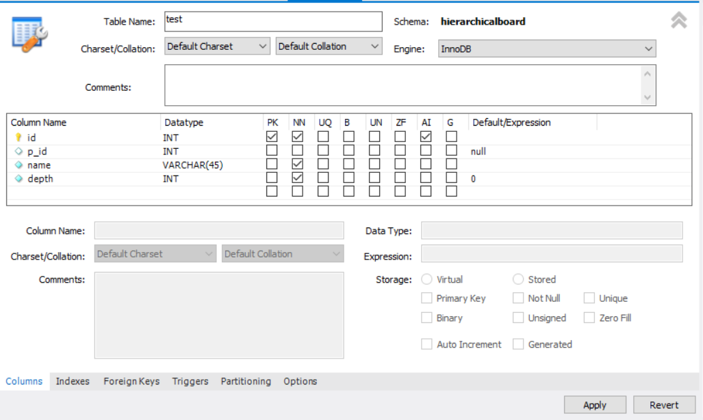
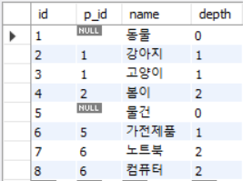
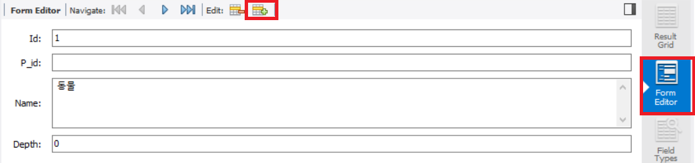
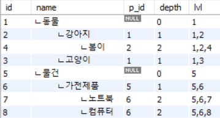

### 게시판 기능 구현 (1)

#### ~~1. 프로젝트 생성~~

#### ~~2. DB 연결~~

#### ~~3. 로그인 Front Page 작성~~

#### ~~4. 로그인 기능 구현~~

#### 5. 게시판 Front Page 작성

#### 6. 게시판 기능 구현

### 계층형 게시판

---

계층형 게시판이 생소할 수도 있겠지만 의외로 주변에서 흔히 볼수있는 형식입니다.

대표적으로 답글을 다는 기능이 계층형이라고 생각하시면 됩니다.


이렇게 답글을 다는 형식을 많이 보셨을 겁니다.

오라클DB를 사용하면 **CONNECT BY** 와 **START WITH** 문법을 사용하면 비교적 간단하게 구현할 수 있습니다.

하지만 **MYSQL**에는 그런 기능이 없습니다.

대신 구현하는 방법이 몇가지 있었습니다.

#### 1. [함수를 정의하는 방법](https://shlee0882.tistory.com/241)

함수를 정의하는 방법은 구현이 복잡하다는 단점이 있습니다.

#### 2. [테이블 구조를 이용하는 방법](http://mikehillyer.com/articles/managing-hierarchical-data-in-mysql/)

테이블 구조를 이용하는 방법은 계층이 추가될때마다 나머지 데이터들을 수정해줘야한다는 단점이 있습니다.

#### 3. [사용자 정의 변수를 사용하는 방법](https://12teamtoday.tistory.com/25)

사용자 정의 변수를 이용하면 **WHERE** 조건을 통해 하위 계층을 검색할 수 있지만 전체적인 계층 구조에 대한 검색은 되지않는다는 단점이 있습니다.

#### 4. [재귀 쿼리를 사용하는 방법](https://mysqlserverteam.com/mysql-8-0-labs-recursive-common-table-expressions-in-mysql-ctes-part-three-hierarchies/)

**MYSQL 5.7버전 이하** 에서는 동작하지 않고,

해당 테이블의 행만큼 반복하기 때문에 역시 효율이 좋지는 않습니다.

이밖에도 [소수점 계층형 방식](https://gopenguin.tistory.com/7) 이라고 해서 계층에 대한 컬럼하나를 추가해 정렬을 통한 계층형 구조를 표현하는 방식이 있었습니다.

여러가지 방법이 있지만...

전부 그렇게 효율이 좋은 것 같지는 않았습니다.

이 중에서 **재귀 쿼리** 사용하여 구현하겠습니다.

**5.7 버전 이하 에서는 사용할 수 없습니다.**

재귀 쿼리를 사용할 때는 몇가지 **주의 사항**이 있습니다.

- **UNION** 사용하기
- **반복하지 않은 검색문** 최소 1개 이상 넣기

- 재귀 쿼리의 바깥에서 재귀 쿼리를 **참조** 하는 문장 넣기

- 반복되는 문장에는 **정지 조건** 넣기

위의 주의 사항을 꼭 지켜주셔야 오류가 나지않습니다.

### Table 생성

---

테스트 용으로 DB에 Table을 만들겠습니다.

테스트로 만들 계층형의 예는

- 동물
  - 강아지
    - 봄이(우리집 반려견 이름입니다)
  - 고양이
    - 수현이(예전에 키우던 고양이 이름입니다)
- 가전제품
  - 노트북
  - 컴퓨터

이런 모양을 만들어 보도록 하겠습니다.

**MySQL Workbench** 를 사용하여 만들었습니다.


워크밴치에서 테이블을 생성할 스키마를 선택합니다.

저는 프로젝트에서 사용하고 있는 스키마에 테이블을 추가하도록 하겠습니다.



상단에 있는 create table 버튼을 클릭합니다.



위와 같이 작성하고 하단에 **Apply** 버튼을 눌러 테이블을 추가하겠습니다.

- #### id

  PK키 입니다.

- #### p_id

  자신이 속해있는 부모의 id 입니다.

- #### name

  이름을 저장합니다.

- #### depth

  몇 번째에 있는 계층인지 저장하는 컬럼입니다.

  화면에 표시하기 위한 값으로 사용합니다.

  ex) 들여쓰기



위 사진처럼 테이블에 값을 넣었습니다.



데이터는 워크밴치의 **Form Editor**를 사용해 저장했습니다.

이제 **재귀 쿼리** 를 사용하여 계층형이 되게 데이터를 검색하겠습니다.

```sql
WITH RECURSIVE CTS AS (
	SELECT  id
		   ,name
           ,p_id
           ,depth
           ,CAST(id as CHAR(100)) lvl
	FROM test
    WHERE p_id IS NULL
    UNION ALL
    SELECT  b.id
		   ,b.name
           ,b.p_id
           ,b.depth
           ,CONCAT(c.lvl, ",", b.id) lvl
	FROM test b
	INNER JOIN CTS c
	ON b.p_id = c.id
)
SELECT id
	  ,CONCAT(REPEAT("          ", depth), "ㄴ", name) as name
      ,p_id
      ,depth
      ,lvl
from cts
ORDER BY lvl
```



쿼리의 결과입니다.

lvl이라는 임의의 컬럼을 만들어 그 컬럼으로 정렬을 했습니다.

---

사실 처음부터 lvl 같은 **정렬의 기준이 되는 컬럼** 을 테이블에 추가해서 계층형으로 정렬이 되게끔 해주시는 방법이 제일 간단합니다.

개인적으로 **정렬의 기준이 되는 컬럼**을 이용해 정렬을 해주면

재귀 쿼리를 할 필요도 없고, 제일 효율적이라 생각하긴 합니다.

대신 정렬의 기준이 되는 컬럼의 데이터 저장 용량이 꽉 차게된다면

더이상 계층을 표현할 수 없다는 단점이 있습니다.

위의 쿼리에서도 lvl 컬럼의 **DateType의 저장가능한 Byte 만큼의 계층**만 표현할 수 있습니다.

처음부터 기준이 되는 컬럼을 추가하지 않은 이유는

공부의 목적 때문입니다.

공부하면서 느낀건 계층형의 깊이가 깊어질수록 효율이 정말 안좋아지는 것 같은 느낌을 받았습니다.

요즘 계층이 깊은 게시판을 보기 드문 이유가 효율이 안 좋기 때문이 아닌가 하는 생각이 들었습니다.

만약 자식을 하나만 가질 수 있는 계층형이라면

쿼리가 훨씬 단순해집니다.

틀린 부분이나 더 좋은 방식이 있다면 댓글 부탁드립니다.
