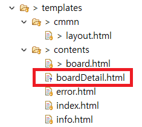
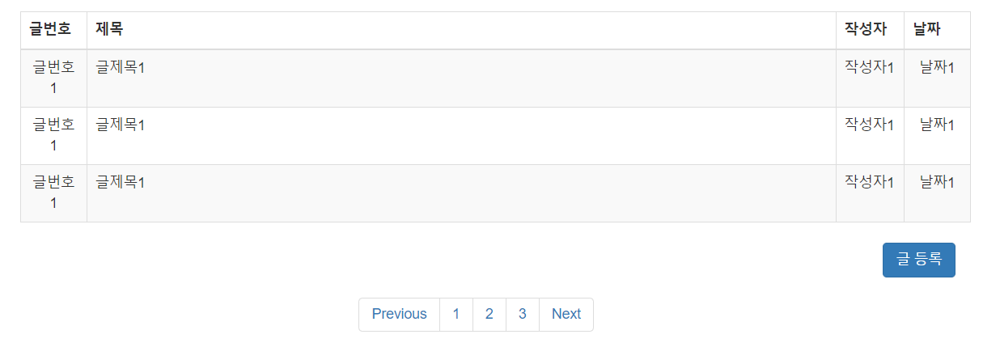
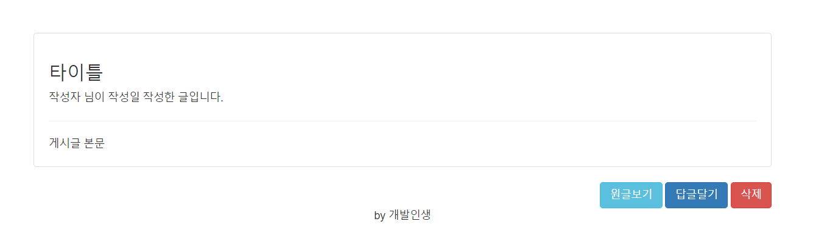

### 게시판 기능 구현 (2)

#### ~~1. 프로젝트 생성~~

#### ~~2. DB 연결~~

#### ~~3. 로그인 Front Page 작성~~

#### ~~4. 로그인 기능 구현~~

#### 5. 게시판 Front Page 작성

#### 6. 게시판 기능 구현

### 게시판 Front Page 작성

---

기능을 구현하기 전에 화면을 먼저 만들겠습니다.

게시글을 보는 페이지를 만들겠습니다.



**boardDetail.html** 을 추가하겠습니다.

**boardDetail.html**

```html
<!DOCTYPE html>
<html
  lang="ko"
  xmlns:th="http://www.thymeleaf.org"
  xmlns:sec="http://www.thymeleaf.org/thymeleaf-extras-springsecurity5"
  xmlns:layout="http://www.ultraq.net.nz/thymeleaf/layout"
  layout:decorate="~{cmmn/layout}"
>
  <section layout:fragment="content">
    <div class="container wrap__content">
      <div class="row text-center">
        <div>
          <div class="thumbnail">
            <div class="wrap__board">
              <div class="text-left">
                <h3>
                  <span>타이틀</span>
                </h3>
                <div>
                  <div>
                    <span>작성자</span> 님이 <span>작성일</span> 작성한
                    글입니다.
                  </div>
                  <hr />
                  <div>게시글 본문</div>
                </div>
              </div>
            </div>
          </div>
          <div class="text-right">
            <button type="button" class="btn btn-info" id="btn-change-modal">
              원글보기
            </button>
            <button type="button" class="btn btn-primary" id="btn-change-modal">
              답글달기
            </button>
            <button type="button" class="btn btn-danger" id="btn-change-modal">
              삭제
            </button>
          </div>
        </div>
      </div>
    </div>
    <script></script>
  </section>
</html>
```

이제 페이지를 만들었으니 **Controller**를 수정하겠습니다.

**WebController.java**

```java
package com.board.webserivce.web;

import java.security.Principal;
import java.util.Optional;

import org.springframework.stereotype.Controller;
import org.springframework.ui.ModelMap;
import org.springframework.web.bind.annotation.GetMapping;
import org.springframework.web.bind.annotation.PathVariable;
import org.springframework.web.bind.annotation.PostMapping;

import com.board.webserivce.domain.users.Users;
import com.board.webserivce.domain.users.UsersRepository;

import lombok.AllArgsConstructor;

@Controller
@AllArgsConstructor
public class WebController {
	private UsersRepository userRepository;

	@GetMapping("/")
	public String init() {
		return "contents/index";
	}

	@GetMapping("/board")
	public String hello() {
		return "contents/board";
	}

	@GetMapping("/login/error")
	public String error() {
		return "contents/error";
	}

	@PostMapping("/login/fail")
	public String initPost() {
		return "contents/index";
	}

	@GetMapping("/info")
	public String info(Principal principal, ModelMap model) {
		Optional<Users> users = userRepository.findByUserId(principal.getName());
		Users user = users.get();

		model.addAttribute("userName", user.getUserName());

		return "contents/info";
	}

	@GetMapping("/board/{id}")
	public String getBoardDetail(@PathVariable int id, ModelMap model) {
		return "contents/boardDetail";
	}

}
```

게시판 화면에서 게시글을 클릭하면 해당 게시글의 번호를 화면에 전달하는 구조입니다.

**/board/{게시글 id(번호)}** 의 형태입니다.

View를 반환하기때문에 **WebController**에 작성했습니다.

`@PathVariable` 을 사용하면 URL에서 **{}** 부분의 값을 받을 수 있습니다.

이제 게시판 화면을 수정하겠습니다.

**board.html**

```html
<!DOCTYPE html>
<html
  lang="ko"
  xmlns:th="http://www.thymeleaf.org"
  xmlns:sec="http://www.thymeleaf.org/thymeleaf-extras-springsecurity5"
  xmlns:layout="http://www.ultraq.net.nz/thymeleaf/layout"
  layout:decorate="~{cmmn/layout}"
>
  <section layout:fragment="content">
    <h1>계층형 게시판</h1>
    <div class="container">
      <table class="table table-striped table-bordered table-hover">
        <thead>
          <tr>
            <th style="width: 7%">글번호</th>
            <th scope="col">제목</th>
            <th style="width: 5%">작성자</th>
            <th style="width: 7%">날짜</th>
          </tr>
        </thead>
        <tbody>
          <tr>
            <td class="text-center" scope="row" data-id="1">글번호1</td>
            <td class="text-overflow" style="max-width: 300px;">글제목1</td>
            <td class="text-overflow" style="max-width: 100px;">작성자1</td>
            <td class="text-center">날짜1</td>
          </tr>
          <tr>
            <td class="text-center" scope="row" data-id="1">글번호1</td>
            <td class="text-overflow" style="max-width: 300px;">글제목1</td>
            <td class="text-overflow" style="max-width: 100px;">작성자1</td>
            <td class="text-center">날짜1</td>
          </tr>
          <tr>
            <td class="text-center" scope="row" data-id="1">글번호1</td>
            <td class="text-overflow" style="max-width: 300px;">글제목1</td>
            <td class="text-overflow" style="max-width: 100px;">작성자1</td>
            <td class="text-center">날짜1</td>
          </tr>
        </tbody>
      </table>

      <div align="right" class="col-md-12 left">
        <button
          type="button"
          class="btn btn-primary"
          data-toggle="modal"
          data-target="#savePostsModal"
        >
          글 등록
        </button>
      </div>
      <div class="center-block" style="width: 300px;padding:15px;">
        <nav aria-label="Page navigation">
          <ul class="pagination">
            <li class="page-item">
              <a class="page-link" href="#">Previous</a>
            </li>
            <li class="page-item"><a class="page-link" href="#">1</a></li>
            <li class="page-item"><a class="page-link" href="#">2</a></li>
            <li class="page-item"><a class="page-link" href="#">3</a></li>
            <li class="page-item"><a class="page-link" href="#">Next</a></li>
          </ul>
        </nav>
      </div>
    </div>
    <div
      class="modal fade"
      id="savePostsModal"
      tabindex="-1"
      role="dialog"
      aria-labelledby="savePostsLabel"
      aria-hidden="true"
    >
      <div class="modal-dialog" role="document">
        <div class="modal-content">
          <div class="modal-header">
            <h5 class="modal-title" id="savePostsLabel">게시글 등록</h5>
            <button
              type="button"
              class="close"
              data-dismiss="modal"
              aria-label="Close"
            >
              <span aria-hidden="true">&times;</span>
            </button>
          </div>
          <div class="modal-body">
            <form>
              <div class="form-group">
                <label for="title">제목</label>
                <input
                  type="text"
                  class="form-control"
                  id="title"
                  placeholder="제목을 입력하세요"
                />
              </div>
              <div class="form-group">
                <label for="author"> 작성자 </label>
                <input
                  type="text"
                  class="form-control"
                  id="author"
                  placeholder="작성자를 입력하세요"
                />
              </div>
              <div class="form-group">
                <label for="content"> 내용 </label>
                <textarea
                  class="form-control"
                  id="content"
                  placeholder="내용을 입력하세요"
                  style="resize: none; height: 300px;"
                ></textarea>
              </div>
            </form>
          </div>
          <div class="modal-footer">
            <button
              type="button"
              class="btn btn-secondary"
              data-dismiss="modal"
            >
              취소
            </button>
            <button type="button" class="btn btn-primary" id="btn-save">
              등록
            </button>
          </div>
        </div>
      </div>
    </div>
    <script></script>
  </section>
</html>
```

테이블 컬럼의 크기와 컬럼을 벗어났을 때 화면에 표시하는 방식을 수정했습니다.

```css
.text-overflow {
  overflow: hidden;
  text-overflow: ellipsis;
  white-space: nowrap;
}
```

위의 css를 주가해주시면 됩니다.



게시판 화면입니다.

주소창에 **http://localhost:8080/board/1** 을 입력합니다.



간단하게 게시판의 화면들을 만들었습니다.

이제 본격적으로 게시판의 기능을 구현하겠습니다.
