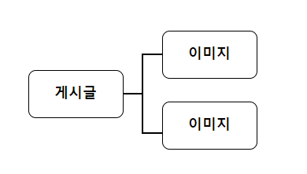

### 게시판 기능 구현 (3)

#### ~~1. 프로젝트 생성~~

#### ~~2. DB 연결~~

#### ~~3. 로그인 Front Page 작성~~

#### ~~4. 로그인 기능 구현~~

#### ~~5. 게시판 Front Page 작성~~

#### 6. 게시판 기능 구현

### 게시판 기능 구현 - 연관 관계 매핑

---

이제 본격적으로 게시판의 기능을 구현해보도록 하겠습니다.

기본적인 CRUD기능을 구현하기 전에 Entitiy의 연관 관계를 설정하겠습니다.

CRUD란

- Create
- Read
- Update
- Delete

의 앞 글자들을 따서 CRUD라고 부릅니다.

---


**domain** 패키지 아래 위의 사진처럼

**boards**, **images** 패키지를 생성합니다.

**board** 패키지 안에 **Boards** 클래스를 생성합니다.

**Boards** (import 부분은 생략했습니다)

전체 코드는 **[Git Hub](https://github.com/dlwnsgus777)** 에 있습니다.

```java
package com.board.webserivce.domain.boards;

@NoArgsConstructor(access = AccessLevel.PROTECTED)
@Getter
@Entity
@DynamicUpdate
public class Boards extends BaseTimeEntity {

	@Id
	@GeneratedValue(strategy = GenerationType.IDENTITY)
	private Long id;

	@ColumnDefault("0")
	private int depth;

	@Column(length = 200, nullable = false)
	private String title;

	@Column(columnDefinition = "TEXT", nullable = false)
	private String content;

	@ColumnDefault("null")
	private Long parentId;

	@ManyToOne
	@JoinColumn(name = "author_id")
	private Users author;

	@OneToMany(orphanRemoval = true, cascade = CascadeType.ALL)
	@JoinColumn(name = "boardId")
	private List<Images> images = new ArrayList<>();

	@Builder
	public Boards(String content, String title, Long parentId, int depth, Users author) {
		this.title = title;
		this.content = content;
		this.parentId = parentId;
		this.depth = depth;
		this.author = author;
	}
}
```

게시글을 저장하는 Entity 입니다.

마찬가지로 **images** 패키지 안에 **Images** 클래스를 생성합니다.

```java
package com.board.webserivce.domain.images;

import javax.persistence.Column;
import javax.persistence.Entity;
import javax.persistence.GeneratedValue;
import javax.persistence.GenerationType;
import javax.persistence.Id;

import org.hibernate.annotations.DynamicUpdate;

import lombok.AccessLevel;
import lombok.Builder;
import lombok.Getter;
import lombok.NoArgsConstructor;

@NoArgsConstructor(access = AccessLevel.PROTECTED)
@Getter
@Entity
@DynamicUpdate
public class Images {

	@Id
	@GeneratedValue(strategy = GenerationType.IDENTITY)
	private Long id;

	@Column(nullable = false)
	private String fileName;

	private Long boardId;

	@Builder
	public Images(String fileName, Long boardId) {
		this.fileName = fileName;
		this.boardId = boardId;
	}
}
```

이미지를 저장하는 Entity 입니다.

- Boards
- Users
- Images

이 3개의 Entity에 대한 관계를 설명하겠습니다.



위의 사진처럼 **하나**의 게시글에는 **여러개**의 이미지를 가질 수 있습니다.

하나의 게시글이 여러개의 이미지

- One to Many

```java
	@OneToMany(orphanRemoval = true, cascade = CascadeType.ALL)
	@JoinColumn(name = "boardId")
	private List<Images> images = new ArrayList<>()
```

코드로 표현하면 이렇게 할 수 있습니다.

JPA에서는 연관 관계를 매핑하면 새로운 테이블을 만들어서 관리하게 됩니다.

이렇게 따로 테이블을 만들어 연관 관계를 매핑하지 않고 연관 관계를 관리하려면

```
@JoinColumn(name = "boardId")
```

이렇게 어노테이션을 설정하면 됩니다.

Images 엔티티에 있는 boardId 컬럼이랑 매핑이 된다고 생각하시면 됩니다.

기능을 구현하기 전에 화면을 먼저 만들겠습니다.

게시글을 보는 페이지를 만들겠습니다.


**boardDetail.html** 을 추가하겠습니다.

**boardDetail.html**

```html
<!DOCTYPE html>
<html
  lang="ko"
  xmlns:th="http://www.thymeleaf.org"
  xmlns:sec="http://www.thymeleaf.org/thymeleaf-extras-springsecurity5"
  xmlns:layout="http://www.ultraq.net.nz/thymeleaf/layout"
  layout:decorate="~{cmmn/layout}"
>
  <section layout:fragment="content">
    <div class="container wrap__content">
      <div class="row text-center">
        <div>
          <div class="thumbnail">
            <div class="wrap__board">
              <div class="text-left">
                <h3>
                  <span>타이틀</span>
                </h3>
                <div>
                  <div>
                    <span>작성자</span> 님이 <span>작성일</span> 작성한
                    글입니다.
                  </div>
                  <hr />
                  <div>게시글 본문</div>
                </div>
              </div>
            </div>
          </div>
          <div class="text-right">
            <button type="button" class="btn btn-info" id="btn-change-modal">
              원글보기
            </button>
            <button type="button" class="btn btn-primary" id="btn-change-modal">
              답글달기
            </button>
            <button type="button" class="btn btn-danger" id="btn-change-modal">
              삭제
            </button>
          </div>
        </div>
      </div>
    </div>
    <script></script>
  </section>
</html>
```
