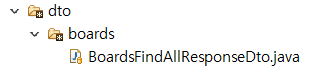
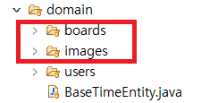
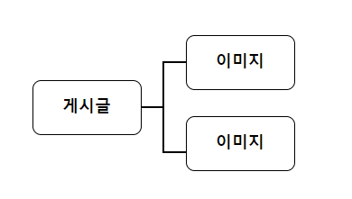
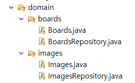

### 게시판 기능 구현 (4)

#### ~~1. 프로젝트 생성~~

#### ~~2. DB 연결~~

#### ~~3. 로그인 Front Page 작성~~

#### ~~4. 로그인 기능 구현~~

#### ~~5. 게시판 Front Page 작성~~

#### 6. 게시판 기능 구현

### 게시판 기능 구현 - 게시글 조회

---

이제 본격적으로 게시판의 기능을 구현해보도록 하겠습니다.

먼저 게시글을 조회하는 기능을 만들겠습니다.

현재 계층형 게시판을 만들고 있기 때문에

**[저번 포스트](https://pro-dev.tistory.com/37?category=830872)** 에서 만들어 놓은 쿼리를 수정하여 적용하겠습니다.

```sql
WITH RECURSIVE CTS AS (
				SELECT  id
					   ,title
			           ,content
			           ,depth
			           ,parent_id
			           ,author_id
					   ,created_date
			           ,modified_date
			           ,CAST(id as CHAR(255)) lvl
                       ,id as groupno
				FROM boards
			    WHERE parent_id IS NULL
			    UNION ALL
			    SELECT  b.id
					   ,b.title
			           ,b.content
			           ,b.depth
			           ,b.parent_id
			           ,b.author_id
			           ,b.created_date
			           ,b.modified_date
			           ,CONCAT(c.lvl, ",", b.id) lvl
			           ,substring_index(c.lvl, ",",1) as groupno
				FROM boards b
				INNER JOIN CTS c
				ON b.parent_id = c.id
			)
			SELECT b.id
				  ,title
			      ,content
			      ,depth
			      ,parent_id
			      ,b.created_date
			      ,b.modified_date
				  ,author_id
                  ,lvl
                  ,groupno
			from cts as b
			ORDER BY groupno desc, lvl
```

게시글을 조회하는 쿼리입니다.
현재 생성한 Entity에 맞게 쿼리를 수정했습니다.

최신글을 상단에 표시하기 위해

**groupno** 라는 컬럼을 만들어 게시글과 해당 게시글의 답글을 묶어놨습니다.

```java
public interface BoardsRepository extends JpaRepository<Boards, Long> {
	@Query(value = "WITH RECURSIVE CTS AS (\r\n" +
			"	SELECT  id\r\n" +
			"		   ,title\r\n" +
			"           ,content\r\n" +
			"           ,depth\r\n" +
			"           ,parent_id\r\n" +
			"           ,author_id\r\n" +
			"		   ,created_date\r\n" +
			"           ,modified_date\r\n" +
			"           ,CAST(id as CHAR(255)) lvl\r\n" +
            "           ,id as groupno\r\n" +
			"	FROM boards\r\n" +
			"    WHERE parent_id IS NULL\r\n" +
			"    UNION ALL\r\n" +
			"    SELECT  b.id\r\n" +
			"		   ,b.title\r\n" +
			"           ,b.content\r\n" +
			"           ,b.depth\r\n" +
			"           ,b.parent_id\r\n" +
			"           ,b.author_id\r\n" +
			"           ,b.created_date\r\n" +
			"           ,b.modified_date\r\n" +
			"           ,CONCAT(c.lvl, \",\", b.id) lvl\r\n" +
			"           ,substring_index(c.lvl, \",\",1) as groupno\r\n" +
			"	FROM boards b\r\n" +
			"	INNER JOIN CTS c\r\n" +
			"	ON b.parent_id = c.id\r\n" +
			")\r\n" +
			"SELECT b.id\r\n" +
			"	  ,title\r\n" +
			"      ,content\r\n" +
			"      ,depth\r\n" +
			"      ,parent_id\r\n" +
			"      ,b.created_date\r\n" +
			"      ,b.modified_date\r\n" +
			"	  ,author_id\r\n" +
			"from cts as b\r\n" +
			"ORDER BY groupno desc, lvl",
			countQuery = "SELECT count(*) FROM boards",
			nativeQuery = true)
	Page<Boards> findAllBoards(Pageable pageable);
}
```

Native 쿼리를 사용하기 위해 위처럼 작성했습니다.

추가로 게시글을 조회할때 페이징 처리를 위해 **Pageable** 기능을 사용하였습니다.

```
Page<Boards> findAllBoards(Pageable pageable);
```

이렇게 **Pageable**을 매개변수로 전달해주면 Page처리를 비교적 쉽게할 수 있습니다.

자세한 부분은 아래에서 설명하겠습니다.

어떤 경우라도 Entity를 외부에 노출해서는 안되기때문에

**controller**에서 값을 전달해 주기위해 **DTO**를 만들겠습니다.



**service** 패키지 안에 **BoardService** 클래스를 생성합니다.

```java
@Service
@AllArgsConstructor
public class BoardService {
	private BoardsRepository boardRepository;
	private UsersRepository usersRepository;

	@Transactional
	public Page<BoardsFindAllResponseDto> findAllPost(int page) {
		int pageNumber = page - 1;
		Pageable pageAble = PageRequest.of(pageNumber, 10);
		Page<Boards> boards = boardRepository.findAllBoards(pageAble);

		Page<BoardsFindAllResponseDto> boardsDto = boards.map(new Function<Boards, BoardsFindAllResponseDto>() {

			@Override
			public BoardsFindAllResponseDto apply(Boards t) {
				// TODO Auto-generated method stub
				BoardsFindAllResponseDto dto = new BoardsFindAllResponseDto();
				dto.converEntityToDto(t);
				return dto;
			}

		});

		return boardsDto;
	}
}

```

---



**domain** 패키지 아래 위의 사진처럼

**boards**, **images** 패키지를 생성합니다.

**board** 패키지 안에 **Boards** 클래스를 생성합니다.

**Boards** (import 부분은 생략했습니다)

전체 코드는 **[Git Hub](https://github.com/dlwnsgus777)** 에 있습니다.

```java
package com.board.webserivce.domain.boards;

@NoArgsConstructor(access = AccessLevel.PROTECTED)
@Getter
@Entity
@DynamicUpdate
public class Boards extends BaseTimeEntity {

	@Id
	@GeneratedValue(strategy = GenerationType.IDENTITY)
	private Long id;

	@ColumnDefault("0")
	private int depth;

	@Column(length = 200, nullable = false)
	private String title;

	@Column(columnDefinition = "TEXT", nullable = false)
	private String content;

	@ColumnDefault("null")
	private Long parentId;

	@ManyToOne
	@JoinColumn(name = "author_id")
	private Users author;

	@OneToMany(orphanRemoval = true, cascade = CascadeType.ALL)
	@JoinColumn(name = "boardId")
	private List<Images> images = new ArrayList<>();

	@Builder
	public Boards(String content, String title, Long parentId, int depth, Users author) {
		this.title = title;
		this.content = content;
		this.parentId = parentId;
		this.depth = depth;
		this.author = author;
	}
}
```

게시글을 저장하는 Entity 입니다.

마찬가지로 **images** 패키지 안에 **Images** 클래스를 생성합니다.

```java
package com.board.webserivce.domain.images;

import javax.persistence.Column;
import javax.persistence.Entity;
import javax.persistence.GeneratedValue;
import javax.persistence.GenerationType;
import javax.persistence.Id;

import org.hibernate.annotations.DynamicUpdate;

import lombok.AccessLevel;
import lombok.Builder;
import lombok.Getter;
import lombok.NoArgsConstructor;

@NoArgsConstructor(access = AccessLevel.PROTECTED)
@Getter
@Entity
@DynamicUpdate
public class Images {

	@Id
	@GeneratedValue(strategy = GenerationType.IDENTITY)
	private Long id;

	@Column(nullable = false)
	private String fileName;

	private Long boardId;

	@Builder
	public Images(String fileName, Long boardId) {
		this.fileName = fileName;
		this.boardId = boardId;
	}
}
```

이미지를 저장하는 Entity 입니다.

- Boards
- Users
- Images

이 3개의 Entity에 대한 관계를 설명하겠습니다.

JPA에서는 JDBC를 사용할 때 처럼 참조하는 테이블의 PK를 변수로 가지고 있지 않고

참조하는 테이블의 **객체**를 가지고 있습니다.

```java
  // jpa
	private Users author;
```

Boards 엔티티의 author라는 맴버 변수는
Users라는 엔티티의 객체를 자료형으로 가지고 있습니다.

단순히 저렇게 변수만 선언한다고 연관관계가 성립되지는 않습니다.

```java
	@ManyToOne
	@JoinColumn(name = "author_id")
	private Users author;
```

위의 코드 처럼 연관 관계를 맺어주는 어노테이션을 사용해야합니다.

코드에 대한 설명을 하기에 앞서 개념에 대한 설명을 간단히 하겠습니다.

#### 1) 다중성

- Many to One - 다대일

  N : 1 관계 입니다.

* Many To Many - 다대다

  N : N 관계 입니다.

- One To Many - 일대다

  1 : N 관계 입니다.

* One To One - 일대일

  1 : 1 관계 입니다.

#### 2) 양방향, 단방향

- 양방향

  두개의 엔티티가 관계를 맺을 때, 양쪽이 서로를 참조하는 경우입니다.

- 단방향

  두개의 엔티티가 관계를 맺을 때, 한 쪽의 엔티티만 반대쪽 엔티티를 참조하는 경우입니다.

#### 3) 연관 관계의 주인

- 연관 관계를 맺을 때, 외래키(PK)를 가지고 있는 테이블이
  연관 관계의 주인이 됩니다.

  이때 연관 관계의 주인만 외래키를 등록, 수정, 삭제 할 수 있습니다.

  주인이 아닌 엔티티는 읽기만 할 수 있습니다.

이제 프로젝트의 게시글과 이미지의 관계에 대해서 설명하겠습니다.



위의 사진처럼 **하나**의 게시글에는 **여러개**의 이미지를 가질 수 있습니다.

하나의 게시글이 여러개의 이미지

- One to Many

```java
	@OneToMany(orphanRemoval = true, cascade = CascadeType.ALL)
	@JoinColumn(name = "boardId")
	private List<Images> images = new ArrayList<>()
```

코드로 표현하면 이렇게 할 수 있습니다.

JPA에서는 연관 관계를 매핑하면 새로운 테이블을 만들어서 관리하게 됩니다.

이렇게 따로 테이블을 만들어 연관 관계를 매핑하지 않고 연관 관계를 관리하려면

```
@JoinColumn(name = "boardId")
```

이렇게 어노테이션을 설정하면 됩니다.

Images 엔티티에 있는 boardId 컬럼이랑 매핑이 된다고 생각하시면 됩니다.

이제 게시글과 작성자(User)의 관계입니다.

```java
	@ManyToOne
	@JoinColumn(name = "author_id")
	private Users author;

```

게시글은 여러명의 유저가 작성할 수 있습니다.

위의 코드처럼

`@ManyToOne` 을 이용해 매핑해줍니다.



엔티티를 만들었으니 Repository를 생성하겠습니다.

**BoardsRepository** 클래스를 추가하겠습니다.

**BoardsRepository.java**

```java
public interface BoardsRepository extends JpaRepository<Boards, Long> {

}

```

**ImagesRepository** 클래스를 추가하겠습니다.

**ImagesRepository.java**

```java
public interface ImagesRepository extends JpaRepository<Images, Long> {

}
```

간단히 연관 관계를 매핑해봤습니다.

다음 포스트부터 본격적으로 CRUD를 진행해보겠습니다.
