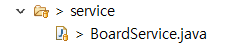
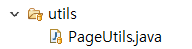
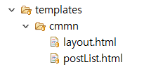

### 게시판 기능 구현 (4)

#### ~~1. 프로젝트 생성~~

#### ~~2. DB 연결~~

#### ~~3. 로그인 Front Page 작성~~

#### ~~4. 로그인 기능 구현~~

#### ~~5. 게시판 Front Page 작성~~

#### 6. 게시판 기능 구현

### 게시판 기능 구현 - 게시글 조회

---

이제 본격적으로 게시판의 기능을 구현해보도록 하겠습니다.

먼저 게시글을 조회하는 기능을 만들겠습니다.

현재 계층형 게시판을 만들고 있기 때문에

**[저번 포스트](https://pro-dev.tistory.com/37?category=830872)** 에서 만들어 놓은 쿼리를 수정하여 적용하겠습니다.

```sql
WITH RECURSIVE CTS AS (
				SELECT  id
					   ,title
			           ,content
			           ,depth
			           ,parent_id
			           ,author_id
					   ,created_date
			           ,modified_date
			           ,CAST(id as CHAR(255)) lvl
                       ,id as groupno
				FROM boards
			    WHERE parent_id IS NULL
			    UNION ALL
			    SELECT  b.id
					   ,b.title
			           ,b.content
			           ,b.depth
			           ,b.parent_id
			           ,b.author_id
			           ,b.created_date
			           ,b.modified_date
			           ,CONCAT(c.lvl, ",", b.id) lvl
			           ,substring_index(c.lvl, ",",1) as groupno
				FROM boards b
				INNER JOIN CTS c
				ON b.parent_id = c.id
			)
			SELECT b.id
				  ,title
			      ,content
			      ,depth
			      ,parent_id
			      ,b.created_date
			      ,b.modified_date
				  ,author_id
                  ,lvl
                  ,groupno
			from cts as b
			ORDER BY groupno desc, lvl
```

게시글을 조회하는 쿼리입니다.
현재 생성한 Entity에 맞게 쿼리를 수정했습니다.

최신글을 상단에 표시하기 위해

**groupno** 라는 컬럼을 만들어 게시글과 해당 게시글의 답글을 묶어놨습니다.

```java
public interface BoardsRepository extends JpaRepository<Boards, Long> {
	@Query(value = "WITH RECURSIVE CTS AS (\r\n" +
			"	SELECT  id\r\n" +
			"		   ,title\r\n" +
			"           ,content\r\n" +
			"           ,depth\r\n" +
			"           ,parent_id\r\n" +
			"           ,author_id\r\n" +
			"		   ,created_date\r\n" +
			"           ,modified_date\r\n" +
			"           ,CAST(id as CHAR(255)) lvl\r\n" +
            "           ,id as groupno\r\n" +
			"	FROM boards\r\n" +
			"    WHERE parent_id IS NULL\r\n" +
			"    UNION ALL\r\n" +
			"    SELECT  b.id\r\n" +
			"		   ,b.title\r\n" +
			"           ,b.content\r\n" +
			"           ,b.depth\r\n" +
			"           ,b.parent_id\r\n" +
			"           ,b.author_id\r\n" +
			"           ,b.created_date\r\n" +
			"           ,b.modified_date\r\n" +
			"           ,CONCAT(c.lvl, \",\", b.id) lvl\r\n" +
			"           ,substring_index(c.lvl, \",\",1) as groupno\r\n" +
			"	FROM boards b\r\n" +
			"	INNER JOIN CTS c\r\n" +
			"	ON b.parent_id = c.id\r\n" +
			")\r\n" +
			"SELECT b.id\r\n" +
			"	  ,title\r\n" +
			"      ,content\r\n" +
			"      ,depth\r\n" +
			"      ,parent_id\r\n" +
			"      ,b.created_date\r\n" +
			"      ,b.modified_date\r\n" +
			"	  ,author_id\r\n" +
			"from cts as b\r\n" +
			"ORDER BY groupno desc, lvl",
			countQuery = "SELECT count(*) FROM boards",
			nativeQuery = true)
	Page<Boards> findAllBoards(Pageable pageable);
}
```

Native 쿼리를 사용하기 위해 위처럼 작성했습니다.

추가로 게시글을 조회할때 페이징 처리를 위해 **Pageable** 기능을 사용하였습니다.

```
Page<Boards> findAllBoards(Pageable pageable);
```

이렇게 **Pageable**을 매개변수로 전달해주면 Page처리를 비교적 쉽게할 수 있습니다.

자세한 부분은 아래에서 설명하겠습니다.

어떤 경우라도 Entity를 외부에 노출해서는 안되기때문에

**controller**에서 값을 전달해 주기위해 **DTO**를 만들겠습니다.


**dto** 패키지 안에 **boards** 패키지에

**BoardsFindAllResponseDto** 클래스를 생성합니다.

```java
package com.board.webserivce.dto.boards;

import java.time.LocalDate;
import java.time.LocalDateTime;
import java.util.List;

import com.board.webserivce.domain.boards.Boards;
import com.board.webserivce.domain.users.Users;

import lombok.Builder;
import lombok.Getter;
import lombok.NoArgsConstructor;
import lombok.Setter;

@Getter
@Setter
@NoArgsConstructor
public class BoardsFindAllResponseDto {
	private Long id;
	private String title;
	private Long authorId;
	private int depth;
	private String authorName;
	private LocalDate createdDate;

	public void converEntityToDto(Boards boards) {
		this.id = boards.getId();
		this.title = boards.getTitle();
		this.authorId = boards.getAuthor() == null ? null :  boards.getAuthor().getId();
		this.depth = boards.getDepth();
		this.authorName = boards.getAuthor() == null ? null :boards.getAuthor().getUserName();
		this.createdDate = boards.getCreatedDate();
	}
}
```

화면의 게시글 목록으로 보내줄 DTO 입니다.

화면에 Entity를 그대로 보내게되면 원치않은 값이 화면으로 내려갈 수도 있습니다.

회원 비밀번호 같이 노출이 되면 위험한 값들이 화면에 내려가서는 안됩니다.

그렇기 때문에 원하는 값만을 DTO에 담아 화면에 내려주도록 하겠습니다.

```java
	public void converEntityToDto(Boards boards) {
		this.id = boards.getId();
		this.title = boards.getTitle();
		this.authorId = boards.getAuthor() == null ? null :  boards.getAuthor().getId();
		this.depth = boards.getDepth();
		this.authorName = boards.getAuthor() == null ? null :boards.getAuthor().getUserName();
		this.createdDate = boards.getCreatedDate();
	}
```

DTO의 **converEntityToDto** 메서드는 Entity로 검색한 값을 DTO로 변환해주기 위해 사용합니다.



**service** 패키지 안에 **BoardService** 클래스를 생성합니다.

```java
@Service
@AllArgsConstructor
public class BoardService {
	private BoardsRepository boardRepository;

	@Transactional
	public Page<BoardsFindAllResponseDto> findAllPost(int page) {
		int pageNumber = page - 1;
		Pageable pageAble = PageRequest.of(pageNumber, 10);
		Page<Boards> boards = boardRepository.findAllBoards(pageAble);

		Page<BoardsFindAllResponseDto> boardsDto = boards.map(new Function<Boards, BoardsFindAllResponseDto>() {

			@Override
			public BoardsFindAllResponseDto apply(Boards t) {
				// TODO Auto-generated method stub
				BoardsFindAllResponseDto dto = new BoardsFindAllResponseDto();
				dto.converEntityToDto(t);
				return dto;
			}
		});

		return boardsDto;
	}
}

```

화면에 내려줄 페이지를 정하기위해 Pageable 객체를 만들어 매개변수로 보내게 됩니다.

후에 검색해 온 값을

**Entity**에서 **DTO** 값으로 변경해줍니다.

이제 **WebController**를 작성해보겠습니다.

Pageable의 page는 0부터 시작하기때문에 화면에서 올라온 값에서 1을 빼줍니다.

화면에서의 Pagenation은 1부터 시작하기때문입니다.

```java
package com.board.webserivce.web;

@Controller
@AllArgsConstructor
public class WebController {
	private UsersRepository userRepository;
	private BoardService boardService;

	@GetMapping("/")
	public String init() {
		return "contents/index";
	}

	@GetMapping("/board")
	public String hello() {
		return "contents/board";
	}

	@GetMapping("/login/error")
	public String error() {
		return "contents/error";
	}

	@PostMapping("/login/fail")
	public String initPost() {
		return "contents/index";
	}

	@GetMapping("/info")
	public String info(Principal principal, ModelMap model) {
		Optional<Users> users = userRepository.findByUserId(principal.getName());
		Users user = users.get();

		model.addAttribute("userName", user.getUserName());

		return "contents/info";
	}

	@GetMapping("/posts")
	public String getPosts(@RequestParam("page") int page, ModelMap model) {
		Page<BoardsFindAllResponseDto> boards = boardService.findAllPost(page);
		Pageable pageAble = boards.getPageable();
		model.addAttribute("page", PageUtils.getPages(pageAble, boards.getTotalPages()));
		model.addAttribute("posts", boards);
		model.addAttribute("nowTime", LocalDate.now());
		model.addAttribute("msg", "success");
		return  "cmmn/postList";
	}
}
```

DB에서 검색한 게시글을 화면에 보내게 됩니다.

추가로 화면에서 오늘 작성한 글이면 따로 표시를 하기위해 오늘 날짜를 같이 보내줍니다.

```java
model.addAttribute("page", PageUtils.getPages(pageAble, boards.getTotalPages()));
```

게시글 화면의 하단에 페이지 네이션 표시를 하기위해 PageUtils라는 클래스를 만들어 값을 계산하겠습니다.



**utils** 패키지를 만들고 그 안에 **PageUtils** 클래스를 생성합니다.

**PageUtils.java**

```java
package com.board.webserivce.utils;

import java.util.HashMap;
import java.util.Map;

import org.springframework.data.domain.Pageable;

public class PageUtils {
	static int pageScale = 5;

	public static Map<String, Object> getPages(Pageable page, int totalPage) {
		Map<String, Object> pageMap = new HashMap<String, Object>();
		int size = page.getPageSize();
		int pageNumber = page.getPageNumber() + 1;
		int startPage = ((pageNumber - 1)   / pageScale) * pageScale;
		int endPage = startPage + pageScale- 1;

		if (endPage >= totalPage) {
			endPage = totalPage;
		}

		int inPage = (pageNumber - 1) / size + 1;

		pageMap.put("startPage", startPage);
		pageMap.put("endPage", endPage);
		return pageMap;
	}
}

```

보통 페이지를 계산할때는 1부터 계산하는 것이 편해서 여기서도

1부터 계산했습니다.

pageScale은 화면의 페이지 번호를 몇개까지 출력할지에 대한 변수입니다.

[참고자료](https://okky.kr/article/282819)

---

이제 화면을 만들어보겠습니다.

**WebController** 에서 리턴값을 보시면

```java
	@GetMapping("/posts")
	public String getPosts(@RequestParam("page") int page, ModelMap model) {
		Page<BoardsFindAllResponseDto> boards = boardService.findAllPost(page);
		Pageable pageAble = boards.getPageable();
		model.addAttribute("page", PageUtils.getPages(pageAble, boards.getTotalPages()));
		model.addAttribute("posts", boards);
		model.addAttribute("nowTime", LocalDate.now());
		model.addAttribute("msg", "success");
		return  "cmmn/postList";
	}
```

cmmn폴더에 있는 postList를 반환하게됩니다.



**postList.html**

```html
<table class="table table-striped table-bordered table-hover">
  <thead>
    <tr>
      <th style="width: 7%">글번호</th>
      <th scope="col">제목</th>
      <th style="width: 7%">작성자</th>
      <th style="width: 8%">날짜</th>
    </tr>
  </thead>
  <tbody id="wrap__post">
    <tr th:each="post: ${posts.content}">
      <td
        class="text-center"
        scope="row"
        th:attr="data-id=${post.authorName} == null ? 'del' :${post.id}"
        th:text="${post.id}"
      ></td>
      <td class="text-overflow" style="max-width: 300px;">
        <div
          th:if="${post.depth} > 0"
          th:each="page : ${#numbers.sequence(1, post.depth)}"
          th:text="${post.depth} == ${page} ? 'ㄴ' : '&nbsp;&nbsp;&nbsp;&nbsp;'"
          style="float:left;"
        ></div>
        <div style="display:flex;">
          <div th:text="${post.title}"></div>
          <span
            th:if="${post.createdDate} == ${nowTime}"
            class="badge new-badge"
            ><span class="new-badge-text">N</span></span
          >
        </div>
      </td>
      <td
        class="text-overflow"
        style="max-width: 100px;"
        th:text="${post.authorName} == null ? '탈퇴한유저' :${post.authorName}"
      ></td>
      <td class="text-center" th:text="${post.createdDate}"></td>
    </tr>
  </tbody>
</table>
<div align="right" class="col-md-12 left">
  <button
    type="button"
    class="btn btn-primary"
    data-toggle="modal"
    data-target="#savePostsModal"
  >
    글 등록
  </button>
</div>
<div class="center-block" style="width: 350px;padding:15px;">
  <nav aria-label="Page navigation">
    <ul class="pagination">
      <li
        th:attr="data-haspage=${!posts.first} ? 'page' : 'none'"
        class="page-item"
      >
        <a class="page-link" href="javascript:;">Previous</a>
      </li>
      <th:block
        th:each="page : ${#numbers.sequence(page.startPage, page.endPage)}"
      >
        <li
          th:if="${page} != ${posts.totalPages}"
          th:classappend="${posts.number } == ${page} ? active"
          class="page-item"
        >
          <a th:text="${page + 1}" class="page-link" href="javascript:;"></a>
        </li>
      </th:block>
      <li
        th:attr="data-haspage=${!posts.last} ? 'page' : 'none'"
        class="page-item"
      >
        <a class="page-link" href="javascript:;">Next</a>
      </li>
    </ul>
  </nav>
</div>
```

이제 **board.html** 을 수정하겠습니다.

```html
<!DOCTYPE html>
<html
  lang="ko"
  xmlns:th="http://www.thymeleaf.org"
  xmlns:sec="http://www.thymeleaf.org/thymeleaf-extras-springsecurity5"
  xmlns:layout="http://www.ultraq.net.nz/thymeleaf/layout"
  layout:decorate="~{cmmn/layout}"
>
  <section layout:fragment="content">
    <h1>계층형 게시판</h1>
    <div class="container">
      <div id="post__list"></div>
    </div>
    <div
      class="modal fade"
      id="savePostsModal"
      tabindex="-1"
      role="dialog"
      aria-labelledby="savePostsLabel"
      aria-hidden="true"
    >
      <div class="modal-dialog" role="document">
        <div class="modal-content">
          <div class="modal-header">
            <h5 class="modal-title" id="savePostsLabel">게시글 등록</h5>
            <button
              type="button"
              class="close"
              data-dismiss="modal"
              aria-label="Close"
            >
              <span aria-hidden="true">&times;</span>
            </button>
          </div>
          <div class="modal-body">
            <form
              enctype="multipart/form-data"
              th:action="@{/post/save}"
              method="post"
              id="write-frm"
            >
              <div class="form-group">
                <label for="title">제목</label>
                <input
                  type="text"
                  class="form-control"
                  name="title"
                  id="title"
                  placeholder="제목을 입력하세요"
                />
              </div>
              <div class="form-group">
                <label for="author"> 이미지 </label>
                <input
                  type="file"
                  class="form-control"
                  name="images"
                  id="images"
                  placeholder="이미지 첨부"
                  multiple
                  accept="image/*"
                />
              </div>
              <div class="form-group">
                <label for="content"> 내용 </label>
                <textarea
                  class="form-control"
                  name="content"
                  id="content"
                  placeholder="내용을 입력하세요"
                  style="resize: none; height: 300px;"
                ></textarea>
              </div>
            </form>
            <div class="modal-footer">
              <button
                type="button"
                class="btn btn-secondary"
                data-dismiss="modal"
              >
                취소
              </button>
              <button type="button" class="btn btn-primary" id="btn-write">
                등록
              </button>
            </div>
          </div>
        </div>
      </div>
    </div>
    <script>
      let board = {
        init: function () {
          this.getPosts();
          this.clickPost();
          this.clickPageNation();
        },
        csrf: {
          token: $("meta[name='_csrf']").attr("content"),
          header: $("meta[name='_csrf_header']").attr("content"),
        },
        getPosts: function (pageNumber) {
          let $this = this;
          let page = pageNumber ? pageNumber : 1;
          $.ajax({
            type: "GET",
            url: `/posts?page=${page}`,
            dataType: "html",
            contentType: "application/json; charset=utf-8",
            beforeSend: function (xhr) {
              xhr.setRequestHeader($this.csrf.header, $this.csrf.token);
            },
          })
            .done(function (result) {
              $("#post__list").html(result);
            })
            .fail(function (error) {
              console.log(error);
            });
        },
        clickPost: function () {
          $("#post__list").on("click", "#wrap__post td", function () {
            const postId = $(this).parent().children(":first").data("id");
            if (postId === "del") {
              alert("삭제된 게시글 입니다.");
            } else {
              location.href = `/post/${postId}`;
            }
          });
        },
        clickPageNation: function () {
          $("#post__list").on("click", ".pagination li", function () {
            const pageValue = $(this).text();

            if ($(this).data("haspage") === "none") {
              return;
            }

            if (pageValue === "Previous") {
              const page = $(".pagination .active > a").text();
              board.getPosts(Number(page) - 1);
            } else if (pageValue === "Next") {
              const page = $(".pagination .active > a").text();
              console.log("다음 클릭", Number(page) + 1);
              board.getPosts(Number(page) + 1);
            } else {
              console.log("page 넘버 클릭", pageValue);
              board.getPosts(pageValue);
            }
          });
        },
      };
      $(function () {
        board.init();
      });
    </script>
  </section>
</html>
```

Controller에서 받은 html을 board.html에 Jquery를 이용해 출력합니다.

추가로 페이지에 대한 메서드, 테이블 클릭에 대한 메서드도 추가했습니다.

이제 게시글 상세를 보여주는 기능을 작업하겠습니다.

**WebController**

```java
package com.board.webserivce.web;

@Controller
@AllArgsConstructor
public class WebController {
	private UsersRepository userRepository;
	private BoardService boardService;

	@GetMapping("/")
	public String init() {
		return "contents/index";
	}

	@GetMapping("/board")
	public String hello() {
		return "contents/board";
	}

	@GetMapping("/login/error")
	public String error() {
		return "contents/error";
	}

	@PostMapping("/login/fail")
	public String initPost() {
		return "contents/index";
	}

	@GetMapping("/info")
	public String info(Principal principal, ModelMap model) {
		Optional<Users> users = userRepository.findByUserId(principal.getName());
		Users user = users.get();

		model.addAttribute("userName", user.getUserName());

		return "contents/info";
	}

	@GetMapping("/posts")
	public String getPosts(@RequestParam("page") int page, ModelMap model) {
		Page<BoardsFindAllResponseDto> boards = boardService.findAllPost(page);
		Pageable pageAble = boards.getPageable();
		model.addAttribute("page", PageUtils.getPages(pageAble, boards.getTotalPages()));
		model.addAttribute("posts", boards);
		model.addAttribute("nowTime", LocalDate.now());
		model.addAttribute("msg", "success");
		return  "cmmn/postList";
	}

	@GetMapping("/post/{id}")
	public String getBoardDetail(@PathVariable int id, ModelMap model) {
		BoardsFindResponseDto boardDto = boardService.findPost(id);
		model.addAttribute("path", id);
		model.addAttribute("post", boardDto);
		return "contents/postDetail";
	}
}
```

`@PathVariable` 를 사용하면 url에 있는 값을 변수로 받을 수 있습니다.

위의 코드에서는 **/post/{id}** 에서 **id** 값을 변수로 받습니다.

**BoardService**

```java
package com.board.webserivce.service;

@Service
@AllArgsConstructor
public class BoardService {
	private BoardsRepository boardRepository;
	private UsersRepository usersRepository;


	@Transactional
	public BoardsFindResponseDto findPost(int boardId) {
		ModelMapper modelmapper = new ModelMapper();
		Boards boards = boardRepository.findById((long)boardId);
		BoardsFindResponseDto boardsDto = modelmapper.map(boards, BoardsFindResponseDto.class);

		return boardsDto;
	}

	@Transactional
	public Page<BoardsFindAllResponseDto> findAllPost(int page) {
		int pageNumber = page - 1;
		Pageable pageAble = PageRequest.of(pageNumber, 10);
		Page<Boards> boards = boardRepository.findAllBoards(pageAble);
		Page<BoardsFindAllResponseDto> boardsDto = boards.map(new Function<Boards, BoardsFindAllResponseDto>() {

			@Override
			public BoardsFindAllResponseDto apply(Boards t) {
				// TODO Auto-generated method stub
				BoardsFindAllResponseDto dto = new BoardsFindAllResponseDto();
				dto.converEntityToDto(t);
				return dto;
			}

		});

		return boardsDto;
	}
}
```

Entity를 DTO로 쉽게 변환하기 위해 ModelMapper를 사용했습니다.

ModelMapper를 사용하기위해 디펜던시를 추가하겠습니다.

**build.gradle** 에 아래의 코드를 삽입합니다.

`implementation('org.modelmapper:modelmapper:2.3.0')`

자세한 내용은 [여기](https://blog.naver.com/writer0713/221596629064)를 참고하시기 바랍니다.

이제 화면에 내려줄 html을 작업하겠습니다.

**postDetail.html**

```html
<!DOCTYPE html>
<html
  lang="ko"
  xmlns:th="http://www.thymeleaf.org"
  xmlns:sec="http://www.thymeleaf.org/thymeleaf-extras-springsecurity5"
  xmlns:layout="http://www.ultraq.net.nz/thymeleaf/layout"
  layout:decorate="~{cmmn/layout}"
>
  <section layout:fragment="content">
    <div class="container wrap__content">
      <div class="row text-center">
        <div>
          <div class="thumbnail">
            <div th:attr="data-id=${post.id}" class="wrap__board">
              <div class="text-left">
                <h3>
                  <span th:text="${post.title}"></span>
                </h3>
                <div class="text-right">
                  <span th:text="${post.authorName}"></span> 님이
                  <span th:text="${post.createdDate}"></span> 작성한 글입니다.
                </div>

                <div>
                  <hr />
                  <div th:each="image :${post.images}">
                    
                  </div>
                  <div>
                    <p th:text="${post.content}"></p>
                  </div>
                </div>
              </div>
            </div>
          </div>
          <div class="text-right">
            <button
              th:attr="data-parent=${post.parentId}"
              th:if="${post.parentId} != null"
              type="button"
              class="btn btn-info"
              id="btn-show-parentPost"
            >
              원글보기
            </button>
            <button
              type="button"
              class="btn btn-primary"
              id="post-reply-btn"
              data-toggle="modal"
              data-target="#replyPostsModal"
            >
              답글달기
            </button>
            <button
              th:if="${#authentication.principal.Username} == ${post.authorUserId}"
              type="button"
              class="btn btn-danger"
              id="post-del-btn"
            >
              삭제
            </button>
            <button
              th:if="${#authentication.principal.Username} == ${post.authorUserId}"
              data-toggle="modal"
              data-target="#modifiedPostsModal"
              type="button"
              class="btn btn-warning"
              id="post-fix-btn"
            >
              수정
            </button>
          </div>
        </div>
      </div>
      <div
        class="modal fade"
        id="replyPostsModal"
        tabindex="-1"
        role="dialog"
        aria-labelledby="replyPostsLabel"
        aria-hidden="true"
      >
        <div class="modal-dialog" role="document">
          <div class="modal-content">
            <div class="modal-header">
              <h5 class="modal-title" id="replyPostsLabel">게시글 등록</h5>
              <button
                type="button"
                class="close"
                data-dismiss="modal"
                aria-label="Close"
              >
                <span aria-hidden="true">&times;</span>
              </button>
            </div>
            <div class="modal-body">
              <form
                enctype="multipart/form-data"
                th:action="@{/post/save}"
                method="post"
                id="write-frm"
              >
                <div class="form-group">
                  <label for="title">제목</label>
                  <input
                    type="text"
                    class="form-control"
                    name="title"
                    id="title"
                    placeholder="제목을 입력하세요"
                  />
                </div>
                <div class="form-group">
                  <label for="author"> 이미지 </label>
                  <input
                    type="file"
                    class="form-control images__input"
                    name="images"
                    placeholder="이미지 첨부"
                    multiple
                    accept="image/*"
                  />
                </div>
                <div class="form-group">
                  <label for="content"> 내용 </label>
                  <textarea
                    class="form-control"
                    name="content"
                    id="content"
                    placeholder="내용을 입력하세요"
                    style="resize: none; height: 300px;"
                  ></textarea>
                </div>
              </form>
              <div class="modal-footer">
                <button
                  type="button"
                  class="btn btn-secondary"
                  data-dismiss="modal"
                >
                  취소
                </button>
                <button
                  type="button"
                  class="btn btn-primary"
                  id="btn-write-reply"
                >
                  등록
                </button>
              </div>
            </div>
          </div>
        </div>
      </div>

      <div
        class="modal fade"
        id="modifiedPostsModal"
        tabindex="-1"
        role="dialog"
        aria-labelledby="modifiedPostsLabel"
        aria-hidden="true"
      >
        <div class="modal-dialog" role="document">
          <div class="modal-content">
            <div class="modal-header">
              <h5 class="modal-title" id="modifiedPostsLabel">게시글 수정</h5>
              <button
                type="button"
                class="close"
                data-dismiss="modal"
                aria-label="Close"
              >
                <span aria-hidden="true">&times;</span>
              </button>
            </div>
            <div class="modal-body">
              <form
                enctype="multipart/form-data"
                th:action="@{/post/save}"
                method="post"
                id="modified-frm"
              >
                <div class="form-group">
                  <label for="title">제목</label>
                  <input
                    type="text"
                    class="form-control"
                    name="title"
                    th:value="${post.title}"
                    id="title"
                    placeholder="제목을 입력하세요"
                  />
                </div>
                <div class="form-group">
                  <label for="author"> 이미지 </label>
                  <input
                    type="file"
                    class="form-control images__input"
                    name="images"
                    placeholder="이미지 첨부"
                    multiple
                    accept="image/*"
                  />
                </div>
                <div class="form-group">
                  <label for="content"> 내용 </label>
                  <textarea
                    class="form-control"
                    name="content"
                    id="content"
                    th:text="${post.content}"
                    placeholder="내용을 입력하세요"
                    style="resize: none; height: 300px;"
                  ></textarea>
                </div>
              </form>
              <div class="modal-footer">
                <button
                  type="button"
                  class="btn btn-secondary"
                  data-dismiss="modal"
                >
                  취소
                </button>
                <button
                  type="button"
                  class="btn btn-primary"
                  id="btn-write-modified"
                >
                  등록
                </button>
              </div>
            </div>
          </div>
        </div>
      </div>
    </div>
  </section>
</html>
```

이제 게시글 조회에 대한 기능이 완성되었습니다.

---

계층형 게시판에 대한 포스트는 여기서 마무리해야할 것 같습니다...

사실 프로젝트 자체는 완성 단계입니다.

[계층형 게시판 github](https://github.com/dlwnsgus777/HierarchicalBoard)

하지만 포스트를 여기서 마무리하는 이유는 이제 새로운 문법이나, 기술보다는 그냥 코드를 복붙하는 일이 많아지기 때문입니다.

아직 블로그를 작성하는데 서투른 이유도 있습니다.

이번 프로젝트에 대한 피드백은 다음 포스트에서 하겠습니다.
