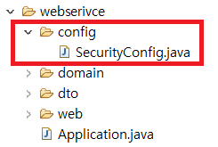

### 로그인 기능 구현

#### [기억보단 기록을](https://jojoldu.tistory.com/284?category=689637) 블로그를 참고하여 만들었습니다.

#### ~~1. 프로젝트 생성~~

#### ~~2. DB 연결~~

#### ~~3. 로그인 Front Page 작성~~

#### 4. 로그인 기능 구현

#### 5. 게시판 Front Page 작성

#### 6. 게시판 기능 구현

### Spring Security(스프링 시큐리티)

---

아무래도 로그인 / 로그아웃의 기능에 대해서 생각해야 할 것들이 많습니다.

대표적으로

- 접근 주체(Principal) : 보호된 대상에 접근하는 유저

- 인증 (Authenticate) : 현재 유저가 누구인지 확인 (로그인)

- 인가 (Authorize) : 현재 유저가 어떤 서비스에 접근할 수 있는지에 대한 권한 검사

- 권한 : 애플리케이션의 동작을 수행할 수 있도록 허락되어있는지를 결정

간단한 예로 **사용자** 라는 **권한** 을 가진 유저는 **관리자 권한**을 가진 사람이 접근할 수 있는 서비스에는 접근을 하지 못하게 하는 것 입니다.

이밖에도 생각할 것들이 더 많습니다...

간단하게 로그인 / 로그아웃 기능을 구현하려해도
배보다 배꼽이 더 커지는 경우가 발생한다고하여

로그인 / 로그아웃 기능은 **Spring Security**를 사용해 구현하기로 결정했습니다.

- **Spring Security(스프링 시큐리티)**  
   \* 스프링 시큐리티란 스프링 기반의 애플리케이션의 보안을 담당하는 프레임워크입니다.

      	* [공식문서](https://docs.spring.io/spring-security/site/docs/4.2.7.RELEASE/reference/htmlsingle/#getting-started)

### Spring Security 적용

---

Spring Security 디펜던시를 추가하겠습니다.

#### build.gradle

```java
// 스프링 시큐리티
implementation 'org.springframework.boot:spring-boot-starter-security'
// thtmeleaf에서 스프링 시큐리티를 사용하기위한 디펜던시
implementation 'org.thymeleaf.extras:thymeleaf-extras-springsecurity5'
```

스프링 시큐리티를 사용하기위해 설정을 추가하겠습니다.



webservice 패키지 아래에 config 패키지를 만들고

SecurityConfig 클래스를 생성합니다.

#### SecurityConfig

Optional 은 java 8 에서 처음 도입이 되었으며 java 에서 값이 없음을 표현하기 위한 null 값을 그대로 사용하지 않고 Optional 인스턴스로 대체하여 값이 없음에 대한 예기치 못한 에러 발생으로 부터 안전한 값의 처리를 지원한다는 점이 특징이라고 할 수 있습니다.

```java
implementation 'org.springframework.boot:spring-boot-starter-thymeleaf'
```

**build.gradle** 에 다음과 같이 디펜던시를 추가하겠습니다.

#### applications.yml

```java
thymeleaf:
	cache: false
```

**applications.yml** 에 다음과 같이 설정을 추가하겠습니다.

cache값에 **false** 를 두면 수정내용을 프로젝트 재시작없이 확인할 수 있습니다.

추후 배포를 할때는 **true** 값으로 변경해야합니다.


**resource > templates > index.html** 파일을 생성합니다.

```html
<!DOCTYPE html>
<html>
  <head xmlns:th="http://www.thymeleaf.org">
    <meta charset="UTF-8" />
    <title>Hierarchical - Board</title>
  </head>
  <body>
    <h1>테스트해보자</h1>
  </body>
</html>
```

위처럼 head 태그에 `xmlns:th="http://www.thymeleaf.org"` 를 추가하시면 thymeleaf 문법을 사용할 수 있습니다.

이제 Controller를 작성하겠습니다.


위의 사진처럼 web 패키지에 WebController 클래스를 생성합니다.

#### WebController Class

```java
@Controller
@AllArgsConstructor
public class WebController {

	@GetMapping("/")
	public String init() {
		return "index";
	}

}

```

`@Controller` 를 사용하면 View(화면)을 반환하게 됩니다.

여기서는 **resource/templates/index.html** 을 반환합니다.

이제 Test 코드를 작성하여 확인해보겠습니다.


위의 사진과 같이 webservice / web 패키지를 만들고

WebControllerTest 클래스를 생성합니다.

#### WebControllerTest class

```java
@ExtendWith(SpringExtension.class)
@SpringBootTest(webEnvironment = WebEnvironment.RANDOM_PORT)
public class WebControllerTest {

	@Autowired
	private TestRestTemplate testRestTemplate;

	@Test
	public void 메인페이지() {
		//when
		String body = this.testRestTemplate.getForObject("/", String.class);

		//then
		assertThat(body).contains("테스트해보자");

	}
}

```

반환하는 페이지에 `테스트해보자` 라는 text가 있는지 확인하는 코드입니다.


테스트 코드가 통과되었으니 실제로 화면이 잘 뜨는지 확인합니다.


실제 화면이 잘 출력되니 간단하게 로그인화면을 구현하겠습니다.

### Thymeleaf Layout

---

Thymeleaf Layout을 이용해 html에서 공통적인 부분들을 나누겠습니다.

Thymeleaf에서 Layout 기능을 사용하려면 **build.gradle** 파일에 디펜던시를 추가해야합니다.

```java
implementation 'nz.net.ultraq.thymeleaf:thymeleaf-layout-dialect'
```

Thymeleaf Layout에 대한 자세한 설명은 따로 [여기서](https://blog.jiniworld.me/44) 보시기 바랍니다.


저는 위와같이 html에서 공통적인 부분들을 따로 layout.html에 빼놨습니다.

추후 부트스트랩 사용을 위해 미리 부트스트랩까지 추가했습니다.

부트스트랩 추가는 [기억보단 기록을](https://jojoldu.tistory.com/255?category=635883) 참고 하시기 바랍니다.

```html
<!DOCTYPE html>
<html
  lang="ko"
  xmlns:th="http://www.thymeleaf.org"
  xmlns:sec="http://www.thymeleaf.org/thymeleaf-extras-springsecurity5"
  xmlns:layout="http://www.ultraq.net.nz/thymeleaf/layout"
>
  <head>
    <meta charset="utf-8" />
    <meta http-equiv="X-UA-Compatible" content="IE=edge" />
    <meta name="viewport" content="width=device-width, initial-scale=1" />
    <title>고수의 발자취를 따라서</title>
    <!-- 부트스트랩 -->
    <link rel="stylesheet" href="/css/lib/bootstrap.min.css" />
  </head>
  <body>
    <header>
      <h2>테스트 레이아웃</h2>
    </header>
    <nav>
      <a href="/">main</a>
      <a href="/hello">hello</a>
    </nav>
    <section layout:fragment="content"></section>
    <footer>
      <p>개발인생</p>
    </footer>
    <!-- Jquery, bootstrap -->
    <script src="/js/lib/jquery.min.js"></script>
    <script src="/js/lib/bootstrap.min.js"></script>
  </body>
</html>
```

이제 페이지에서 Content가 되는 부분을 작성해보겠습니다.


위처럼 페이지에서 변화가 있는 부분은 따로 **content** 폴더에 만들겠습니다.

#### index.html

```html
<!DOCTYPE html>
<html
  lang="ko"
  xmlns:th="http://www.thymeleaf.org"
  xmlns:sec="http://www.thymeleaf.org/thymeleaf-extras-springsecurity5"
  xmlns:layout="http://www.ultraq.net.nz/thymeleaf/layout"
  layout:decorate="~{cmmn/layout}"
>
  <section layout:fragment="content">
    <h1>테스트해보자</h1>
  </section>
</html>
```

### hello.html

```html
<!DOCTYPE html>
<html
  lang="ko"
  xmlns:th="http://www.thymeleaf.org"
  xmlns:sec="http://www.thymeleaf.org/thymeleaf-extras-springsecurity5"
  xmlns:layout="http://www.ultraq.net.nz/thymeleaf/layout"
  layout:decorate="~{cmmn/layout}"
>
  <section layout:fragment="content">
    <h1>Hello</h1>
  </section>
</html>
```

이제 **hello.html** 을 불러올 수 있게 **Webcontroller** 클래스를 수정합니다.

```java
@Controller
@AllArgsConstructor
public class WebController {

	@GetMapping("/")
	public String init() {
		return "contents/index";
	}

	@GetMapping("/hello")
	public String hello() {
		return "contents/hello";
	}

}
```

이제 프로젝트를 실행해서 레이아웃이 잘 동작하는지 확인하겠습니다.

#### main 클릭시


#### hello 클릭시


공통으로 지정한 부분을 제외하고 화면이 변하는 걸 확인할 수 있습니다.
