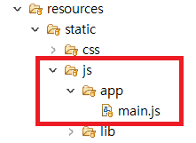

### 로그인 기능 구현 (1)

#### ~~1. 프로젝트 생성~~

#### ~~2. DB 연결~~

#### ~~3. 로그인 Front Page 작성~~

#### 4. 로그인 기능 구현

#### 5. 게시판 Front Page 작성

#### 6. 게시판 기능 구현

### Spring Security(스프링 시큐리티)

---

아무래도 로그인 / 로그아웃의 기능에 대해서 생각해야 할 것들이 많습니다.

대표적으로

- 접근 주체(Principal) : 보호된 대상에 접근하는 유저

- 인증 (Authenticate) : 현재 유저가 누구인지 확인 (로그인)

- 인가 (Authorize) : 현재 유저가 어떤 서비스에 접근할 수 있는지에 대한 권한 검사

- 권한 : 애플리케이션의 동작을 수행할 수 있도록 허락되어있는지를 결정

간단한 예로 **사용자** 라는 **권한** 을 가진 유저는 **관리자 권한**을 가진 사람이 접근할 수 있는 서비스에는 접근을 하지 못하게 하는 것 입니다.

이밖에도 생각할 것들이 더 많습니다...

간단하게 로그인 / 로그아웃 기능을 구현하려해도
배보다 배꼽이 더 커지는 경우가 발생한다고하여

로그인 / 로그아웃 기능은 **Spring Security**를 사용해 구현하기로 결정했습니다.

- **Spring Security(스프링 시큐리티)**

  - 스프링 시큐리티란 스프링 기반의 애플리케이션의 보안을 담당하는 프레임워크입니다.

  - [공식문서](https://docs.spring.io/spring-security/site/docs/4.2.7.RELEASE/reference/htmlsingle/#getting-started)

### Spring Security 적용

---

Spring Security 디펜던시를 추가하겠습니다.

#### build.gradle

```java
// 스프링 시큐리티
implementation 'org.springframework.boot:spring-boot-starter-security'
// thtmeleaf에서 스프링 시큐리티를 사용하기위한 디펜던시
implementation 'org.thymeleaf.extras:thymeleaf-extras-springsecurity5'
```

스프링 시큐리티를 사용하기위해 설정을 추가하겠습니다.

#### 이번 프로젝트에서는 정말 기본적인 설정만으로 구현하겠습니다.


webservice 패키지 아래에 config 패키지를 만들고

SecurityConfig 클래스를 생성합니다.

#### SecurityConfig

```java
@Configuration
@EnableWebSecurity
@AllArgsConstructor
public class SecurityConfig extends WebSecurityConfigurerAdapter {
	private UserSecurityService userSecurityService;

	@Bean
	public PasswordEncoder passwordEncoder() {
		return new BCryptPasswordEncoder();
	}

	@Override
	public void configure(WebSecurity web) throws Exception {
		// static 폴더 하위 목록은 인증 무시하기
		web.ignoring().antMatchers("/css/**", "/js/**", "/img/**");
	}

	@Override
	protected void configure(HttpSecurity http) throws Exception {
		// 페이지 접근 권한에 대한 설정
		http.authorizeRequests()
			.antMatchers("/board").hasRole("USER")
			.antMatchers("/**").permitAll()
		.and()	// 로그인 설정
			.formLogin()
			.loginPage("/")
			.loginProcessingUrl("/user/login")
			.defaultSuccessUrl("/board", true)
			.failureHandler(loginFailHandler())
			.permitAll()
		.and()	// 로그아웃 설정
			.logout()
			.logoutRequestMatcher(new AntPathRequestMatcher("/user/logout"))
			.logoutSuccessUrl("/")
			.invalidateHttpSession(true)
		.and() // 403 예외처리 설정
			.exceptionHandling().accessDeniedPage("/login/error");
	}

	@Override
	public void configure(AuthenticationManagerBuilder auth) throws Exception {
		auth.userDetailsService(userSecurityService).passwordEncoder(passwordEncoder());
	}

  @Bean
	public AuthenticationFailureHandler loginFailHandler() {
		return new LoginFailHandler();
	}
}
```

스프링 시큐리티의 설정 클래스입니다.

`@EnableWebSecurity` 어노테이션을 붙여서
스프링 시큐리티의 설정을 정의할 수 있습니다.

`WebSecurityConfigurerAdapter` 클래스를 상속받아 시큐리티의 설정을 진행합니다.

```java
@Bean
public PasswordEncoder passwordEncoder() {	  return new BCryptPasswordEncoder();
}
```

스프링 시큐리티에서 제공하는 암호화 객체입니다.
서비스에서 사용할 수 있도록 Bean으로 등록합니다.

```java
	@Override
	public void configure(WebSecurity web) throws Exception {
		// static 폴더 하위 목록은 인증 무시하기
		web.ignoring().antMatchers("/css/**", "/js/**", "/img/**");
	}
```

configure 메서드를 오버라이딩하여 시큐리티의 설정을 진행합니다.

매개변수로 `WebSecurity`를 전달해고 위의 코드처럼 작성하면  
 `antMatchers()` 의 전달인자로 전해주는 경로의 파일들은 스프링 시큐리티가 무시할 수 있도록 설정이 됩니다.

**아래의 코드에서 loginFailHandler()는 따로 작성한 handler입니다**

```java
	@Override
protected void configure(HttpSecurity http) throws Exception {
	// 페이지 접근 권한에 대한 설정
	http.authorizeRequests()
		.antMatchers("/board").hasRole("USER")
		.antMatchers("/**").permitAll()
	.and()	// 로그인 설정
		.formLogin()
		.loginPage("/")
		.loginProcessingUrl("/user/login")
		.defaultSuccessUrl("/board", true)
		.failureHandler(loginFailHandler())
		.permitAll()
	.and()	// 로그아웃 설정
		.logout()
		.logoutRequestMatcher(new AntPathRequestMatcher("/user/logout"))
		.logoutSuccessUrl("/")
		.invalidateHttpSession(true)
	.and() // 403 예외처리 설정
		.exceptionHandling().accessDeniedPage("/login/error");
}
```

`HttpSecurity` 를 전달인자로 전해주면

**HTTP** 요청에 대한 보안 설정을 할 수 있습니다.

```java
	http.authorizeRequests()
		.antMatchers("/board").hasRole("USER")
		.antMatchers("/**").permitAll()
```

- `.antMatchers("/board").hasRole("USER")`

  이 부분은 "/board"에 대한 요청 처리를 설정합니다.

  요청을 보내는 대상의 **ROLE** 을 확인하여 **USER** 라는

  **ROLE** 을 가지고 있는 대상만 해당 페이지로의 접근이 가능합니다.

- `permitAll()`

  모든 요청에 대해 접근할 수 있도록 해줍니다.

```java
	.and()	// 로그인 설정
		.formLogin()
		.loginPage("/")
		.loginProcessingUrl("/user/login")
		.defaultSuccessUrl("/board", true)
		.failureHandler(loginFailHandler())
		.permitAll()
```

- `.formLogin()`

  form 기반으로 로그인 인증을 하도록 합니다.

  **/login** 경로로 접속하면 스프링 시큐리티에서 제공하는 form을 사용할 수 있습니다.

- `.loginPage("/")`

  기본으로 제공하는 form 말고 커스텀한 form을 사용하고 싶을때 그 form이 있는 주소를 적습니다.

- `.loginProcessingUrl("/user/login")`

  매개변수로 전달한 주소에 대해 요청을 보내면 로그인을 진행하게 됩니다.

  커스텀한 form 태그의 action 주소를 매개변수로 전달한 주소와 맞춰주어야합니다.

* `.defaultSuccessUrl("/board", true)`

      로그인에 성공했을 때 어떤 페이지로 이동할 것인지 설정하는 메서드입니다.

* `.failureHandler(loginFailHandler())`

  로그인에 실패했을 때에 어떻게 처리를 할지에 대한 설정입니다.

  따로 작성한 handler를 매개변수로 전달해줍니다.

```java
	.and()	// 로그아웃 설정
		.logout()
		.logoutRequestMatcher(new AntPathRequestMatcher("/user/logout"))
		.logoutSuccessUrl("/")
		.invalidateHttpSession(true)
```

- `logoutRequestMatcher()`
  로그아웃에 대한 설정입니다. 위에서 전달한 경로에 대한 요청이 발생하면 로그아웃을 진행합니다.

- `logoutSuccessUrl()`

  로그아웃에 성공했을시 이동하게되는 페이지의 주소를 적습니다.

* `invalidateHttpSession(true)`

  로그아웃에 성공할 시 HTTP Session을 초기화 합니다.

```java
	.and() // 403 예외처리 설정
		.exceptionHandling().accessDeniedPage("/login/error");
```

- `.exceptionHandling().accessDeniedPage("/login/error");`

  페이지 접근 권한이 없을때에 대한 처리 메서드입니다.

  위의 코드에서는 페이지에 대한 접근이 없을때

  /login/error 페이지로 이동합니다.

```java
	@Override
	public void configure(AuthenticationManagerBuilder auth) throws Exception {
		auth.userDetailsService(userSecurityService).passwordEncoder(passwordEncoder());
	}
```

스프링 시큐리티에 대한 로그인 처리에 대한 설정입니다.

인증을 위해서는 UserDetailService 인터페이스를 구현해야하는데 여기서는 userSercurityService에서 구현했습니다.

비밀번호 암호화는 `passwordEncoder` 를 사용했습니다.

```java
  @Bean
	public AuthenticationFailureHandler loginFailHandler() {
		return new LoginFailHandler();
	}
```

로그인 오류처리에 대한 handler입니다.


위의 사진처럼 service 패키지를 만들고

**UserSecurityService** 클래스를 생성합니다.

**UserSecurityService**

```java
@Service
@AllArgsConstructor
public class UserSecurityService implements UserDetailsService  {
	private UsersRepository usersRepository;

	@Transactional
	public Long accountUser(UsersSaveRequestDto saveDto) {
		BCryptPasswordEncoder passwordEncoder = new BCryptPasswordEncoder();
		saveDto.setPassword(passwordEncoder.encode(saveDto.getPassword()));

		return usersRepository.save(saveDto.toEntity()).getId();
	}

	@Override
	public UserDetails loadUserByUsername(String userId) throws UsernameNotFoundException {
		// TODO Auto-generated method stub
		Optional<Users> userEntitiy = usersRepository.findByUserId(userId);
		Users findUser = userEntitiy.get();
		ArrayList<GrantedAuthority> authorities = new ArrayList<>();

		authorities.add(new SimpleGrantedAuthority("ROLE_USER"));

		return new User(findUser.getUserId(), findUser.getPassword(), authorities);
	}
}
```

- `accountUser`

  회원가입 처리에 대한 메서드입니다.

  비밀번호를 암호화하여 저장합니다.

  매서드 이름은 마음대로 정해도 됩니다.

- `loadUserByUsername`

  로그인 요청이 들어왔을 때 유저의 정보를 조회하는 메서드입니다.

  여기서 유저의 권한 **ROLE** 을 부여합니다.

  **ROLE** 에 대한 설정은 다양한 방법이 있지만 여기서는 전부 **USER** 라는 권한을 주겠습니다.

  위에서는 매개변수로 유저의 ID를 받습니다.

  form의 input 에서는 username 이라는 이름으로 서버에 전달해줘야합니다.

  또 주의할 점으로 User라는 클래스는 스프링 시큐리티에서 사용중임으로 User라는 클래스 이름이 겹치지 않게 해주어야합니다.

**UserRespository**

```java
public interface UsersRepository extends JpaRepository<Users, Long> {
	Optional<Users> findByUserId(String userId);
}
```

**UserRespository** 에 위처럼 UserId로 검색할 수 있게 매서드를 추가합니다.

- Optional

  Optional 은 java 8 에서 처음 도입이 되었으며 java 에서 값이 없음을 표현하기 위한 null 값을 그대로 사용하지 않고 Optional 인스턴스로 대체하여 값이 없음에 대한 예기치 못한 에러 발생으로 부터 안전한 값의 처리를 지원한다는 점이 특징이라고 할 수 있습니다.


**config** 패키지 안에 **LoginFailHandler** 클래스를 추가합니다.

**LoginFailHandler**

```java
public class LoginFailHandler implements AuthenticationFailureHandler {

	@Override
	public void onAuthenticationFailure(HttpServletRequest request, HttpServletResponse response,
			AuthenticationException exception) throws IOException, ServletException {
		// TODO Auto-generated method stub
		String errorMsg = exception.getMessage();
		request.setAttribute("errorMsg", errorMsg);

		request.getRequestDispatcher("/login/fail").forward(request, response);
	}
}
```

로그인 실패시에 처리할 핸들러는 `AuthenticationFailureHandler` 인터페이스를 구현하여 설정하였습니다.

여기서는 로그인에 실패할 시 실패한 내용을 화면에 출력해주기 위한 작업을 했습니다.

이제 **controller** 에 대한 작업을 하겠습니다.

**WebRestController**

```java
@RestController
@AllArgsConstructor
public class WebRestController {
	private UsersRepository re;
	private UserSecurityService userSecurityService;

	@PostMapping("/users/signup")
	public ResponseEntity<Map<String, Object>> saveUsers(@RequestBody UsersSaveRequestDto dto) {
		userSecurityService.accountUser(dto);
		Map<String, Object> map = new HashMap<>();

		map.put("msg", "save");
		return new ResponseEntity<>(map, HttpStatus.OK);
	}
}
```

**WebRestController** 에 위와같이 회원가입에 대한 처리를 추가합니다.

회원가입은 Ajax를 이용해 진행하겠습니다.

**WebController**

```java
@Controller
@AllArgsConstructor
public class WebController {

	@GetMapping("/")
	public String init() {
		return "contents/index";
	}

	@GetMapping("/board")
	public String hello() {
		return "contents/board";
	}

	@GetMapping("/login/error")
	public String error() {
		System.out.println("??");
		return "contents/error";
	}

	@PostMapping("/login/fail")
	public String initPost() {
		return "contents/index";
	}

	@GetMapping("/info")
	public String info() {
		return "contents/info";
	}
}
```

**WebController** 에서 화면에 대한 요청들을 처리해줍니다.


위와 같이 html들을 추가해줍니다.

**layout.html**

```html
<!DOCTYPE html>
<html
  lang="ko"
  xmlns:th="http://www.thymeleaf.org"
  xmlns:sec="http://www.thymeleaf.org/thymeleaf-extras-springsecurity5"
  xmlns:layout="http://www.ultraq.net.nz/thymeleaf/layout"
>
  <head>
    <meta charset="utf-8" />
    <meta http-equiv="X-UA-Compatible" content="IE=edge" />
    <meta name="viewport" content="width=device-width, initial-scale=1" />

    <meta name="_csrf" th:content="${_csrf.token}" />
    <meta name="_csrf_header" th:content="${_csrf.headerName}" />

    <title>고수의 발자취를 따라서</title>
    <!-- 부트스트랩 -->
    <link rel="stylesheet" href="/css/lib/bootstrap.min.css" />

    <style>
      body {
        margin: 0;
        padding: 0;
      }

      .wrap__content {
        margin-top: 100px;
      }
    </style>
  </head>
  <body>
    <header>
      <h4>계층형 게시판</h4>
    </header>
    <ul class="nav nav-tabs">
      <li th:if="!${#request.isUserInRole('USER')}" role="presentation">
        <a href="/">main</a>
      </li>
      <li sec:authorize="hasRole('ROLE_USER')" role="presentation">
        <a th:href="@{/board}">게시판</a>
      </li>
      <li sec:authorize="hasRole('ROLE_USER')" role="presentation">
        <a th:href="@{/info}">내정보</a>
      </li>
      <li sec:authorize="hasRole('ROLE_USER')" role="presentation">
        <a th:href="@{/user/logout}">로그아웃</a>
      </li>
    </ul>

    <section layout:fragment="content"></section>
    <footer>
      <div class="footer-copyright text-center py-3">by 개발인생</div>
    </footer>

    <!-- Jquery, bootstrap -->
    <script src="/js/lib/jquery.min.js"></script>
    <script src="/js/lib/bootstrap.min.js"></script>
    <script src="/js/app/main.js"></script>
  </body>
</html>
```

```html
<meta name="_csrf" th:content="${_csrf.token}" />
<meta name="_csrf_header" th:content="${_csrf.headerName}" />
```

스프링 시큐리티의 csrf 보안을 위해 삽입한 meta 태그입니다.

form 태그를 사용하면 굳이 위의 태그를 삽입할 필요는 없지만,

회원가입을 ajax 통신을 사용하여 하기때문에 추가해주었습니다.

- `<li th:if="!${#request.isUserInRole('USER')}" role="presentation"><a href="/">main</a>`

  `th:if="!${#request.isUserInRole('USER')}"` 이 부분은 화면의 사용자가 USER라는 권한이 없을 때,

  즉, 로그인을 하지 않았을 때 main이라는 버튼을 노출시킵니다.

- `<li sec:authorize="hasRole('ROLE_USER')" role="presentation"><a th:href="@{/info}">내정보</a>`

  `sec:authorize="hasRole('ROLE_USER')"` 는 유저의 권한이 ROLE_USER일 때 화면에 노출시킵니다.

**bord.html**

```html
<!DOCTYPE html>
<html
  lang="ko"
  xmlns:th="http://www.thymeleaf.org"
  xmlns:sec="http://www.thymeleaf.org/thymeleaf-extras-springsecurity5"
  xmlns:layout="http://www.ultraq.net.nz/thymeleaf/layout"
  layout:decorate="~{cmmn/layout}"
>
  <section layout:fragment="content">
    <h1>계층형 게시판</h1>
    <div class="container">
      <table class="table table-striped table-bordered table-hover">
        <thead>
          <tr>
            <th>#</th>
            <th>컬럼2</th>
            <th>컬럼3</th>
            <th>컬럼4</th>
            <th>컬럼5</th>
          </tr>
        </thead>
        <tbody>
          <tr>
            <td>1</td>
            <td>데이터2</td>
            <td>데이터3</td>
            <td>데이터4</td>
            <td>데이터5</td>
          </tr>
          <tr>
            <td>2</td>
            <td>데이터2</td>
            <td>데이터3</td>
            <td>데이터4</td>
            <td>데이터5</td>
          </tr>
          <tr>
            <td>3</td>
            <td>데이터2</td>
            <td>데이터3</td>
            <td>데이터4</td>
            <td>데이터5</td>
          </tr>
        </tbody>
      </table>
    </div>
    <div align="right" class="col-md-12 left">
      <button
        type="button"
        class="btn btn-primary"
        data-toggle="modal"
        data-target="#savePostsModal"
      >
        글 등록
      </button>
    </div>
    <div class="center-block" style="width: 300px;padding:15px;">
      <nav aria-label="Page navigation">
        <ul class="pagination">
          <li class="page-item"><a class="page-link" href="#">Previous</a></li>
          <li class="page-item"><a class="page-link" href="#">1</a></li>
          <li class="page-item"><a class="page-link" href="#">2</a></li>
          <li class="page-item"><a class="page-link" href="#">3</a></li>
          <li class="page-item"><a class="page-link" href="#">Next</a></li>
        </ul>
      </nav>
    </div>
    <div
      class="modal fade"
      id="savePostsModal"
      tabindex="-1"
      role="dialog"
      aria-labelledby="savePostsLabel"
      aria-hidden="true"
    >
      <div class="modal-dialog" role="document">
        <div class="modal-content">
          <div class="modal-header">
            <h5 class="modal-title" id="savePostsLabel">게시글 등록</h5>
            <button
              type="button"
              class="close"
              data-dismiss="modal"
              aria-label="Close"
            >
              <span aria-hidden="true">&times;</span>
            </button>
          </div>
          <div class="modal-body">
            <form>
              <div class="form-group">
                <label for="title">제목</label>
                <input
                  type="text"
                  class="form-control"
                  id="title"
                  placeholder="제목을 입력하세요"
                />
              </div>
              <div class="form-group">
                <label for="author"> 작성자 </label>
                <input
                  type="text"
                  class="form-control"
                  id="author"
                  placeholder="작성자를 입력하세요"
                />
              </div>
              <div class="form-group">
                <label for="content"> 내용 </label>
                <textarea
                  class="form-control"
                  id="content"
                  placeholder="내용을 입력하세요"
                ></textarea>
              </div>
            </form>
          </div>
          <div class="modal-footer">
            <button
              type="button"
              class="btn btn-secondary"
              data-dismiss="modal"
            >
              취소
            </button>
            <button type="button" class="btn btn-primary" id="btn-save">
              등록
            </button>
          </div>
        </div>
      </div>
    </div>
  </section>
</html>
```

**error.html**

```html
<!DOCTYPE html>
<html
  lang="ko"
  xmlns:th="http://www.thymeleaf.org"
  xmlns:sec="http://www.thymeleaf.org/thymeleaf-extras-springsecurity5"
  xmlns:layout="http://www.ultraq.net.nz/thymeleaf/layout"
  layout:decorate="~{cmmn/layout}"
>
  <section layout:fragment="content">
    <div class="container wrap__content">
      <h1>Error</h1>
    </div>
  </section>
</html>
```

**index.html**

```html
<!DOCTYPE html>
<html lang="ko" xmlns:th="http://www.thymeleaf.org"
	xmlns:sec="http://www.thymeleaf.org/thymeleaf-extras-springsecurity5"
	xmlns:layout="http://www.ultraq.net.nz/thymeleaf/layout"
	layout:decorate="~{cmmn/layout}">

<section layout:fragment="content">
	<div class="container wrap__content">
		<div class="col-md-6 col-md-offset-3">
		<div th:if="!${#request.isUserInRole('USER')}">
			<form th:action="@{/user/login}"class="form-horizontal" method="post" id="login-frm">
				<div class="form-group">
					<label for="inputEmail3" class="col-sm-2 control-label">아이디</label>
					<div class="col-sm-10">
						<input type="text" class="form-control" name="username"
							id="username" placeholder="user-id">
					</div>
				</div>
				<div class="form-group">
					<label for="inputPassword3" class="col-sm-2 control-label">Password</label>
					<div class="col-sm-10">
						<input type="password" class="form-control" id="password" name="password"
							placeholder="Password">
					</div>
				</div>
				<span th:text="${errorMsg}" style="color:red"></span>
				<div class="form-group">
					<div class="col-sm-offset-2 col-sm-5">

						<button type="button" class="btn btn-default" id="login-btn">Sign in</button>
						<button type="button" class="btn btn-primary" data-toggle="modal"
							data-target="#accountUserModal">회원가입</button>
					</div>
				</div>
			</form>
			</div>


			<div class="modal fade" id="accountUserModal" tabindex="-1"
				role="dialog" aria-labelledby="accountUserLabel" aria-hidden="true">
				<div class="modal-dialog" role="document">
					<div class="modal-content">
						<div class="modal-header">
							<h5 class="modal-title" id="accountUserLabel">회원 가입</h5>
							<button type="button" class="close" data-dismiss="modal"
								aria-label="Close">
								<span aria-hidden="true">&times;</span>
							</button>
						</div>
						<div class="modal-body">
							<form>
								<div class="form-group">
									<label for="user_name">이름</label> <input type="text"
										class="form-control" id="userName" placeholder="이름을 입력하세요">
								</div>
								<div class="form-group">
									<label for="user_id">아이디</label> <input type="text"
										class="form-control" id="userId" placeholder="아이디를 입력하세요">
								</div>
								<div class="form-group">
									<label for="password">패스워드</label> <input class="form-control"
										id="initPassword" placeholder="비밀번호을 입력하세요"></input>
								</div>
							</form>
						</div>
						<div class="modal-footer">
							<button type="button" class="btn btn-secondary"
								data-dismiss="modal">취소</button>
							<button type="button" class="btn btn-primary" id="btn-save">가입</button>
						</div>
					</div>
				</div>
			</div>
		</div>
	</div>
</section>
```

- `<span th:text="${errorMsg}" style="color:red"></span>`

  로그인 실패시 핸들러에서 전달해준 에러 매시지를 화면에 출력합니다.

form 태그에서 주의할 점은 스프링 시큐리티에서 화면의 form 태그를 받아 로그인을 진행할 때

**username**

**password**

라는 매개변수를 받아 진행하기때문에 이름이 바뀌지 않게 주의 하셔야합니다.

따로 설정을 하셔서 매개변수의 이름을 바꿀 수 있습니다.

**info.html**

```html
<!DOCTYPE html>
<html
  lang="ko"
  xmlns:th="http://www.thymeleaf.org"
  xmlns:sec="http://www.thymeleaf.org/thymeleaf-extras-springsecurity5"
  xmlns:layout="http://www.ultraq.net.nz/thymeleaf/layout"
  layout:decorate="~{cmmn/layout}"
>
  <section layout:fragment="content">
    <div class="container wrap__content">
      <div class="row">
        <div class="col-sm-6 col-md-8 col-md-offset-2">
          <div class="thumbnail">
            <div class="caption">
              <h3><span sec:authentication="name"></span> 님 환영합니다.</h3>
              <p>
                <a href="#" class="btn btn-primary" role="button">Button</a>
                <a href="#" class="btn btn-default" role="button">Button</a>
              </p>
            </div>
          </div>
        </div>
      </div>
    </div>
  </section>
</html>
```

이제 JQuery를 이용해 화면에 이벤트를 넣겠습니다.



사진처럼 main.js 파일을 추가합니다.

**mina.js**

```javascript
let main = {
  init: function() {
    this.userSignup();
    this.userLogin();
  },
  csrf: {
    token: $("meta[name='_csrf']").attr("content"),
    header: $("meta[name='_csrf_header']").attr("content")
  },
  // 회원가입시 서버로 넘어가는 값 체크하기.
  validationSingup: function(userObj) {
    let userName = userObj.userName;
    let userId = userObj.userId;
    let passwd = userObj.password;
    let checkSpc = /[~!#$%^&*()_+|<>?:{}]/; // @는 검사에서 제외
    console.log(userName.trim());
    if (!userName) {
      alert("유저 이름을 다시 정해주세요");
      return false;
    }

    if (!userId && checkSpc.test(userName)) {
      alert("아이디를 다시 입력해주세요");
      return false;
    }

    if (!passwd) {
      alert("비밀번호를 입력해주세요");
      return false;
    }
    return true;
  },
  userSignup: function() {
    let $this = this;
    let suerSignIn = document.querySelector("#btn-save");
    suerSignIn.addEventListener("click", function() {
      let user = {
        userName: document.querySelector("#userName").value.trim(),
        userId: document.querySelector("#userId").value.trim(),
        password: document.querySelector("#initPassword").value.trim()
      };

      if ($this.validationSingup(user)) {
        $.ajax({
          type: "POST",
          url: "/users/signup",
          dataType: "json",
          contentType: "application/json; charset=utf-8",
          data: JSON.stringify(user),
          beforeSend: function(xhr) {
            xhr.setRequestHeader($this.csrf.header, $this.csrf.token);
          }
        })
          .done(function(result) {
            if (result.msg === "save") {
              alert("회원가입에 성공했습니다.");
              location.reload();
            } else {
              alert("회원가입에 실패했습니다. 다시 가입해주세요");
              location.reload();
            }
          })
          .fail(function(error) {
            console.log(error);
          });
      }
    });
  },
  userLogin: function() {
    let userSignIn = document.querySelector("#login-btn");

    userSignIn.addEventListener("click", function() {
      $("#login-frm").submit();
    });
  }
};

main.init();
```

원래는 순수 자바스크립트 만으로 진행하려했으니 Ajax 통신은

Jquery를 이용하는게 더 수월하기때문에 Jquery를 사용했습니다.

```javascript
  csrf: {
    token: $("meta[name='_csrf']").attr("content"),
    header: $("meta[name='_csrf_header']").attr("content")
  },
```

위 부분은 화면에서 서버와 통신하기 위한 부분입니다.

스프링 시큐리티는 csrf 보안을 해주기때문에 위처럼 csrf 토큰을 삽입해줘야합니다.

```javascript
        $.ajax({
          type: "POST",
          url: "/users/signup",
          dataType: "json",
          contentType: "application/json; charset=utf-8",
          data: JSON.stringify(user),
          beforeSend: function(xhr) {
            xhr.setRequestHeader($this.csrf.header, $this.csrf.token);
          }
		  ...
```

ajax 통신을 할때 csrf 토큰을 **beforeSend** 메서드에서 `setRequestHeader()` 매개변수로 주어야 합니다.

이제 기능이 잘 작동하는 화면을 통해 확인해보겠습니다.

**로그인 하기 전**


로그인 하기전 화면입니다.

**로그인 실패시**


로그인 실패시 에러 메세지를 화면에 출력합니다.

**로그인 성공시**


로그인 성공시 nav 메뉴가 늘어나는 것과

로그인 성공시 /board 페이지로 연결되는 걸 확인합니다.

이렇게 정말 기본적은 회원가입, 로그인, 로그아웃 기능이 끝났습니다.

추가로 게시판에 대한 기본적인 table을 추가했습니다.

포스트가 길어지는 것을 방지하기 위해 회원탈퇴, 유저 정보 변경 작업은 다음 포스트에서 하겠습니다.
