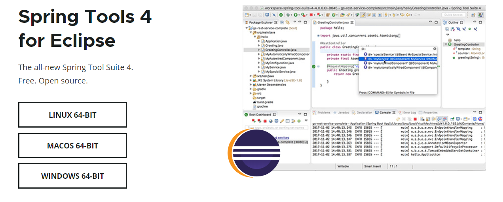
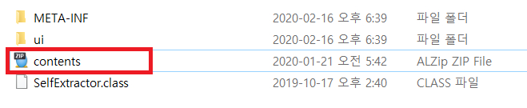
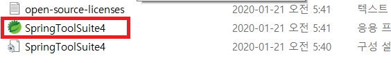

### STS 설치 

원래 Java와 IDE에 대한 설치는 넘어가려고 했지만 오랜만에 STS를 설치하려고 하니 예전과 좀 달라져서 STS 설치를 정리해보려고 합니다.

먼저 STS 설치를 위해 아래의 홈페이지로 이동합니다.

https://spring.io/tools   

자신에게 맞는 OS용 버전을 클릭하여 설치합니다.

### 압축풀기
처음 당황한 부분이 바로 이 부분인데... 갑자기 jar파일로 다운받아 지길래 당황했습니다..ㅎ

다운받아진 jar파일의 압축을 풀어주면 위의 사진과 같이 나오는데 빨간 테두리의 zip파일을 한번 더 압축해제합니다.

### 실행

압축을 해제하시면 __sts-4.5.1.RELEASE__ 라는 파일이 생겼을 겁니다.
##### (현재 시점 기준이기때문에 파일명은 바뀔 수 있습니다.)

사진에 보이는 SpringToolsSuite파일을 클릭해서 실행하면 STS를 실행할 수 있습니다.