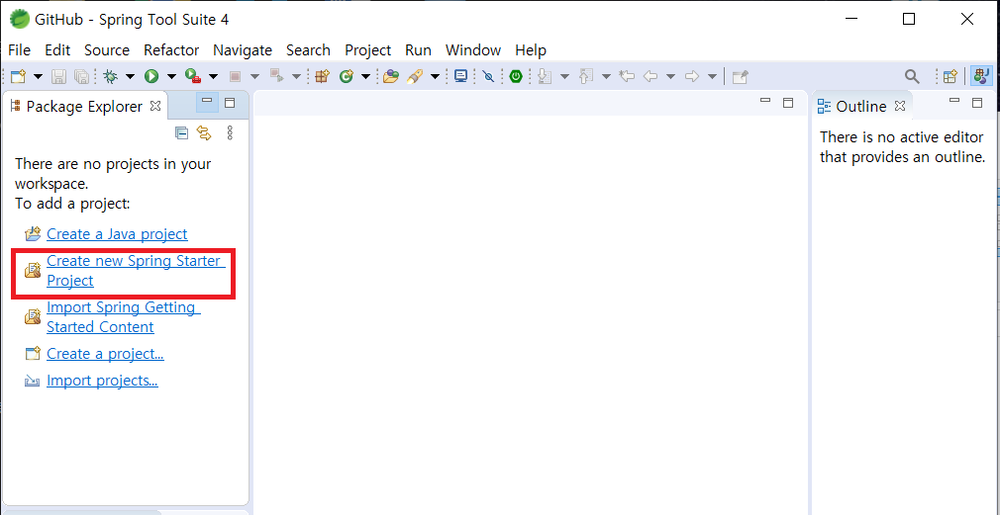
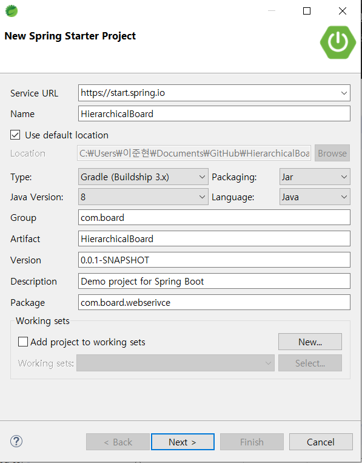
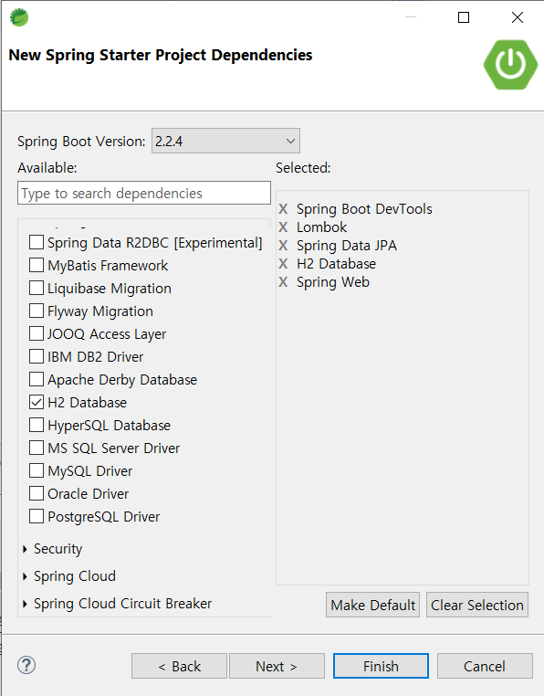
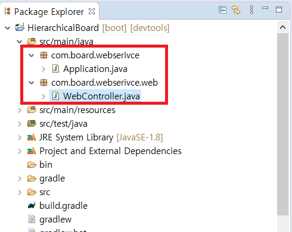
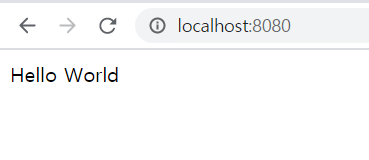

### 계획 세우기

막연하게 프로젝트를 진행하기보다는 나름의 계획을 세우고 차근차근 진행하는게 좀 더 수월할 것 같습니다.

저같은 경우는 큰 틀을 미리 정해두고 시작하는 편입니다.

큰 틀을 생각해보자면

#### 1. 프로젝트 생성

#### 2. DB 연결

#### 3. 로그인 Front Page 작성

#### 4. 로그인 기능 구현

#### 5. 게시판 Front Page 작성

#### 6. 게시판 기능 구현

이정도가 될 것 같습니다.

세세한 내용은 진행하면서 추가하도록 하겠습니다.

### 프로젝트 생성

가장 먼저 프로젝트를 생성해보겠습니다.



sts 첫 화면입니다. workspace는 편하신 폴더를 선택하시면 될 것 같습니다.  
빨간 테두리에 있는 **Create new Spring Starter Project** 를 클릭합니다.



위와 같이 프로젝트의 대략적인 설정을 하는 창이 나타납니다.

기본 패키기나, 프로젝트 이름을 설정할 수 있습니다.

저같은 경우 프로젝트 이름을 HierarchicalBoard로 하겠습니다.  
패키지명은 com.board.webservice로 하겠습니다.



next 버튼을 클릭하면 위와 같은 화면이 됩니다.  
여기서는 스프링 부트 프로젝트에 필요한 디펜던시를 추가하는 작업을 합니다.

- web -> Spring Web
- SQL -> Spring Data JPA, H2 DataBase
- Developer Tools -> Spring Boot DevTools, Lombok

이렇게 선택하겠습니다.

처음 프로젝트를 만들고 나면 **HierarchicalBoardApplication.java** 가 생성될텐데 이를 **Application.java** 로 이름을 변경하겠습니다.

그리고 **com.board.webservice** 패키지 안에 web이라는 패키지를 만들고 **WebController.java** 를 생성합니다.



**WebController.java** 파일에 아래와 같이 작성합니다.

```java
// WebController.java

package com.board.webserivce.web;

import org.springframework.web.bind.annotation.GetMapping;
import org.springframework.web.bind.annotation.RestController;

@RestController
public class WebController {

	@GetMapping("/")
	public String init() {
		return "Hello World";
	}
}

```

이제 프로젝트를 실행합니다. 기본적으로 포트번호는 **8080** 입니다.



위의 사진과 같은 화면을 보셨다면 성공적으로 프로젝트를 생성하신 겁니다.
