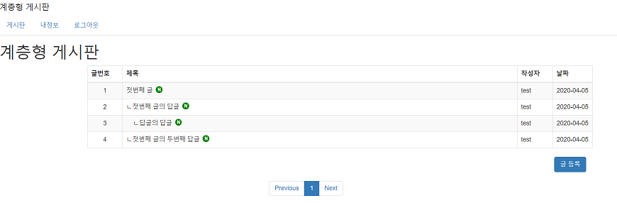
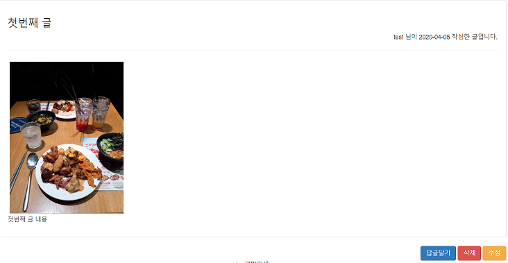
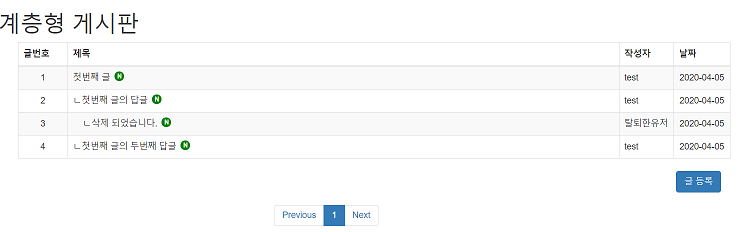

### 고수의 발자취를 따라서 - 계층형 게시판 후기, 피드백

---

2달 가량의 계층형 게시판이 마무리 되었습니다.

전체 코드는 Git Hub에 있습니다.

**[계층형 게시판 github](https://github.com/dlwnsgus777/HierarchicalBoard)**

#### 게시판 페이지

#### 게시판 상세 페이지

#### 게시판 삭제 후 페이지

허접하지만... 여차저차 마무리가 되었습니다.

그 전에 틈틈히 정리한 포스트는 게시판 조회에서 마무리했습니다.

점점 새로운 기술보다는 코드를 복붙하는 느낌이 강해졌기 때문입니다.

## 후기

---

정말 간단하게 구현해서 후기랑 피드백을 쓰기도 민망하지만

작은 일에도 스스로에게 피드백을 주고 개선하는게 중요하다 생각합니다.

사실 처음 시작했을때 마무리가 될지... 걱정이 앞섰는데

여자처차 마무리가 되어서 후련한 기분이 듭니다.

이것저것 기능을 더 붙일수도 있겠지만 초반에 완성 시키고자 한 기능에 대한 구현에만 집중했습니다.

예전에 만들다가 시간이 점점 늘어나 포기했던 게시판이 있었는데 이번에는 1일 1커밋의 힘으로 무사히 마무리 할 수 있었습니다.

**jpa** 나 **spring-security , thymeleaf** 등 처음 사용하는 기술이 많았지만 그만큼 공부도 많이 된 것 같습니다.

동시에 많은 부족함을 느꼈습니다.

## 피드백

---

아쉬운 점, 부족한 점이 너무나도 많습니다.

큰 부분들을 나열해보자면 

* 테스트 코드를 작성하지 않은 점

* 오류처리의 미흡

* 코드를 좀 더 깔끔하게 작성하지 못한 점

* 깔끔하지 못한 ui

#### 테스트 코드 를 작성하지 않았다.

테스트 코드를 작성하지 않았던 이유는 너무나도 생소했기 때문입니다...

테스트 코드를 작성하기위해 중간에 테스트 코드를 공부하게 되면 시간이 더 걸릴 것 같았기에 일단은 마무리를 목표로 잡았습니다.

앞으로는 테스트 코드에 대한 연습과 공부를 해 볼 생각입니다.

#### 오류 처리 미흡

이 부분 역시 좀 더 공부가 필요하다는 걸 느꼈습니다.

http 통신처리에 대한 부분, 그 밖에 오류처리에 대한 부분이 너무나도 미흡했습니다.

#### 코드를 좀 더 깔끔하게 작성하지 못한 점 

코드를 작성하면서 로직에 대한 고민을 꽤 하였지만 쉽사리 답을 얻기가 힘들었습니다.

어떻게 로직을 작성해야할지, 또 어떤 기능별로 나눠야할지,

심지어 프로젝트 폴더 구조도 지저분한 느낌이 들었습니다.

#### 깔끔하지 못한 ui

아무래도 깔끔하고 이쁜 디자인이면 눈길을 끌기 마련입니다.

다음 프로젝트에서는 UI에 좀 더 시간을 투자해야겠습니다.

#### 그밖에 

블로그 글을 쓰는데 익숙하지 않아 프로젝트 진도와 블로그 포스트의 진도가 완전히 차이가 나버렸습니다... 

---

이렇게 뭔가 아쉽게 프로젝트가 마무리되었습니다.

다음은 

* 객체지향 

을 공부해 볼 계획입니다.

다음 고수의 발자취는 언제가 될런지...

좀 더 수련을 하고 다시 프로젝트에 도전해야겠습니다ㅎ

