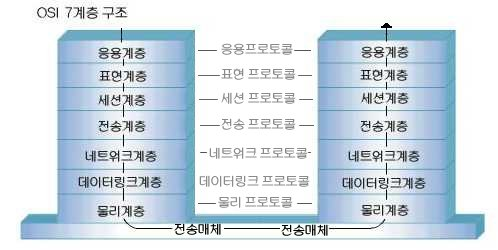

### OSI 7 계층 (OSI 7 Layer)

---

OSI 7계층(OSI 7 Layer)에 대해서 알아보겠습니다.

### 탄생 배경

데이터를 주고 받기위한 규칙을 **프로토콜** 이라고 합니다.

하지만 이런 규칙이 통신 회사마다 다르다면 어떤 일이 일어나게 될까요?

예를들어 하나의 게임을 하기위해선 게임 개발 회사에서

지정한 장비만으로 게임을 해야할 것입니다.

단순히 메일을 주고받을 때 역시 상대방과 프로토콜을 맞추기 위해 많은 노력을 해야 할 수도 있습니다.

이러한 문제를 해결하기 위해 ISO(국제 표준화 기구)에서 데이터를 주고받기 위한 규칙인

**프로토콜**을 표준화해서 나온게 바로 **OSI 7계층**입니다.

---

_출처:http://www.a24s.com/data/jeongbotongsinhakseub/jbts/contents/ch2-4.htm_

OSI 7계층입니다.

각 계층을 살펴보기 전에

OSI 7계층엔 중요한 특징 몇가지가 있습니다.

- **각 계층은 하위 계층의 기능만을 이용하고, 상위 계층에게 기능을 제공한다.**

- **각 계층을 건너 뛸 수 없다.**

또한 OSI 7계층은 이름에서 알 수 있듯 **계층 구조**로 이루어져 있습니다.

이렇게 계층 구조로 나눈 이유는 단계별로 파악하기 쉽고,

큰 문제를 해결할 때 작은 문제로 나누어 해결하면 쉽게 해결할 수 있다는 개념인 **분할 정복** 을 이용하기 위해서 입니다.

이제 본격적으로 각 계층에 대해 알아보겠습니다.

---

### PDU (Protocol Data Unit)

**PDU**란 각 계층에서 전송되는 단위입니다.

데이터 자체는 동일하지만 각 계층을 거쳐가며 헤더 정보가 추가됨에 따라 이름이 달라지게 됩니다.

### 1. 물리 계층 (Physical Layer)

### 2. 데이터 계층 (Link Layer)

### 3. 네트워크 계층 (Network Layer)

### 4. 전송 계층 (Transport Layer)

### 5. 세션 계층 (Session Layer)

### 6. 표면 계층 (Presentation Layer)

### 7. 응용 계층 (Application Layer)
