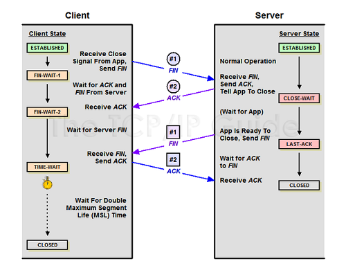
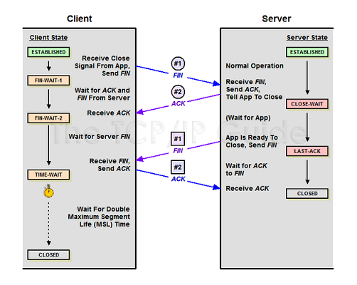

### TCP UDP란

---

**TCP, UDP** 는 **TCP/IP** 모델의 **전송 계층** 에서 사용하는 프로토콜 입니다.

TCP, UDP 모두 패킷을 한 컴퓨터에서 다른 컴퓨터로 전달해주는 IP 프로토콜을 기반으로 구현되어있습니다.

**TCP**는 연속성보다 신뢰성이 있는 전송이 중요할 때 사용하는 프로토콜입니다. 

**UDP**는 신뢰성보다 연속성이 있는 전송이 중요할 때 사용하는 프로토콜입니다.

그럼 TCP부터 자세히 알아보겠습니다.

### TCP

TCP는 Transmission Control Protocol의 약자입니다.

네트워크에 연결된 컴퓨터에서 실행되는 프로그램 간의 데이터를 

안정적으로, 순서대로, 에러없이 교환하게 해줍니다.

#### 연결형 서비스

TCP는 연결형 서비스로 가상 회선 방식을 제공합니다.

**3-way handshaking**을 통해 연결을 설정하고

**4-way handshaking**을 통해 연결을 해제합니다.

_3-way handshaking_

##### SYN: synchronize sequence numbers

##### ACK: acknowledgment

1. 클라이언트는 서버에 접속을 요청하는 **SYN** 패킷을 보낸다.
    
    이때 클라이언트는 **SYN/ACK** 응답을 기다리는 **SYN_SENT** 상태가 된다.

2. 서버는 SYN 요청을 받고 클라이언트에게 요청을 수락한다는 ACK와 SYN flay가 설정된 패킷을 전송한다.

    이때 서버는 클라이언트가 다시 ACK로 응답하기를 기다리는 **SYN_RECEIVED**상태가 된다.

3. 클라이언트는 다시 서버에게 ACK를 보내고 이후로는 연결이 이루어지고 데이터가 오고가게 된다. 

    이때 서버의 상태는 **ESTABLISHED**가 된다.

_4-way handshaking_

1. 클라이언트가 연결을 종료하겠다는 **FIN** 플래그를 전송한다.

2. 서버에서는 확인 메시지를 보내고 자신의 통신이 끝날때까지 기다리게 된다.

    이때 서버의 상태는 **TIME_WAIT** 가 된다.

3. 서버의 통신이 끝났으면 연결이 종료되었다고 클라이언트에게 **FIN** 플래그를 전송한다.

4. 클라이언트는 확인했다는 메시지를 보낸다.

#### 흐름제어 (Flow Control)

데이터 처리 속도를 조절하여 수진자의 버퍼 오버플로우를 방지합니다.

데이터를 송신하는 쪽에서 감당이 안될정도로 많은 데이터를 빠르게 보내는 것을 방지합니다.

수신자가 **Window Size** 값을 통해 수신량을 정할 수 있습니다.

#### 혼잡제어 (Congestion Control)

 네트워크 내의 패킷 수가 넘치게 증가하지 않도록 방지합니다.

 정보의 전송량이 많다면 패킷을 조금만 전송하여 혼잡 붕괴 현상이 일어나는 것을 방지합니다.

 #### 신뢰성이 높은 전송 (Reliable Transmission)

 * Dupack-based retransmission

    정상적인 상황에서는 ACK값이 연속적으로 전송되어야 합니다.

    ACK값이 중복으로 올 경우 패킷 이상을 감지하고 재전송을 요청합니다.

* Timeout-based retransmission 

    일정시간동안 ACK 값을 수신하지 못할 경우 재전송을 요청합니다.

#### 전이중, 점대점 방식

* 전이중 (Full-Duplex)

    전송이 양방향으로 동시에 일어날 수 있습니다.

* 점대점 (Point to Point)

    각 연결이 정확히 2개의 종단점을 가지고 있습니다.

#### = 멀티캐스팅이나 브로드 캐스팅을 지원하지 않습니다.

--- 

#### TCP Header 정보

| 필드 | 설명 | 크기(bit) |
|:--------|:--------:|:--------:|
| 송수신자의 포트 번호 | TCP로 연결되는 가상 회선 양단의 송수신 프로세스에 할당되는 포트 주소 | 16 |
| 시퀀스 번호(Sequence Number) | 송신자가 지정하는 순서 번호, 전송되는 바이트 수를 기준으로 증가 | 32 |
| 응답 번호(ACK Number) | 수신 프로세스가 제대로 수신한 바이트의 수를 응답하기 위해 사용 | 32 |
| 데이터 오프셋(Data Offset) | TCP 세그먼트의 시작위치를 기준으로 데이터의 시작 위치 표현(TCP 헤더의 크기) | 4 |
| 예약 필드(Reserved) | 사용하지 않지만 나중을 위한 예약 필드, 0으로 채워져야한다 | 6 |
| 제어 비트(Flag bit) | SYN, ACK, FIN 등의 제어 번호 | 6 |
| 윈도우 크기(Window Size) | 수신 윈도우의 버퍼 크기를 지정할때 사용, 0이면 프로세스의 전송 중지 | 16 |
| 체크섬(Checksum) | TCP 세그먼트에 포함되는 프로토콜 헤더와 데이터에 대한 오류 검출 용도로 사용 | 16 |
| 긴급 위치(Urgent Pointer) | 긴급 데이터를 처리하기 위해 사용, URG 플래그 비트가 지정된 경우에만 유효 | 16 |

#### 제어 비트 정보

| 종류 | 설명 |
|:--------|:--------:|
| URG | 긴급 위치 필드가 유효한지 설정 |
| ACK | 응답 번호 필드가 유효한지 설정, 클라이언트가 보낸 최초의 SYN 패킷 이후 전송되는 모든 패킷에는 이 플래그가 설정되어야 함 |
| PSH | 수신 어플리케이션에 버퍼링된 데이터를 상위 계층에 전달할 때 사용 |
| RST | 연결의 리셋이나 유요하지 않은 세그먼트에 대해 응답할때 사용 |
| SYN | 연결 설정 요구. 동기화 시퀀스 번호. 양쪽이 보낸 최초의 패킷에만 이 플래그가 설정되어 있어야 함 |
| FIN | 더 이상 전송할 데이터가 없을때 연결 종료 의사 표시 |

---

### UDP

UDP는 User Datagram Protocol의 약자입니다.

여기서 Datagram은 **독립적인 관계를 지니는 패킷**을 뜻합니다.

즉, 각각의 패킷이 독립적이기 때문에 패킷마다 서로 다른 경로로 독립적으로 처리하게 됩니다.

#### 비연결형 서비스

UDP는 비연결형 서비스 입니다.

때문에 정보를 주고받을 때 TCP의 3-way-handshaking 과 같은 연결절차를 밟지 않습니다.

그렇게 때문에 **TCP 보다 속도가 빠른 것이 특징입니다.**

#### 비신뢰성 서비스

UDP는 수신지에서 패킷을 제대로 받던, 받지않던 상관않고 그저 데이터를 전송할 뿐입니다.

#### UDP Header 정보

| 필드 | 설명 | 크기(bit) |
|:--------|:--------:|:--------:|
| 송수신자의 포트 번호 | TCP로 연결되는 가상 회선 양단의 송수신 프로세스에 할당되는 포트 주소 | 16 |
| 데이터의 길이 | UDP 헤더와 데이터의 총 길이 | 16 |
| 체크섬(Checksum) | TCP 세그먼트에 포함되는 프로토콜 헤더와 데이터에 대한 오류 검출 용도로 사용 | 16 |

--- 

### TCP와 UDP의 차이점

| TCP | UDP |
|:--------|:--------|
| 연결형 프로토콜 | 비연결형 프로토콜 | 
| 데이터의 경계를 구분하지 않음 | 데이터의 경계를 구분함 | 
| 신뢰성 있는 데이터 전송 | 비신뢰성의 데이터 전송 | 
| 일 대 일(Unicast) 통신 | 일 대 일, 일 대 다(Broadcast)), 다 대 다(Multicast) 통신 |

