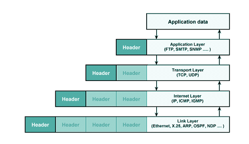

### TCP/IP 4계층

---

TCP/IP 모델은 현재의 인터넷에서 컴퓨터들이 정보를 주고 받는데 쓰이는 프로토콜의 모음입니다.

하드웨어, 운영체제, 접속 매체에 관계없이 동작할 수 있는 개방성을 가집니다.

_출처:https://hahahoho5915.tistory.com/15_

---

### 1. 네트워크 엑세스 계층 (Network Access Layer)

OSI 7계층의 물리 계층과 데이터 링크 계층에 해당합니다.

OS의 네트워크 카드와 디바이스 드라이버 등과 같이 하드웨어적인 요소와 관련된 모든 것을 지원하는 계층입니다.

물리적인 주소로 **MAC**을 사용합니다.

**LAN, 패킷망** 등에 사용됩니다.

### 2. 인터넷 계층 (Internet Layer)

OSI 7계층의 네트워크 계층에 해당합니다.

통신 노드 간의 IP 패킷을 전송하는 기능, 라우팅 기능을 담당합니다.

**IP, ARP, RARP** 프로토콜을 사용합니다

### 3. 전송 계층 (Transport Layer)

OSI 7계층의 전송 계층에 해당합니다.

통신 노드 간의 연결을 제어하고, 신뢰성 있는 데이터 전송을 담당합니다.

**TCP, UDP** 프로토콜을 사용합니다

### 4. 응용 계층 (Application Layer)

OSI 7계층의 세션 계층, 표현 계층, 응용 계층에 해당합니다.

응용 프로그램들의 네트워크 서비스, 메일 서비스 등을 할 수 있도록

표준적인 인터페이스를 제공합니다.

**TCP, UDP** 기반의 응용 프로그램을 구현할 때 사용합니다.

**FTP, HTTP, SSH** 프로토콜을 사용합니다

데이터를 전송할 때 단계별로 헤더를 붙여 전송하게 됩니다.

* ex) Frame => Datagram => Segment => Data

이를 **데이터 캡슐화** 라고 합니다.

_출처:https://velog.io/@hidaehyunlee/%EB%8D%B0%EC%9D%B4%ED%84%B0%EA%B0%80-%EC%A0%84%EB%8B%AC%EB%90%98%EB%8A%94-%EC%9B%90%EB%A6%AC-OSI-7%EA%B3%84%EC%B8%B5-%EB%AA%A8%EB%8D%B8%EA%B3%BC-TCPIP-%EB%AA%A8%EB%8D%B8_

---

OSI 7계층과 TCP/IP 4계층의 차이점은

* **TCP/IP** 는 인터넷 개발 이후 계속 표준화되어 신뢰성이 우수하지만
**OSI 7계층**은 실제적으로 구현된 예가 없어 신뢰성이 떨어진다는 점

* **OSI 7계층**은 장비 개발, 통신 자체를 어떻게 표준으로 잡을지에 사용되지만 실질적인 통신ㄴ은 **TCP/IP 프로토콜**을 사용하는 점

등이 있습니다.
