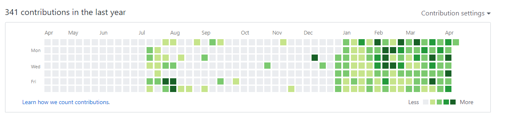

### 1일 1커밋 100일 회고

---

1일 1커밋을 진행한지 어느덧 100일이 지났다.

그 동안의 느낀점, 부족한 점을 정리하기 위해 포스트를 작성한다.

##### 현재 깃허브 커밋 상황이다.

1일 1커밋을 하고 한달째에 **[회고글](https://pro-dev.tistory.com/13?category=819941)** 을 작성했었다.

시간이 참 빠르게 흘러간다는 걸 느꼈다.

어느덧 100일이라니....

크게는 3가지의 활동이 있었다.

- 블로그 작성
- 계층형 게시판 만들기
- 인터넷 강의 시청

내가 생각한 1일 1커밋의 큰 장점은

#### 내가 시작한 일에 마무리를 지을 수 있게 해주는 것

이라고 생각한다.

호기롭게 시작하기는 쉬워도 마무리를 한다는 건 정말 어려운 일인 것 같다.

##### 출처(https://m.vingle.net/posts/2559756?shsrc=fb)

특히나 나는 마무리를 잘 하지 못한다는 단점이 있다. 

그래서 학원 수강을 위주로 공부했었다.

스스로가 마무리가 부족한 걸 잘알기에..

예전 호기롭게 시작했던 개인 프로젝트가 시간이 길어지며 중간에 포기하는 일이 있었다.

지금도 상당히 찝찝한 기억으로 남아있는데 이번에 비슷하게

계층형 게시판을 도전했는데 마무리를 지을 수 있었다.

내 성에 차지는 않지만 이번 경험을 바탕으로 좀 더 공부할 것들이 생겨났고, 부족한 점이 무엇인지 알았다.

또 구매했던 인터넷 강의를 끊기지 않고 볼 수 있었던 점, 블로그 글을 계속 작성할 수 있었던 점... 

나에게는 나름의 큰 변화가 있는 100일 이었다.

개인적으로 스스로에게 냉철하고 객관적이게 피드백을 하는게 중요하다 생각하는데

1일 1커밋은 이런 피드백을 해주기에 정말 좋은 수단인 것 같다.

매일 매일 공부하는 습관을 들여나가는 중인 것 같아 가끔은 뿌듯하기도 하다.

### 아쉬운 점 
---

다만 요즘 객체지향 공부가 부족하다는 사실을 깨달아 책을 구입해 읽고있는데 

책을 읽는 중에 커밋은 어떻게 해야할지 잘 모르겠다. 

남들보다 책을 읽는 속도가 느린 편이라 어떻게 해야할지 아직 감이 잡히지 않는다.

이 점은 좀 더 고민이 필요한 것 같다.

또 냉철하게 판단해보면 

> 내가 그리고, 꿈꾸던 내 모습에 좀 더 가까워졌는가?

라는 질문을 던졌을 때 대답은 **아니오** 이다.

단순히 커밋에만 집착하지 말고 공부에 집착해야한다는 걸 잊지 말아야겠다.

앞으로의 계획은 크게 2가지 이다.

* 이직
* 서비스 개발해보기

틈틈히 공부하면서 도전해보자!

