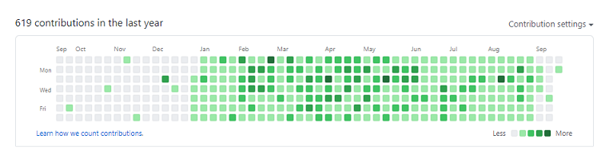

### 1일 1커밋 종료...... 그리고 회고
---

최근 1일 1커밋이 종료되었다.

_시원 섭섭하다_

특별한 이유가 있어서 내 의지로 종료한 것이 아니라 최근 결혼 준비로 바쁜 와중에 

아침부터 웨딩촬영을 떠났는데 다음날이 되어서야 알게되었다...

커밋을 안했다는 걸...ㅋㅋ

보통 이렇게 꾸준히 하던게 끊긴다면 아쉽고, 화나야겠지만 나의 경우는 

**큰 골칫덩이를 처리한 느낌**이 컷다..

### 골칫덩이가 된 이유.
---

커밋이 **골칫덩어리** 가 된 부분은 전적으로 내 잘못이다.

점점 **커밋의 질**이 떨어져갔기 때문이다.

1일 1커밋을 시작하게된 이유는 아마 모두들 비슷할 것이라 생각한다.

나같은 경우 하루하루 꾸준히 개발 공부를 하는 습관을 들이고 싶어서 시작하였다.

하지만 진행하면 할수록 점점 **개발 공부를 하기위한 커밋이 아니라 잔디밭을 채우기 위한 커밋이 되었다.**

내가 접근을 잘못한 것이다. 

나같은 경우가 있다면 과감히 커밋을 중지하든지, 방식을 변경해야할 것이다.

---

요즘은 새로운 공부 기법을 찾게되었다.

뽀모도로 기법인데 워낙 유명한 기법이라 아는 분들이 꽤 많을 것이다.

정석적으로 뽀모도로 기법을 하지 않더라도 일부 발췌해서 요긴하게 사용 중이다.

이 뽀모도로 기법을 1일 1커밋 대신 적용하는 것도 좋은 방법인 것 같다.

이 부분에 대한 이야기는 다른 포스트에서 진행하도록 하고

결론적으로 나랑 1일 1커밋은 안 맞는다는 걸 알게되었다.

나는 참 게으른 사람이구나... 라는걸 다시한번 깨닫게 되었다.

커밋의 양 보다는 질이 더 중요하다는 걸 깨달았다.

이대로 커밋을 다시 지속하기에는 나에게 남는게 없다는 걸 알았다.

앞으로는 커밋을 매일 안하더라도 하루 하루마다 의미 있는 공부를 하는게 어떨까 싶다...

이 부분에 대해서는 다시 또 고민이 필요할 것 같다.

