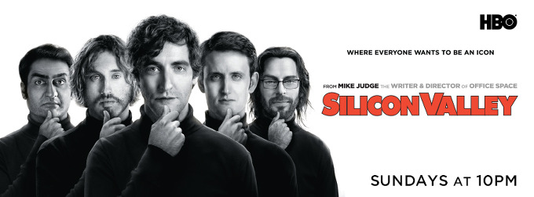
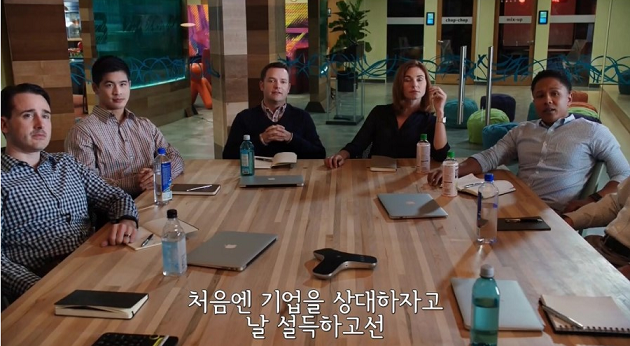
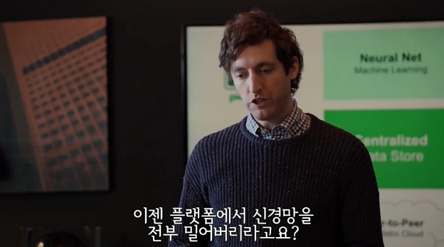
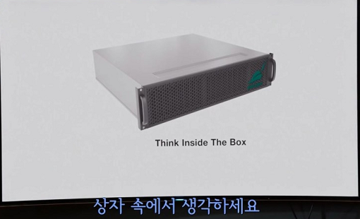

### 미드 실리콘 밸리 - 스포주의!!!

---

실리콘 밸리에서의 개발자의 삶에 관한 미드,

실리콘 밸리를 보고 참 많은 생각이 들어 느낀점을 정리해보려고 합니다.

**약간의 스포가 있으니... 주의해주시길 바랍니다ㅎ**

---

먼저 간단히 드라마에 대해 소개하자면 실리콘 밸리에서 개발자들이 겪는 이야기를 코미디 형식으로

재미나게 그려낸 드라마이다.

이 드라마는 몇 년전 한참 개발자에 대한 꿈을 키워나가고 있을 때, 접하게 되었다.

나는 관심사가 생기면 그 관심사에 관한 드라마나 영화 등을 보곤 하는데 

본격적으로 개발자의 꿈을 키워나가고 있을 때 봤던 드라마다.

그때는 시즌2까지만 나왔었지만 최근 **왓챠**라는 어플을 통해 다시 볼수 있게되어 

다시 보게되었다.

현재 시즌6를 끝으로 완결이 났지만 왓챠에서는 시즌4 까지만 볼 수 있다.. _아쉽다..._

---

신입이라는 딱지를 붙이고 개발자들의 세계에 들어서기 전에 실리콘 밸리를 봤을 때는

정말 웃긴 드라마라는 생각, 개발에 몰두하는 주인공들이 멋있다는 생각 등을 했다.

하지만 최근 다시 드라마를 봤을 때는 큰 감명을 받았다....

_스포주의....!!!!_

시즌3의 한 장면이다.

시즌 1에서 주인공이 우연치않게 창업의 기회를 얻어 창업을 하게되고

시즌 2에서는 회사 운영을 잘 하지못한 주인공이 CEO에서 짤리는 과정

시즌 3에서는 자신의 회사의 CTO가 되어 회사 운영진과 한바탕 하는 과정을 담고있다.

시즌 4에서는 다시 CEO가 된 주인공이 회사를 운영하기위해 계약을 하고, 그 계약을 지키기 위해 

어떤식으로 고군분투하는지에 대한 내용이 주가된다.

엔딩까지 보지는 못했지만 시즌4까지 본 입장으로

시즌3를 제일 감명깊게 봤다.

회사에 입사하기 전에 본 실리콘 밸리와 회사에 입사하고 나서 본 실리콘 밸리는

전혀 다른 느낌이었다.

--- 

시즌3에서는 CEO에서 물러난 주인공이 CTO가 되어서 회사 운영진들과 다툼이 발생하게 되는데,

이 과정에서 

> 어떤 과정으로 개발자는 자기가 하기 싫은 개발을 하게 되는지

> 운영진들과 개발자의 마찰이 어떻게 시작되는지

이런 내용이 상세하게 묘사된다.

_개발자들이 만들기 싫어 퇴사까지 고민했던 회사 상품..._

하지만 여기서 주인공들은 

