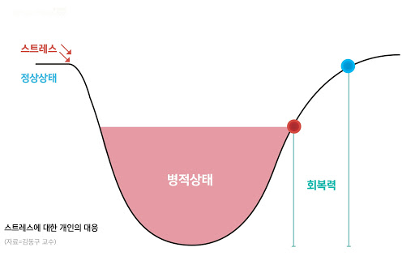

### 스트레스 관리의 중요성

---

최근 공부의 양이 현저히 줄어들었다. 때문에 블로그 포스트도 잘 못쓰고 있다...

이것 저것 준비할 것들이 많이 쌓이고, 쌓인만큼 해결도 되지않아 마음 고생중이다.

사실 준비할 것들이 개발과 관련됬다면 얘기가 좀 달랐겠지만

개발과 전혀 관련없는 일들이 겹치니 공부하려고 해도 집중이 잘 되지않는다...

스트레스가 쌓이니 점점 의욕이 떨어지고, 떨어진 의욕으로 생활하다보니 공부를 소흘히 하게된다.

1일 1커밋도 알고리즘 문제를 풀고 커밋하는게 주가 되었다.

_회복하고 싶다아아아_

과거 면접에서 스트레스 관리나 취미에 대한 질문을 종종 듣곤 했는데, 그 이유를 알 것 같다.

다른 곳에서 스트레스를 받다보니 개발 공부에 소흘히하게 되는데, 스트레스 관리를 잘 해줘야 무사히 원래의 상태로 돌아올 수 있기 때문이다.

나에게는 스트레스 해소법이 하나 있는데, **코인 노래방** 이다.

하필... 이시국에...ㅎ 

그래서 스트레스가 점점 쌓여가는 것 같다.

가뜩이나 해결이 오래걸리는 일이 생겨 스트레스를 받고있는데

새로운 스트레스 해소법을 찾거나 앞으로의 일들이 잘 해결되길 바래야지!

예전에는 할 일이 많아서, 피곤해서, 힘들어서 공부를 안하는 사람들을 이상하게 생각했었다.

지금 공개적으로 반성하고, 마음 속으로나마 사과를 구하고싶다..

함부로 사람을 무시하거나 내가 우월하다는 생각을 했다는 게 정말 부끄럽다..

---

생각을 글로써 써내려가 보니 신기하게 마음이 차분해진다.

앞으로 생각이 복잡하거나, 여러 생각이 떠오를 때는 이렇게 정리하는 것도 좋은 방법인 것 같다.

자주써야지ㅎ

