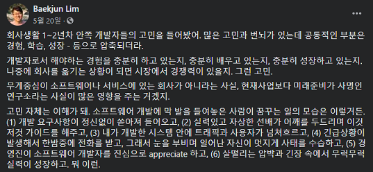

### 주변을 탓하기 전에..

개발 경력이 아직 1년도 안된 새내기지만 최근 어떤 글을 보고 많은 생각이 들어서 글을 남긴다.

그저 개인적인 생각이고, 아직 개발 물정 잘 모르는 신입이 쓴 글이라 부족한 점도 많고

틀린 부분이 많을 수 있다는 점... 양해 부탁드립니다.

---

나를 포함한 대부분의 신입들은 현재 다니고 있는 회사에 만족하고 있지 않을 것이다.

너무나 당연하게도 **내가 만족하는 회사** 를 다니는 일이란 쉬운 일이 아니기 때문이다.

일반적으로 **좋은 회사란**

* 부족하지 않은 임금

* 너무나도 좋은 복지

* 개발자로써 성장하고, 도전하기에 좋은 문화

* 다양한 경험과 실력을 쌓을 수 있는 업무

* 열정이 가득 넘치는 동료, 선배들

* 집과 가깝거나 출퇴근에 용이한 회사 위치

등등 너무나도 많은 조건들에 부합하는 회사를 찾기 마련이다.

현실적으로 위의 **조건을 전부 충족시키는 회사는 없다**는 걸 누구나 다 알 것이다.

그렇기 때문에 개인마다 회사를 고르는 기준에서 중요도를 놓고 그에 맞는 회사를 지원하는 것이라 생각한다.

**임금이 낮은 대신 거리가 가깝거나, 임금이 높은 대신 복지가 약하거나** 등등 

각자가 좀 더 중요하게 생각하는 부분에 중점을 두기 마련이다.

---

개인적인 생각으로 위의 조건들 중에서 하나라도 진심으로 만족하는 회사에 다닌다면 축복이라 생각한다.

나 역시 회사에 만족을 하지않고, 하나 둘 불만이 쌓여가는 와중에 아래와 같은 글을 읽었다.

[전체 글 읽기](https://www.facebook.com/baekjun.lim/posts/3253046061380427)

글을 읽고 많은 생각을 하게됬다.

나 자신을 바꾸기보다는 주변 환경 탓만 했던 것 같다.

