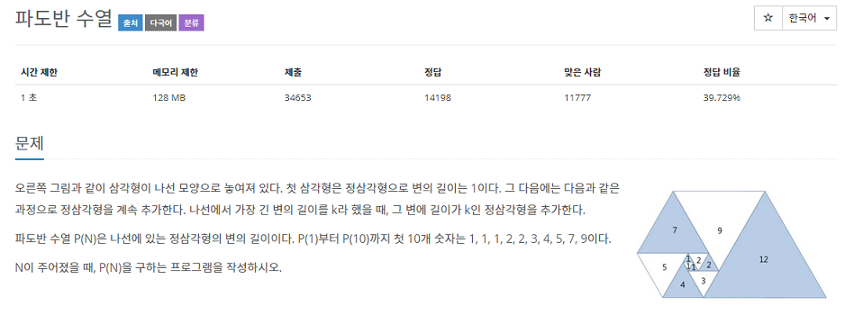
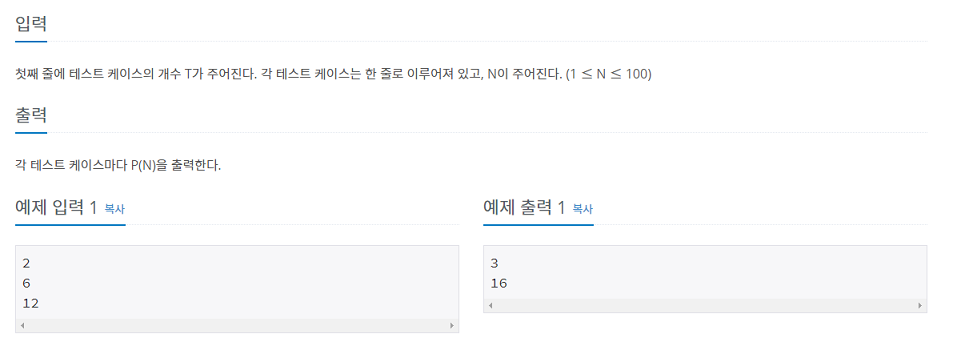

### 백준 9461 - 파도반 수열

---

**[백준 9461](https://www.acmicpc.net/problem/9461)**

다이나믹 프로그래밍 카테고리에 있는 문제입니다.

먼저 문제를 살펴보겠습니다.



이 문제에서 핵심은 

> P(1)부터 P(10)까지 첫 10개 숫자는 1, 1, 1, 2, 2, 3, 4, 5, 7, 9이다.

이 부분입니다.

여기서 정답을 출력하기 위한 점화식을 도출 할 수 있습니다.

**P(n) => p(n - 2) + p(n - 3)**

이런 수식을 도출 할 수 있습니다.

n의 값을 구하려면 n - 2의 값과 n - 3의 값을 더하면 됩니다.

문제의 입력, 출력부분과 함께 코드를 보며 설명하겠습니다.



```java
import java.util.Scanner;

public class PadovanSequence {
    public static void main(String[] args) {
        Scanner sc = new Scanner(System.in);

        long[] pado = new long[101];

        pado[1] = 1;
        pado[2] = 1;
        pado[3] = 1;

        for (int i = 3; i < pado.length; i++) {
            pado[i] = pado[i - 2] + pado[i - 3];
        }


        int t = sc.nextInt();

        for (int i = 0; i < t; i++) {
            int n = sc.nextInt();

            System.out.println(pado[n]);
        }
    }
}
```

```java
long[] pado = new long[101];

        pado[1] = 1;
        pado[2] = 1;
        pado[3] = 1;
```
이 부분을 보시면 pado배열을 **int형이 아닌 long으로 선언했습니다.**

문제에서 **N값의 범위는 1이상, 100이하입니다.**

때문에 int형으로 계산을 하면 int형의 범위를 초과하기때문에

long타입으로 계산해야합니다.

배열의 첫번째, 두번째, 세번째 값은 모두 1로 초기값을 주고 계산했습니다.


