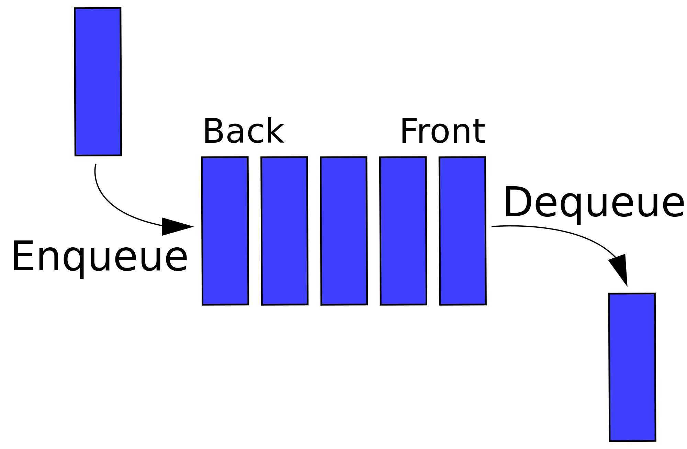

### 큐(Queue)

큐 (Queue)란 FIFO(First In First Out) 방식을 기반으로 한 자료구조 입니다.  
FIFO란 먼저 들어온 Data가 먼저 나가게 되는 방식입니다.  

일상생활에서도 종종 큐를 접할 수 있습니다.  
대표적인 예를 들어보겠습니다.

* #### 대기줄  
  큐에 대한 예를 설명할 때 가장 많이 나오는게 바로 대기줄 입니다.  우리가 음식을 먹으려 줄을 섰을 때 먼저 온사람이 먼저 주문을 하는 것처럼 큐도 먼저 들어온 Data가 먼저 나가게 됩니다.

### 큐가 사용되는 곳

 큐는 프린터의 출력, 프로세스 관리 등 입력된 시간 순서대로 처리해야 할 필요가 있는 상황에 이용됩니다.

### 큐의 주요 동작 기능

 * #### Queue의 마지막에 데이터 삽입
   보통 insert, enqueue, offer, push 라는 이름의 함수로 구현합니다.

 * #### Queue의 맨 처음 데이터 삭제 후 반환
   보통 remove, dequeue, poll, pop 이라는 이름의 함수로 구현합니다.

 * #### Queue의 맨 처음 데이터 확인(제거하지 않고 반환합니다.)
   보통 peek, element, front 라는 이름의 함수로 구현합니다.

 * #### Queue가 비어있는지 확인
   보통 isEmpty 라는 이름의 함수로 구현합니다.

### 큐의 종류

* #### 선형 큐  
    가장 기본이 되는 큐입니다.  
    길다란 막대 모양이라고 상상하시면 될 듯합니다. 

    선형 큐에는 치명적인 단점이 있습니다.  
    데이터를 추가, 삭제를 하다보면 큐의 앞부분을 가르키는 front가 점점 밀려와 앞의 공간이 남게 됩니다.   
    공간을 아끼려면 하나의 데이터가 빠져나간 뒤에 나머지 데이터들의 자리를 앞으로 이동해야합니다.  
    데이터의 양이 많고, 사이즈가 크다면 속도 측면에서 상당히 느려지게 됩니다. 
* #### 원형 큐
    선형 큐의 단점을 보완하여 만들어진 큐 입니다.  
    큐를 직선이 아닌 원형으로 생각하여 구현했습니다.

    