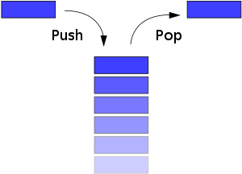

### 스택(Stack)

스택은 LIFO(Last In First Out) 형식을 기반으로 한 자료구조입니다.

LIFO 란 나중에 들어온 데이터가 먼저 나가게되는 방식입니다.

스택에서 자료를 넣는 것을 __push__
자료를 꺼내는 것을 __pop__ 이라고 부릅니다.

위의 사진처럼 저장 공간이 세로로 되어있고 거기에 데이터를 차곡 차곡 쌓아간다고 생각하시면 이해하기 좀 더 편할 것 같습니다.

#### 스택의 사용

- 뒤로가기 버튼  
우리가 사용하는 브라우저의 뒤로가기 버튼이 바로 스택을 사용한 것 입니다.

