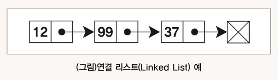
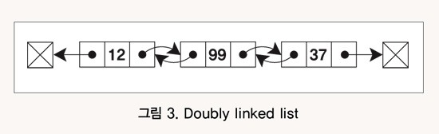

### 리스트란
리스트란 순서가 있는 엘리먼드의 모임입니다. 

배열이 가지고 있는 장점 중 하나인 인덱스를 버리는 대신 데이터의 삽입, 삭제에 용이한 자료구조입니다.

 

#### 노드 (Node)
리스트에서 저장되는 데이터의 단위입니다.  
보통 노드에는 입력된 값 (Data)과 함께 다음 노드에 대한 주소값이 같이 저장됩니다.

### 리스트의 장 / 단점
### 1. 장점
- #### 데이터 추가 삭제에 용이합니다.  
    각 노드에 다음 노드에 대한 주소의 값이 저장되어 있기 때문에 데이터 추가나 삭제를  
    할때 이 주소값을 바꿔줌으로써 데이터 추가나 삭제가 편리합니다.

- #### 생성할 때 따로 정해진 메모리를 할당해주지 않아도 됩니다.  
    배열처럼 처음 생성할 때 크기를 지정해주지 않기 때문에 저장되는 데이터 양에  
    손쉽게 대처할 수 있습니다.

### 2. 단점 
- #### 데이터에 접근할 때 시간이 오래걸립니다.  
    배열처럼 Index값이 있는게 아니기때문에 순차적으로 리스트의 각 항목에 접근하여   
    값을 검색하게 됩니다.

- #### 메모리 사용량  
    각 노드에 데이터와 함께 다음 노드에 대한 주소값을 저장하기 때문에 상대적으로  
    배열보다 사용하는 메모리가 많습니다.

### 리스트의 종류
리스트에는 다양한 종류가 있지만
대표적인 종류 2가지를 설명하겠습니다.

- #### 단일 연결 리스트 (Single Linked List)   
리스트의 각 노드에 Data와 함께 
다음 노드의 주소를 저장하는 방식입니다. 

바로 다음에 있는 노드의 주소를 알고 있기 때문에 처음 시작하는 노드를 알면  
리스트에 있는 전체 데이터를 알 수 있습니다.

또 데이터를 추가하거나 삭제할 때 연결되어있는 노드의 주소를 수정해주면 되기 때문에  
삭제와 추가에 용이합니다. 

하지만 노드에 데이터와 함께 다음에 오는 노드의 주소를 저장하기 위해 추가로 메모리를  
사용하게 됩니다.

- #### 이중 연결 리스트  (Double Linked List)
리스트의 각 노드에 Data와 함께 다음 노드의 주소와 이전 노드의 주소를 저장하는 방식입니다.

앞의 노드와 뒤의 노드의 주소를 둘다 저장합니다.   
이렇게 함으로써 해당 리스트에 있는 노드를 하나만 알게되더라도 전체 리스트를  
알 수 있다는 장점이 있습니다.

